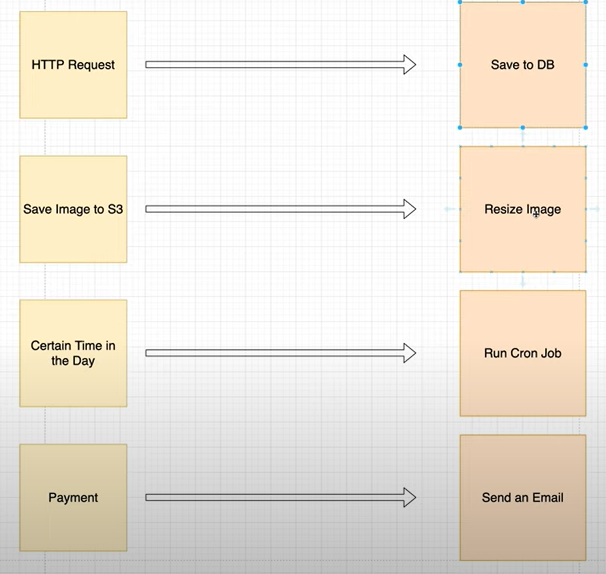

# AWS Serverless

We can protect the Billing of the AWS account by setting up the Budget and the IAM role

To make s3 resources **public** for static web hosting we need to make sure:

1. That the **Static website hosting** is **Enabled** under **Properties** of the **s3 bucket**

2. That the **Block public access (bucket settings)** under **Permissions** is turned off for the **s3 bucket**

Additionally:

**EITHER** to access an individual resource publically we need to make sure that the **Read** mode for **Everyone (public access)** is turned on under **Access control list(ACL)** under **Permissions** i.e. **Individual Resource -> Permissions -> Access control list(ACL) -> Everyone (public access) -> Read(Enabled)**

**OR** to make **all** the resources of the bucket public we can set up the **Bucket Policy** under **Permissions** for the whole bucket i.e. **Bucket -> Permissions -> Bucket Policy -> (followed by the code given below)**

```
{
    "Version": "2012-10-17",
    "Statement": [
        {
            "Sid": "PublicReadGetObject",
            "Effect": "Allow",
            "Principal": "*",
            "Action": [
                "s3:GetObject"
            ],
            "Resource": [
                "arn:aws:s3:::Bucket-Name/*"
            ]
        }
    ]
}
```

### AWS Lambda

A rule of thumb for Lambda is that there should be one function per Lambda

### AWS API Gateway

To make sure that the updated API changes are deployed we always need to **Deploy API** after making the changes under **Actions**

**Note: While creating Lambda it's important to click on the option** **_Use Lambda Proxy Integration_** **to make sure that the Requests will be proxied to Lambda with request details available in the 'event' of your handler function**

### AWS Lambda - logs with AWS CloudWatch - Node.js

We can also view the AWS Lambda logs on the CloudWatch by examining the logs on the CloudWatch i.e. whenever we have logging going on in our Lambda function we can execute the lambda function and goto: **View logs in CloudWatch**. By viewing the logs on the CloudWatch if we were to log the event object of the Lambda function for Node.js we can see a large object on the CloudWatch console.

**Event object** - The arguments of the Event object contains the parameters passed in during Querying and Mutation (For GraphQL)

### AWS Lambda, AWS DynamoDB - Permissions

In order to allow the Lambda function to interact with the DynamoDB table we have to attach the **AmazonDynamoDBFullAccess** policy to the IAM role associated with the corresponding Lambda function

### Example - AWS Lambda, AWS AppSync, AWS DynamoDB

*https://www.youtube.com/watch?v=_9DFFg-pNss*

**Resources**:
AWS Lambda -> AppSyncDataStoreLambda
AWS AppSync -> AppSyncExample [DataSource: AppSyncDataStoreLambda]
AWS DynamoDB -> UserAPITable
AWS IAM -> We have modified the IAM role

**AWS Lambda**

Note: We have to attach the DynamoDB policy with the Lambda for the Lambda to interact with the DynamoDB table

1. index.js

```
const getUserById = require('./getUserById');

exports.handler = async (event) => {
    // console.log('Received event: ', JSON.stringify(event, 3));

    switch(event.info.fieldName) {
        case "getMessage":
            return { data: "Hello from Lambda" };
        case "getUserById":
            return await getUserById(event.arguments.userId);
        default:
            return null;
    }

};

```

2. getUserById.js

```
const AWS = require('aws-sdk');
const docClient = new AWS.DynamoDB.DocumentClient();

async function getUserById(userId) {
    const params = {
        TableName: "UserAPITable",
        Key: {
            id: userId
        }
    }

    try {
        const {Item} = await docClient.get(params).promise();
        return Item;
    } catch(err) {
        console.log("DDB error: ", err);
    }
}

module.exports = getUserById
```

**AWS DynamoDB**
id location name
2 Africa Sam
1 Canada Pujan Soni

**AWS AppSync**

Note: We have to create the Data Source to attach the Lambda to the corresponding resolver function

1. Schema

```
type Message {
	data: String!
}

type Query {
	getMessage: Message!
	getUserById(userId: ID!): User
}

type User {
	id: ID!
	name: String!
	location: String!
}
```

2. Query

```
query getUserById {
  getUserById(userId: "1") {
    id
    name
    location
  }
}

query getMessage {
  getMessage {
    data
  }
}
```

# Serverless Course

## Why Serverless?

- You have a fantastic web application that receives **non-linear traffic**, and you cannot keep an eye on your server always. It would be best if you had someone to **auto scale** (scale up and down) your application
- If you are facing any of the above problems, you are in the right place

## What is Serverless?

- _Serverless_ is a computing model where the cloud service provider is responsible for managing the piece of code without the developer having to bother about the infrastructure setup and management
- _Just like wireless internet with wires somewhere, serverless architectures still use servers somewhere_
- The idea behind Serverless is _Focus on your software or application, not on infrastructure_

## What makes your application serverless?

The below-given properties make your application \*_Serverless_:

- **Zero Administration**: Deploy application without any provision and management
- **Auto Scale**: Let service provider worry about scaling the application up or down
- **Pay-per-use**: Pay only for the resources, what you have used
- **Increased Velocity**: Shorten the time between idea implementation and deployment

## Serverless v/s Traditional Architecture


Serverless is also known as _Function as Service_, because each part of your application is divided as functions and can be hosted over multiple service providers

Whereas, the case of traditional applications, an application is treated as a whole

Moreover, the **serverless** cost is linear to the _growth of your business_

## Serverless Application Architecture

_Serverless applications are usually divided as separate units/functions based on their functionalities_


# Serverless Platform

- Serverless itself is not a product. It is just a concept
- Many cloud providers have invested many resources into it to provide a cloud serverless platform
- Serverless cost model is that you are charged based on the number of executions
- Providers allow your functions to respond to **events** such as image upload to S3 bucket

## Serverless Providers

Many cloud vendors provide **_Serverless_** architecture. Some of them are:

- AWS Lambda
- Google Cloud Functions
- Azure Functions
- IBM OpenWhisk
- Alibaba Function Compute
- Iron Functions
- Auth0 Webtask
- Oracle Fn Project

## Serverless Framework

- Even though, cloud providers provide the platform to execute your functions, it is difficult to deploy and manage those functions manually
- In future, if you plan to change your provider, you will be required to do a lot of configuration to achieve that

This is where **Serverless Framework** comes in handy

**_Serverless Framework_** is an open source _CLI_ tool that helps to deploy and manage serverless functions

## Serverless Framework Features

- **Infrastructure as Code**: Serverless framework allows you to define entire application configuration in a **yaml** file to utilize the power of cloud providers such as **AWS Lambda**
- **Simple Serverless Development**: Serverless framework provides a simple **CLI** to deploy and manage your serverless functions
- **Provider Agnostic**: Serverless Framework is one tool solution to all cloud providers

**We use Serverless CLI to manage Serverless functions**

# Serverless CLI Installation

_Serverless CLI is an npm package that should be installed globally to access the CLI_

**Steps**

- Install NodeJS on your system. Azure Functions Serverless Framework plugin requires Node v6.5.0
- Execute **node --version** to verify you have the proper NodeJS installed
- Now install serverless using

```
npm install -g serverless
```

- Verify the installation by running **sls --help**

**Note: sls is a shorthand command for serverless**

## Credential Setup

For Serverless CLI to work,

- You must have a cloud provider like **AWS** or **Azure** that provide the serverless environment
- You must allow **Serverless CLI** access to your account through **IAM, Service Principal** or similar mechanisms

## Azure Credentials: Setup

1. The easiet way to provide azure credentials to **Serverless CLI** is by running **serverless deploy**. It will provide an interactive way to set up the credentials
2. Alternatively, you can follow the hard way,

   1. You must have **Azure CLI** installed
   2. Login to Azure

   ```
   az login
   ```

   The above Command will give you a code and will ask you to log in with credentials (**aka.ms/devicelogin**)

   3. Now that you are logged in, you should be able to fetch your subscription information by running

   ```
   az account list
   ```

   The above command will give the below object as output

   ```
   {
    "cloudName": "AzureCloud",
    "id": "some_ID,
    "isDefault": true,
    "name": "My Azure Subscription",
    "registeredProviders": [],
    "state": "Enabled",
    "tenantId": "5bd108149c-4cbe-b7c9-bcd05cb035c2",
    "user": {
        "name": "you@domain.com",
        "type": "user"
    }
   }
   ```

   4. Next step is to create a service principal. Run the below given command

   ```
   az ad sp create-for-rbac
   ```

   The above command will produce

   ```
   {
    "appId": "19f7b7c1-fc4e-4c8aaf-22fffc23b4c9",
    "displayName": "azure-cli-1900",
    "name": "http://azure-cli-1900",
    "password": "38d82600f2-4e80c5-65192f9bb2d0",
    "tenant": "16f43fe8-17db-476f-b2b3-ba3752a03a33"
   }
   ```

   5. Finally set environmental variables for **Subscription ID** so that **Serverless CLI** can authorize itself

   ```
   export azureSubId='<subscriptionId>' # From step 3
   export azureServicePrincipalTenantId='<tenant>'
   export azureServicePrincipalClientId='<name>'
   export azureServicePrincipalPassword='<password>'
   ```

## Serverless for AWS

To enable serverless for AWS, we can create a new user with the **Programmatic Access** and attach the **Administrative Policy** to the user and then we can copy the **Access Key ID** and **Secret Access Key**

After generating the access key we can open the terminal where we have installed serverless and use the command given below to configure

```
serverless config credentials --provider aws --key ACCESS_KEY_ID --secret SECRET_ACCESS_KEY
```

Here the ACCESS_KEY_ID and SECRET_ACCESS_KEY in the above command are the corresponding Access Key ID and Secret Access Key of the User

# Serverless Core Concepts

## Serverless Yaml

Now that you have setup credentials for your Azure, let's create a sample function

We'll use the Azure template provided by **Serverless**. Execute the below-given command

```
serverless create --template azure-nodejs --path my-service-path --name my-some-unique-name
```

This will give you an **Azure** boilerplate **NodeJS** template

Now that you have created NodeJS Azure functions, the next step is to examine the boilerplate

- **cd** into **<my-service-path>**
- Type **ls** to list the files in the directory
  - handler.js
  - package.json
  - serverless.yml
- **handler.js** is the file where your actual code goes
- **package.json** is NodeJS specific dependency management file
- **serverless.yaml** is the one doing all magic
  - It specifies the functions, events, and much more

## Serverless Yaml

Now, let's observe the default **serverless.yaml**

```
service: my-some-unique-name  #service name that you have given
provider:
  name: azure
  location: West US
plugins:
  - serverless-azure-functions
functions:
  hello: #default function
    handler: handler.hello
    events:
      - http: true
        x-azure-settings:
          authLevel : anonymous
      - http: true
        x-azure-settings:
          direction: out
          name: res
```

Let's understand each field in the **serverless.yaml**

- This is a minimal configuration file. There are many other fields to be added

**Responsibilities of serverless.yaml file are:**

1. Declare a service
2. Define the service provider such as **AWS** or **Azure**
3. Define functions for the service
4. Define plugins used
   - Define events that trigger each function
   - Allow events to create resources automatically

This course uses Azure functions to demonstrate serverless framework capabilities. **serverless.yaml** file contents change a bit from vendor to vendors

### Services

Service is a top-level object in **serverless.yaml** file

```
service: my-some-unique-name
.
.
.
```

- **Service** is like a project
- It is where you are supposed to specify functions, events that trigger those functions and resources used by the function

### Functions

- Functions are basic unit of deployments
- Functions are piece of codes that are supposed to perform one single task
- All functions should be written under **functions** section of **serverless.yaml**

```
.
.
.
functions:
  hello:
     handler: templates/handler.hello
     events:
       - http: true
         x-azure-settings:
           authLevel : anonymous
```

Observe the below given **serverless.yaml** file

```
...
functions:
  functionOne:
    handler: handler.functionOne
    description: optional description for your Function
  functionTwo:
    handler: handler.functionTwo
  functionThree:
    handler: handler.functionThree
```

- **handler** section points to the file which contains the function you want to run
- You can add multiple functions under **functions** section

### Events

- Events make it possible to run functions based on certain conditions
- Simply put, events trigger functions
- Events can be anything that triggers your function. Events can be,
  - HTTP triggers
  - Blog updates
  - Message queues
  - Cron-scheduled events

Observe the below given **serverless.yaml**

```
...
# 'functions' in serverless.yml
functions:
  createUser: # Function name
    handler: handler.createUser # Reference to file handler.js & exported function 'createUser'
    events:
      - http: true
```

- Events section lists all the events associated with the function

_The image belows shows various external events that may trigger serverless functions_


### Plugins

Plugins are Javascript codes that provide additional capabilities to serverless framework by adding a new or extending the existing command

**serverless.yaml** file has a section for these plugins

```
# serverless.yml

plugins:
  - serverless-plugin-identifier
  - serverless-another-plugin
```

### In a nutshell

- Functions:
  - Unit of deployment
  - Package of code
  - Respondible for single task
  - Support for: Node.js, Python, Java, C#
- Events:
  - Triggers functions
  - Infrastructure provisioned automatically
- Resources:
  - Define used AWS services
  - Serverless will provision them
  - Automated process
  - Repeatable: other AWS account
- Services:
  - Unit of organization
  - Contains config for all functions, events and resources
- Plugins:
  - Extend the framework
  - Examples: Support TypeScript, Optimize JS code

## Variables Introduction

Serverless framework allows you to add dynamic data into **serverless.yaml**. They are known as **Variables** of Serverless Framework

They help in **separation of concerns**. You can keep your dynamic data separate from the configuration file

### Variables

Serverless variables allows you to,

- Load data from environment variables
- Reference and load variables through CLI options
- Refer the same serverless.yaml file and fetch data from some other properties
- Access data from YAML/JSON files
- Combine variable references and overwrite each other

### References to Serverless Yaml

- You can access the value of any property from the same **serverless.yaml** file
- We use **${self:someProperty}** syntax to access the value of **someProperty**

```
service: my-service
provider: azure
custom:
  schedule: cron(0 * * * *)

functions:
  hello:
    handler: handler.hello
    events:
      - timer: ${self:custom.schedule}
  fresco:
    handler: handler.fresco
    events:
      - timer: ${self:custom.schedule}
```

The above file **- timer** referes data from **custom.schedule**

### Refer External Files

- **Serverless** allows you to refer **variables** from external **json, yaml, or js** files
- To refer a variable in **yaml** file, use the syntax **${file(../filename.yml):someProp}**
- To refer a variable in **json** file, use the syntax **${file(../filename.json):someProp}**
- It is important to specify **relative path** and proper **file extension**

### Refer yaml/json Files

Consider the below-given example to understand how to refer **external variables**

```
# customFile.yml

cron: cron(0 * * * *)
```

The above file specifies a **yaml** property **cron** with value **cron(0 \* \* \* \*)**

**serverless.yaml** corresponding to the custom file is given below:

```
# serverless.yml

service: my-service
provider: azure
custom: ${file(../customFile.yml)}
functions:
  hello:
    handler: handler.hello
    events:
      - timer: ${file(../customFile.yml):cron}property
  fresco:
    handler: handler.fresco
    events:
      - timer: ${self:custom.cron}
```

Observe how,

- **custom** section is referring to the entire file content
- **timer** section of **hello** function is referring to the particular property
- **timer** section of **fresco** function is referring to the **self:custom** which in turn is referring to the file

### Refer Js File

- Just like **yaml** and **json** you can also use javascript file to provide variable to **serverless.yaml**
- You can use **${file(../someFile.js):someModule}** syntax to access it in **serverless.yaml**

Consider the below **js** file

```
// config.js
module.exports.cron = () => {
   return 'cron(0 * * * *)';
}
```

You can use both **named** and **unnamed** exports

The given **serverless.yaml** file uses **config.js** file, defined earlier:

```
# serverless.yml
service: new-service
provider: azure

functions:
  hello:
      handler: handler.hello
      events:
        - timer: ${file(../config.js):cron}
```

- **timer** section refers to the **cron** property defined in the file **config.js**

### Multiple Configuration Files

When you are using **serverless** for your real-world application, you would requre to use many **resources, events** and many more in your **serverless.yaml**

This will bloat your **serverless.yaml** and thereby decreasing the readability of the file

To make your **serverless.yaml** file reader-friendly, you can go with external files to declare those **resources** or **events**

**Example**

```
resources:
  Resources: ${file(azure-resources.json)}
```

The above **serverless.yaml** file loads **Resources** from file **azure-resources.json**

# Serverless CLI Introduction

- As mentioned earlier, **Serverless** is a CLI tool
- Serverless provides you with various commands that can be used to deploy and manage your serverless functions
- Serverless commands can be extended using plugins
- New commands can be added using plugins

## Serverless Create

**Create** command is used to create a new service in the current working directory

**Example**

```
serverless create --template azure-nodejs
```

The above command creates a new **azure** service using a predefined template in the current directory

```
serverless create --template azure-nodejs --path myService
```

The above command create new **azure** service using predefined template inside **./myService**

### Create Arguments

**Serverless Create** command can take these options as arguments

- **--template** or **-t**: Specifies the name of the template. This argument is required if --template-url and -template-path are not present
- **--template-url** or **-u**: Specifies the url of the template. This argument is required if **--template** and **--template-path** are not present
- **--template-path**: Specified the **local path** of the template. This argument is required if **--template** and **--template-url** are not present
- **-path** or **-p**: Specified the path where the service is to be created
- **--name** or **-n**: Specifies the service name in serverless.yml

## Handler.js

**handler.js** is the file that holds your business logic i.e. contains your serverless application code

```
//handler.js

module.exports.fresco = function (context) {
  context.log('Function triggered.');

  context.res = {
    body: 'Go Serverless v1.x! Your function executed successfully!',
  };

  context.done();
};
```

- Observe the named export (**module.exports.fresco**). This function name (**fresco**) should be placed as the value to **handler:** in **serverless.yaml**
- Function arguments change based on your **triggers** or **bindings**

## Serverless Install

**install** command of serverless framework will install a service from a git repo

- This command downloads service from **https://github.com/some/service** and puts in the current directory

```
sls install --url https://github.com/some/service
```

Options:

- **--url** or **-u**: Service's GitHub URL. It is a required attribute
- **--name** or **-n**: Service name

## Serverless Deploy

**sls deploy** deploys entire service to the cloud

To deploy entire service, use the below-given command

```
sls deploy
```

Options:

- **--noDeploy** or **-n**: Skips deployment steps and puts artifacts in the **.serverless** directory
- **--verbose** or **-v**: Shows all events during deployment
- **--function** or **-f**: If your changes are **function level** i.e. you have not made any changes to **serverless.yaml**, then go with this argument. This will only deploy the specified function

```
sls deploy function -f myFunction
```

## Serverless Invoke

**sls invoke** command invokes a functions and prints its results

The below command invode **fnName** function and prints its result to the terminal

```
sls invoke --function fnName
```

Options:

- **--function** or **-f**: Function name to be invoked. This argument is required
- **-path** or **-p**: Specifies json file path which has input data to be sent to the invoked function

## Invoke Examples

- To invoke function with name **fnName** without any input try,

```
sls invoke --function fnName
```

- Function invocation with data

```
sls invoke --function fnName --data '{"name": "fresco"}'
```

- Function invocation with data file

```
sls invoke --function fnName --path data/data.json
```

For above command to work **data/data.json** must be in current directory of **service**

## Serverless Logs

**logs** command used to watch logs of the specified function

The below command streams logs from function fnName to std output i.e., terminal

```
serverless logs -f fnName
```

## Serverless Remove

**remove** command removes the deployed service

```
sls remove
```

The above command removes the service only if it is in the current directory

## Plugin Commands

Serverless plugins can be managed using CLI

- To list all plugins in plugins repository

```
sls plugin list
```

- To search for a specific plugin

```
sls plugin search --query <plugin_name>
```

- To install a plugin

```
sls plugin install --name pluginName
```

If you want a specific version then use **\<pluginName\>@\<version\>**

- To uninstall a plugin

```
sls plugin uninstall --name pluginName
```

## Serverless Print

**print** command prints **serverless.yaml**

**Example**

```
sls print
```

Options:

- **--format**: To format configuration in given format ("yaml", "json", "text"). Default is yaml
- **--path**: To print any sub-value (e.g.: "provider.name")
- **--transform**: Transform-function to be applied to the value (only "keys" is supported)

### Print Command Examples

Consider this **serverless.yaml**

```
service: my-service
provider: azure
custom:
  schedule: cron(0 * * * *)

functions:
  hello:
    handler: handler.world
    events:
      - timer: ${self:custom.schedule}
```

- Running **sls print** will resolve the value of **timer** section and prints the **yaml** file
- **sls print --path provider --format text** will print provider name
- **sls print --path functions --transform keys --format text** will prints all function names

# Serverless - Events

## HTTP Trigger

Your service provider will have HTTP endpoint created for each function you create

This allows you to run a function whenever the API endpoint is hit

The below given **serverless.yaml** specifies that function **fresco** should be called whenever **get** request is made to **api/test/fresco**

```
# serverless.yml

functions:
  fresco:
    handler: handler.fresco
    events:
      - http: true
        x-azure-settings:
            name: req
            methods:
                - get
            route: test/fresco
            authLevel: anonymous
```

### HTTP req Event

Now that you have specified HTTP trigger in your **serverless.yaml** file, the next step is to learn how to access HTTP request from your function

```
module.exports.fresco = function(context, req) {
  const query = req.query; // dictionary of query strings
  const body = req.body; // Parsed body based on content-type
  const method = req.method; // HTTP Method
  const originalUrl = req.originalUrl; //Full URL of the request
  const headers = req.headers; // dictionary of headers
  const params = req.params; // dictionary of params
  const rawBody = req.rawBody; // unparsed body

  context.res = {
      headers:{
          "content-type":"application/json"
      },
      body: {
          "status":"success"
      }
  }
  context.done();
};
```

- As you can see, your function will receive a second argument **req**, which corresponds to HTTP request

## Time Trigger

Azure Timer trigger lets you to trigger your function using Azure Timer

```
functions:
  example:
    handler: handler.fresco
    events:
      - timer:
        x-azure-settings:
            name: timerObj
            schedule: 0 */5 * * * *
```

- The above timer event will trigger **fresco** function once in every five minutes
- **schedule** should be a valid cron expression

You can use this feature to run periodic operation, such as **DataBase backup**

## Queue Storage Trigger

Azure Functions can listen to **Queue Storage** and carry out actions as per your logic. This is how you can configure your **serverless.yaml** to listen to **storage queues**

```
functions:
  example:
    handler: handler.fresco
    events:
      - queue: hello
        x-azure-settings:
            name: item
            connection: AzureWebJobsStorage
```

- **AzureWebJobsStorage** is an environmental variable that contains the **connection string** of queue storage
- The function **fresco** is registered for events of **AzureWebJobsStorage**

### Queue Storage Event

Once you register for **Queue Storage** events, your function will receive new item each time **Queue Storage** is modified

```
// handler.js
module.exports.hello = function(context, item) {
  context.log("Received item: ${item}");
  context.done();
};
```

Your function will receive queue item as an **item** parameter. You can perform processing on it as per your requirements

- You can even access any **bound** item value from **context.bindings.\<name\>** as well
- **\<name\>** is should be same as the one which you have given in **serverless.yml**

### Service Bus Trigger

**Azure Functions** allow you to listen to service bus events

```
# serverless.yml

functions:
  example:
    handler: handler.fresco
    events:
      - serviceBus:
        x-azure-settings:
            name: item
            queueName: hello
            accessRights: manage
            connection: ServiceBusConnection
```

- **queueName** specifies the name of the queue to listen
- **accessRights** specifies the permissions
  - **manage** Creates queue if it does not exist
  - **listen** Only read permission
- **connection** specifies the connection string

### Service Bus Topic Trigger

Azure Service Bus provides Pub/Sub capabilities where your function can subscribe for a specific **topic** and receive notification only for that event

```
# serverless.yml

functions:
  example:
    handler: handler.fresco
    events:
      - serviceBus:
        x-azure-settings:
            name: item
            topicName: "topic-hello"
            subscriptionName: "sub-hello"
            connection: ServiceBusConnection
```

The above **yaml** specifies function **fresco** should run as soon as a new Service Bus Topic item added to the subscription "sub-hello"

### Service Bus Event

Function **fresco** is triggered based on your **serverless.yaml** Service Bus event trigger configuration

```
//handler.js
module.exports.fresco = function(context, item) {
  context.log("Received item: ${item}");
  context.done();
};
```

### Event Hub Trigger

Azure Functions can listen to Event Hub actions

```
# serverless.yml

functions:
  example:
    handler: handler.fresco
    events:
      - eventHub:
        x-azure-settings:
            name: item
            path: hello
            consumerGroup: $Default
            connection: EventHubsConnection
```

- **path** specifies the name of the event hub
- **consumerGroup** specifies consumer group, which is used to subscribe to the event hub

### Event Hub Event

Function **fresco** is triggered based on your **event hub** configuration in **serverless.yaml**

```
// handler.js

module.exports.hello = function(context, item) {
  context.log(`Received item: ${item}`);
  context.done();
};
```

You'll receive event item as parameter (item) to your function. You can process it further according to your need

### Blob Storage Trigger

Azure Functions can listen to Azure Blob Storage events

```
# serverless.yml

functions:
  example:
    handler: handler.fresco
    events:
      - blob:
        x-azure-settings:
            name: item
            path: test/{name}
            connection: AzureWebJobsStorage
```

- The above **yaml** specifies that the function **fresco** should be called when new item is put to blob container **test/{name}**
- **{name}** is the name of the blob

### Blob Storage Event

Function **fresco** will be called as soon as a new item is added to the **blob storage**

```
// handler.js
module.exports.fresco = function(context, item) {
  context.log(`Received item: ${item}`);
  context.done();
};
```

### Other Bindings

- Azure Functions are not just limited to the triggers mentioned so far. You can also set additional input/output bindings
- Not all triggers/bindings provided by azure is supported yet, keep an eye on documentation for updates
- You can specify them under x-azure-settings and match properties as functions.json
- Value of type property in function.json should be the first property's key
- direction (in|out) here specifies the binding (input|output)

# Downsides

**Serverless** is a fancy concept. You may be tempted to use it in every project. However, it also has its downsides such as:

- Entire project will be managed by the cloud vendor, hence **lesser control** on deployment
- Services that your serverless ecosystem use vary from **vendor to vendor**
- **Vendor migration** is not always easy
- Longer running applications incur a considerable cost

# When to Use?

**Serverless** could be useful during the following situations

- Development to market time should be less
- Application is well suited for **microservice architecture**
- Application should **auto scale**
- You don't wish to spend your time on **server maintenance**

# AWS Serverless Architecture

In the **Serverless** we never have a consistent running server unlike normal **Server** based architecture. Moreover, in Serverless there is a block of functionality (a function) that runs when an HTTP Request is made from the client

## What triggers the Serverless function

There are different triggers that invoke a Serverless function for e.g. an HTTP Request

Other Examples of triggers for a Serverless function:



## Pros v/s Cons

Pros: Cheap, Fully Managed, Reduces Complexity
Cons: Cold Starts, Locked-in, Not Suitable for Long-Term Tasks

Generally, the HTTP requests are passed on to the **API Gateway** and the API Gateway pass this request on and create a Lambda function

**aws-cli** is used to access AWS Services through command line/terminal

While setting up **aws-cli** it's important to have the IAM user with the programmatic access. Moreover, the IAM user should also have the Access Key ID and Secret access Key configured in the **aws-cli** with the command **aws configure**

### Installing Serverless

We can install Serverless with the following command:**npm install -g serverless**

# Resources

- https://www.youtube.com/c/Serverless/videos
- https://www.youtube.com/watch?v=woqLi6NEW58
