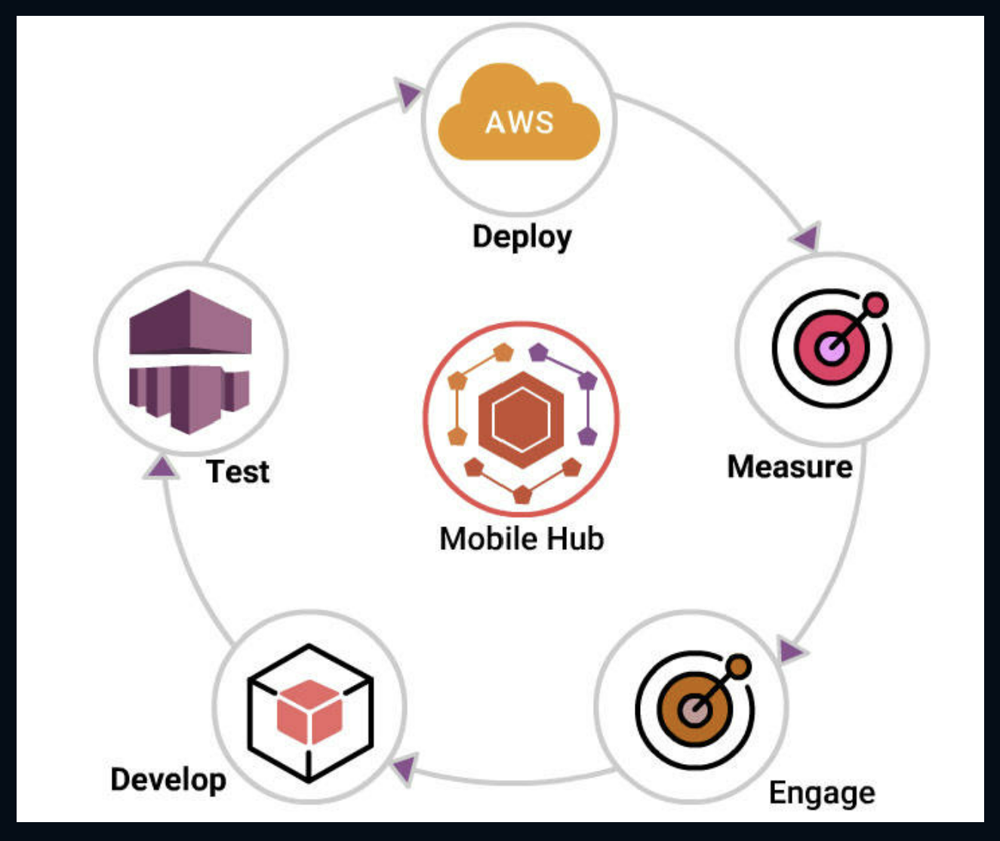

# AWS

## Cloud Computing

- It is type of **Internet-based computing** that provides **shared computer processing resources** and **data to computers and other devices on demand**.
- It is a model for enabling ubiquitous, on-demand access to **shared pool of configurable computing resources** (e.g. **computer networks, servers, storage, applications and services**) provisioned **minimal management effort.**
- This relies on sharing of resources to achieve **coherence and economy of scale**, similar to a utility (like the electricity grid over an electricity network.)

## Cloud Characteristics

**National Institute of Standards and Technology (NIST)** highlights various characteristics that are needed for a **service** to be regarded as **"Cloud"**.

- **On-demand self-service** - Sign up and enjoy the services without delays
- **Broad network access** - Access service through standard platforms (laptop, mobile, desktop, etc.)
- **Resource pooling** - Resources are pooled to multiple customers
- **Rapid elasticity** - Ability to meet with demand peaks
- **Measured Service** - Billing is metered and delivered as a utility service

Three unique **categories** within Cloud Computing:

- **Software as a Service (SaaS)**
- **Platform as a Service (PaaS)**
- **Infrastructure as a Service (IaaS)**

### Software as a Service (SaaS)

- Capability to run applications on a cloud infrastructure
- Applications are accessible from several client devices via either a thin client interface, like a web browser e.g., web-based email
- Interplay between outside world and organization. e.g., email newsletter campaign software
- Software for a short term requirement e.g., collaboration software for particular project
- **"Vanilla"** offerings where the solution is not differentiated
- Consumer does not control or manage the underlying cloud infrastructure, which includes servers, network, operating systems and storage

**SaaS** is not **suitable** in scenarios where the application

- processes quick real time data
- has a regulation or legislation that does not allow data being hosted externally
- existing on-premise solution that satisfies all of the requirements of organization

### Platform as a Service (PaaS)

**Computing platform** that permits creating web applications effortlessly, fast, with no complexity of buying or maintaining the infrastructure and software

- Services to develop and test applications, as well as deploy, host and maintain applications in the similar integrated development environment
- Ability to deploy on cloud infrastructure with the help of programming languages, services, libraries, and tools
- Built in scalability of deployed software with failover and load balancing
- Integration with databases and web services through common standards

**PaaS** is not **suitable** in scenarios where the application

- requires to be more portable with respect to where it is hosted
- performance needs customization of the underlying software and hardware
- proprietary approaches or languages would affect the development process

### Infrastructure as a Service (IaaS)

Capability to provide networks, processing, storage, and other fundamental computing resources, and ability to deploy, run arbitrary software that can include operating systems and applications. Here, the consumer is incompetent of controlling or managing the underlying cloud infrastructure

- Resources are distributed as a service and enables dynamic scaling
- Utility pricing model
- Multiple users on one hardware **Applicability**
- New organizations with less capital would invest in hardware easily
- Organizations growing rapidly
- Pressure on the organization to restrict capital expenditure and to migrate to operating expenditure

**IaaS** is not **suitable** in cases where

- strict regulatory compliance is followed
- very high level of performance is required

## More on Cloud Computing

Let's discuss some advantages to moving to the cloud

- Variable as opposed to upfront Fixed cost
- Economics of scale can reduce Operating cost
- It's easier to match capacity to demand
- It allow you to focus on developing and deploying applications instead of the undifferentiated heavy lifting associated with managing an on-premises data center
- It allows you to increase the velocity of your Agile development and allows a global presence right out of the gate

## Types of Cloud Services

Following are the different types of services that are offered by cloud

1. Infrastructure as a Service: Which allows you to easily provision the IT components you require; including networking capabilities, computers, multi-tenant or dedicated, and data storage. It's flexible and allows you to control and manage your IT resources similar to the way you would in a traditional on-premises data center, such as EC2, S3, and VPC
2. Platform as a Service: It frees you from having to manage the underlying infrastructure and focus on the deployment and management of your application. It frees you from having to think about resource procurement, capacity planning, software maintenance, and patching. Examples of Platform as a Service on AWS include Route 53, Elastic Load Balancing, and Auto Scaling
3. Software as a Service: It provides you with an application that is run and managed entirely by a service provider. Think of SaaS as an end-user application running in the cloud. In a SaaS environment, you have access to the capabilities of an application without the hassle of how it's maintained or it's underlying infrastructure

## Geographical dispersement

Next let's take a look at the infrastructure in terms of its geographical dispersement

- Regions are geographical areas, such as California, that contain multiple data centers in what are called availability zones
- Availability zones are separate physical data centers that may exist within a particular region, but has separate infrastructure dependencies, such as the electrical power grid, flood plain, and any other factors that might isolate it from the potential of outages
- In addition to AZs, AWS supports numerous Edge locations. Throughout the globe, there's a lot more Edge locations than there are AZs. And these are small kind of point of presense services used to deliver content, such as the **Cloud Front and Content Distribution Network**
- Infrastructure usage is the idea that you pay only for what you use, such as EC2. EC2 has various options, one of which is on-demand which is where you only pay for the instance as long as you're using the instance or it's running.
- Pricing concepts include paying for infrastructure usage, such as when using EC2; and data usage and transfer, such as when using **Amazon S3 or DynamoDB**
- Designing for **high availability** is a stricter requirement that designing for **fault tolerance**. For example, in an architecture with a single instance, with an auto scaling group of one, an instance failure will heal itself or replace the instance since the rule might say, "always provide one instance." This is an example of fault tolerance and not high availability. If however, I have an auto scaling group with two instances in different AZs and one fails, the traffic will automatically route to the second instance. This is an example of higher availability.
- Global infrastructure services include **Identity and Access Management(IAM)**. Core services include networking, compute, storage, and databases, Application services include **SNS, SQS, and SWF,** Deployment and management services include **Elastic Beanstalk** and **Cloud formation**

## Features of AWS

AWS offers numerous ways to create and manage resources. Following are the **different ways** to access the features offered by AWS.

- **AWS Management Console** - A web interface for AWS
- **AWS Command Line Interface (AWS CLI)** - Commands for a wide set of AWS products
- **Command Line Tools** - Commands for individual AWS products
- **AWS Software Development Kits (SDK)** - APIs that are specific to programming language or platform
- **Query APIs** - Low-level APIs that are accessible using HTTP requests

## AWS Command Line Interface

The **AWS Command Line Interface** is a unified tool that manages several **AWS services** from the command line and automates all the services through scripts
**aws-shell** is a command-line shell program to offer productivity and ease features to aid advanced and new users of the **AWS Command Line Interface**

**Key Features Include**:

- Fuzzy auto-completion for Resource identifiers, Options, Commands
- Dynamic in-line documentation
- Execution of OS shell commands
- Export executed commands to a text editor

## AWS Cloud - Products

Let us explore about different type of products in AWS:

- Compute - AWS provides numerous compute products that allows you to deploy, run, and scale applications as virtual servers, code or containers
- Storage - Cloud storage is secure, scalable and reliable component that includes the information used by applications
- Database - AWS provides fully managed NoSQL and relational databases, and in-memory cache to suit your application needs
- Developer Tools - AWS Developer tools is a set of services that are offered to allow developers securely version control and store the source code of applications. Also, it aids to build, test and deploy the application automatically
- Management Tools - Aids you to manage the applications and resources
- Security and Compliance - Allows customers to know the proficient controls at AWS to maintain data protection and security in the cloud
- Messaging - Provides several messaging services and tools with diverse abilities
- Application Services - Offers a plethora of managed services for use with applications such as converting digital media into different formats, including search to your website, and hosting streaming application

## Compute in AWS Cloud

**Compute** forms the nucleus of creating and executing business

AWS provides several **compute** products that allows to deploy, run, and scale applications as virtual servers, code, or containers

**Compute Covers**

- Simple websites and applications on one or a few servers
- Control and manage cluster or server level functions such as deployment and scaling
- Manage stateful or stateless applications packaged as Docker containers
- Stateless, event-initiated applications that require fast response times

## AWS Compute Offerings

Different **Compute** services offered by **AWS**

- **Amazon EC2** - Virtual Servers in the Cloud
- **Amazon EC2 Container Service** - Run and Manage Docker Containers
- **AWS Lambda** - Run Code in Response to Events
- **Amazon EC2 Container Registry** - Store and Retrieve Docker Images
- **Amazon Lightsail** - Launch and Manage Virtual Private Servers
- **Amazon VPC** - Isolated Cloud Resources
- **AWS Batch** - Run Batch Jobs at Any Scale
- **AWS Elastic Beanstalk** - Run and Manage Web Apps
- **Auto Scaling** - Automatic Elasticity

Amazon Elastic Compute Cloud (EC2)

Amazon EC2 offers **resizable cloud-based** compute capability taking shape as **virtual servers**. There are a broad range of instance types that are easily manageable and exhibit different combinations of **networking capacity, storage, size, amount of memory, and CPU power**.

**_Features_**

- Removes the necessity of upfront investment on computer hardwares
- Commission numerous instances simultaneously
- Pay only for the used quantity
- Change web-scale cloud computing easy

**_Applications_**

- **Big data** - e.g. Hadoop
- **Database software** - e.g. Aurora, DynamoDB
- **Enterprise applications** - e.g. SAP, Oracle
- **Migrations from on-premises environments**
- **Open-source cluster management**

**Amazon ECS** is a scalable, performance container management service to include **Docker containers**. It enables you to run applications at ease on a managed cluster of Amazon EC2 instances.

Amazon EC2 removes the necessity to **install, run, and scale** cluster management infrastructure.

**Applications**

- Web applications
- Microservices
- Batch jobs
- Docker workloads

**AWS Lambda** aims to run code without managing or provisioning servers

- Lambda is the nucleus of **serverless computing**. So build and run services and applications without bothering about servers
- Run code for virtually any type of backend service or application - with no administration
- Upload the code and Lambda handles everything needed to run and scale the code with better availability
- Pay only for the compute time that you use
- Create code to automatically trigger from other AWS services, otherwise call it directly from a mobile or web app

**Applications**

- Web applications
- Mobile backends
- IoT backends
- Stream processing workloads
- File processing workloads

## Storage in AWS Cloud

**Cloud storage** is a vital component of **cloud computing**, including the information utilized by applications.

- Cloud storage is more **secure, scalable,** and **reliable** than conventional on-premises storage systems.
- AWS provides a complete set of cloud storage services to support **archival** and **application** compliance needs.
- **Backup and archive applications, Databases, Internet of Things, Data warehouses, and Big data analytics** depend on data storage architecture.

### AWS - S3

**Amazon S3** can be described as object storage that stores and retrieves any quantity of data from anywhere on the internet. Amazon S3 features a simple web service interface.

- Renders incredible durability
- Scales past trillions of objects globally
- Once data is saved in S3, it can be tiered automatically into minimal cost, long-term cloud storage classes such as **Amazon Glacier** and **S3 Standard - Infrequent Access** for archiving.
- Serves as a target for backup and recovery, and disaster recovery; "data lake" for Big Data analytics, tier in an active archive and bulk repository for user-generated content.

### Amazon Glacier

**Amazon Glacier** is a durable, secure, and economical cloud storage service for long-term backup and data archiving.

- Customers can safely store any data for as low as **$0.004 per gigabyte per month**.
- Considerable amount of savings in contrast to **on-premises** solutions.
- Amazon Glacier offers three choices to access archives for a few minutes to numerous hours.

### Amazon Elastic File System

**Amazon EFS** offers simple, scalable file storage that can be utilized with Amazon EC2 instances in AWS Cloud.

- Amazon EFS is user-friendly and provides a simple interface allowing you to create and configure file system effortlessly and fast.
- Storage capacity is elastic i.e. that shrinks or grows automatically.
- Several Amazon EC2 instances can access an Amazon EFS file system simultaneously, letting Amazon EFS to offer a common data source for workloads as well as applications operating on more than one Amazon EC2 instance.

**Application** - Amazon EFS is offered for better durability and availability for Big Data and analytics applications, container storage, web and content serving, media processing workflows, and enterprise applications.

## Database in AWS Cloud

AWS provides a broad range of database services to suit all application needs. These database services can be started quickly and are fully manageable.

**AWS database services** include:

- **Amazon Relational Database Service (Amazon RDS)** - supporting six widely used database engines.
- **Amazon DynamoDB** - a quick and flexible NoSQL database service.
- **Amazon Aurora** - a MySQL-compatible relational database that delivers five times the performance.
- **Amazon Elasticache** - an in-memory cache service with Memcached and Redis support.
- **Amazon Redshift** - a petabyte-scale data warehouse service.

AWS provides AWS Database Migration Service - a service that enables you to migrate databases to AWS Cloud in an easy and economical manner.

### Amazon RDS

**Amazon RDS** is very easy to **set up, run,** and **scale** a relational database in the cloud.

- offers resizable and low-cost capacity while managing database administration tasks that consume more time
- Amazon RDS offers size similar database engines to select from including **Microsoft SQL Server, Oracle, MariaDB, Amazon Aurora, MySQL, and PostgreSQL**.

### Dynamo DB

**Amazon DynamoDB** is a flexible and quick NoSQL database service for all applications that require single-digit, consistent millisecond latency at any scale.

- Completely cloud managed database, supporting document and key-value store models.
- reliable performance and flexible data model makes it suitable for several applications such as IoT, mobile, ad tech, web, and gaming.

## AWS CodeBuild

- A build service that is fully managed, compiles source code, operate tests, and creates deployable software packages.
- CodeBuild scales endlessly and processes several builds simultaneously, so the builds are not in queue.

**Benefits**

- Secure
- Allows Continuous Integration and Delivery
- Extensible
- Pay as You Go
- Continuous Scaling
- Fully Managed Build Service

## Management Tools in AWS

AWS offers a wide set of services for **IT and System administrators** to seamlessly **manage and monitor** -

- Infrastructure logs and metrics using alarms and real-time dashboards.
- Hybrid infrastructure resources.

AWS also allows to **track, monitor and enforce security and compliance**.

**Services**

- **Amazon EC2 Systems Manager** - Configure and Manage EC2 Instances and On-premises Servers
- **AWS CloudTrail** - Track User Activity and API Usage
- **AWS Config** - Track Resource Inventory and Changes
- **AWS Service Catalog** - Create and Use Standardized Products
- **AWS Personal Health Dashboard** - Personalized view of AWS service health
- **Amazon CloudWatch** - Monitor Resources and Applications
- **AWS Cloud Formation** - Create and Manage Resources with Templates
- **AWS OpsWorks** - Automate Operations with Chef
- **AWS Trusted Advisor** - Optimize Performance and Security

### Amazon CloudWatch

Amazon CloudWatch is a **monitoring service** designed for AWS cloud resources and the applications operate on AWS. Amazon CloudWatch can be used to:

- Automatically react to changes in AWS resources
- Collect, monitor log files and set alarms
- Collect and track metrics

Attain system-wide visibility into **operational health, application performance, and resource utilization**.

Amazon CloudWatch **monitors** AWS resources such as

- Amazon RDS DB instances
- Amazon DynamoDB tables
- Amazon EC2 instances
- Custom metrics or logs created by services and applications

### Amazon CloudTrail

**AWS CloudTrail** is a service that allows **risk auditing, operational auditing, compliance**, and **governance** of AWS account.

- **Routinely monitor and retain events** specific to API calls throughout the AWS infrastructure.
- **Offers history of AWS API calls** for your account, which includes API calls done through the AWS SDKs, AWS Management Console, command line tools, and various AWS services.
  **Reduces** troubleshooting, security analysis, and resource change tracking.

**Benefits**:

- Security Automation
- Visibility Into User and Resource Activity
- Security Analysis and Troubleshooting
- Simplified Compliance

## Networking and Content Delivery in AWS

This ensures provision of

- Global Content Delivery Network (CDN) service that speeds up **delivery of video content, APIs, websites, or other web assets**.
- **Logically isolated section** of AWS cloud, where you can open AWS resources in a **virtual network**.
- Offer **more safe and economical way** to route end users to web applications by translating names into IP address.
- Set up a dedicated network connection from a location to AWS.

### Services offered -

- **Elastic Load Balancing** - High Scale Load Balancing
- **Amazon Route 53** - Scalable Domain Name System
- **Amazon Cloud Front** - Global Content Delivery Network
- **AWS Direct Connect** - Dedicated Network Connection to AWS
- **Amazon VPC** - Isolated Cloud Resources

## Security, Identity and Compliance

- AWS offers **data center and network architecture** built to meet the requirements of the most **security-sensitive organizations**.
- The AWS cloud provides with a platform to **scale and innovate**, while still maintaining a secure environment.
- Pay only for the services been used.

## Security, Identity, and Compliance Products

- **Amazon Inspector** - automated security assessment service, that aids to enhance the compliance and security of applications deployed on AWS
- **AWS Identity and Access Management(IAM)** - controls **users access** to AWS services. **Allows to create, manage users and groups**, and **deny or grant access**.
- **AWS Artifact** - the portal offers on-demand access to AWS compliance and security documents (audit artifacts).
- **Amazon Cloud Directory** - set up flexible cloud-native directories to organize hierarchies of data along numerous dimensions.
- **AWS Certificate Manager** - seemlessly manage, provision, and deploy Secure Sockets Layer (SSL)/Transport Layer Security (TLS) certificates.
- **AWS CloudHSM** - fulfill regulatory, contractual and corporate compliance requirements for data security by utilizing dedicated Hardware Security Module(HSM), **AWS Directory Service** - allows AWS resources and directory-aware workloads to utilize managed Active Directory in AWS Cloud \*for Microsoft Active Directory\*\*.
- **AWS WAF** - web application firewall that aids in protecting web applications from web threats that could eat up excessive resources, or compromise security, hinder application availability.

## AWS IoT

AWS has developed IoT specific services that assists to gather and send data to the cloud. The IoT services makes it comfortable to load and analyze information, and offer the capability to manage devices and stress on developing applications that suit the requirements.
**AWS Greengrass** helps to operate data caching, messaging and local compute for connected devices in a safe way.
**AWS IoT Platform** is a managed cloud platform that allows connected devices interact with other devices and cloud applications securely and easilty. AWS IoT can support **many devices** and **lot of messages**.
**AWS IoT Button** is a programmable button that is based on the Amazon Dash Button hardware. The Wi-Fi device is effortless to configure. AWS IoT Button is offered to developers to use Amazon SNS, Amazon DynamoDB, AWS Lambda, AWS IoT, and several other Amazon Web Services without the need to write device-specific code.

## Messaging

- Fully managed message queues for safe **communication between microservices and applications**
- **Quick, flexible, fully managed push notification service** to transmit specific messages or to fan-out messages to numerous recipients
- Run **targeted campaigns** to create user engagement in mobile applications
- **Cost-effective email service** created on the scalable and reliable infrastructure

## Key offerings

- **Simple Email Service (SES)** - Email Sending and Receiving
- **Pinpoint** - Push Notifications for Mobile Applications
- **Simple Notification Service (SNS)** - Pub or Sub, Mobile Push and SMS
- **Simple Queue Service (SQS)** - Managed Message Queues

## Application Services

AWS Application services have a broad range of services that helps in enhancing the rendering of application over cloud. Main offerings include -
**Amazon Elastic Transcoder** - Simple Scalable Media Transcoding
**Amazon API Gateway** - Build, Deploy, and Manage APIs
**AWS Step Functions** - Coordinate Distributed Applications

### Step Functions

Offers a **graphical console** to **set up and visualize the components** of the application as a **series of steps**.

- Easy to create and run **multistep applications**
- Coordinate the components of microservices and distributed applications using visual workflows
- Create applications from single components that each perform a discrete function to **change and scale applications quickly**
- **Triggers and tracks each step automatically**, and retries when errors are noticed, which ensure your application executes as intended and in order
- Logs the state of every single step. When things go wrong, it is **simple to diagnose and debug issues fast**. You can change and include steps without need to write code, effortlessly evolve the application and **innovate rapidly**
- Manages the underlying infrastructure and operations to ensure application is available at all scales

## API Gateway

**Fully managed service** that allows developers to create, publish, maintain, monitor, and secure APIs easily at any scale.

- Serves as "front door" for applications to access functionality, data, or business logic from your back-end services, like, code running on AWS Lambda, workloads running on Amazon EC2 or any Web application
- Takes care of processing and accepting of **concurrent API calls**, including API version management, monitoring, traffic management, and authorization and access control
- Pay only for the API calls received and the data transferred

**API Gateway Benefits**

- Low-Cost and Efficient
- Performance at Any Scale
- Easily Monitor API Activity
- Streamline API Development
- Secure and Flexible
- Flexible Security Controls
- Create RESTful Endpoints
- Run Your APIS Without Servers

Media **transcoding** in the cloud

Businesses and developers could transcode or convert **media files** from their source format into versions that will playback on devices such as **PCs, tablets and smartphones**

It is designed to be user-friendly, economical, and highly scalable

## Mobile Services in AWS

AWS allows to easily build advanced cloud-powered applications for mobile devices!

**Stream Real-Time Data** - Gather real-time clickstream logs and react quickly.
**Store Shared Data** - Store and query NoSQL data to users and devices.
**Authorize Access** - Securely access cloud resources.
**Send Push Notifications** - Keep users active by transmitting messages reliably.
**Deliver Media** - Detect mobile devices automatically and render content quickly on a global basis.
**Analyze User Behavior** - Track engagement and active users.
**Synchronize Data** - Sync user preferences across devices.
**Manage Media** - Store and share user-generated photos and other media items.
**Authenticate Users** - Manage identity providers and users.

### Everything You Need to Build Mobile Apps

**Bountiful Cloud Services** AWS provides a wide set of **highly scalable, fully managed services** that include **data warehousing, content delivery, streaming, monitoring, databases, storage, logic, and machine learning** in app without the need to manage any infrastructure.

**The Tools To Help You Build** AWS allows to add cloud services to mobile app easily

- Develop a serverless mobile backend
- Manage user identity and sign-in
- Transmit push notifications
- Track usage patterns and maximize your app with in-app analytics
- Test against a huge set of real devices

## AWS Offerings

- **AWS Mobile Hub** - Build, Test, and Monitor Apps
- **Amazon Cognito** - User Identity and App Data Synchronization
- **AWS Mobile SDK** - Mobile Software Development Kit
- **Amazon API Gateway** - Build, Deploy, and Manage APIs
- **Amazon Pinpoint** - Push Notifications for Mobile Apps
- **AWS Device Farm** - Test Android, FireOS, and iOS Apps on Real Devices in the Cloud

AWS Mobile Hub provides an **integrated console** that helps you

- Build
- Test
- Monitor & manage mobile apps

**Mobile Hub** provisions and configures the necessary AWS services and creates a working sample app

## Cognito

Amazon Cognito **reduces** the task of

- Authenticating users, storing, and managing
- Synchronizing data across several applications, platforms, and devices

This functions both offline or online, and enables to save user-specific data securely such as game state and application preferences.

Cognito supports unauthenticated guest users and works with several existing identity providers.

# AWS Access Management

Cloud is a revolutionary transformation in IT, many startups and established enterprises are adopting cloud for its advantages. **Amazon Web Services** is one such global leader in cloud Service providers, when all enterprises are preparing to use the cloud, **Security is a top concern**.

A major threat comes to data in the form of hacking, manual error, unauthorized access etc, to prevent this from happening AWS provides many services to make its cloud environment secure one among them is **AWS IAM(Identity and Access Management)**.

## What is IAM?

**IAM**(Identity and Access Management) is a service provided by Amazon Web Services used to manage Users, Groups and their access to various resources of AWS using **Policies** and **Roles**

## Shared Responsibility Model

Amazon employs a security model in which **security is shared between users and Amazon**, the responsibility of keeping the data secure is divided in a legitimate manner, They are:

**Security "of" the cloud**:

This means that AWS is responsible for the security of AWS Global infrastructure which includes the combination of regions, Availability zones, edge locations and all core service offerings such as Compute, Database, Network, Storage. This also included the physical security.

**Security "in" the cloud**:

This Security in the cloud is responsibility of the users. The security of what you place and operate in cloud is your responsibility like configuring operating system and patching, access controls, identity and access management, privileges to users given, Network, firewall, etc.

### Separation of Duties

**Separation of duties is a way to share the responsibilities that also secures the account. So, let's know how is that possible.**

The **root account** is the account which we use to create the AWS account, **The username and password of AWS root account are highly confidential** because it has the power to do anything in the service selected.

So just using a username and password is not recommended, enable a **Multi-Factor Authentication** for the account in a Physical-MFA device.

Identify **two trusted groups** within the project and give the password to one group and MFA device to other. So to login into root account both the groups need to work with each other.

**It is recommended not to use the root account for day to day use**.

### AWS CloudTrail

**CloudTrail is a management service which is very much useful in IT audit and security**

AWS uses API's for the internal communication protocol. So when you interact with any of the services through SDK or AWS CLI or through the management console they use backend API's to communicate.

When once configured CloudTrail will record all or selected API interactions and stores them in an S3 Bucket, **it records details of API caller, which includes IP address, time etc**.
