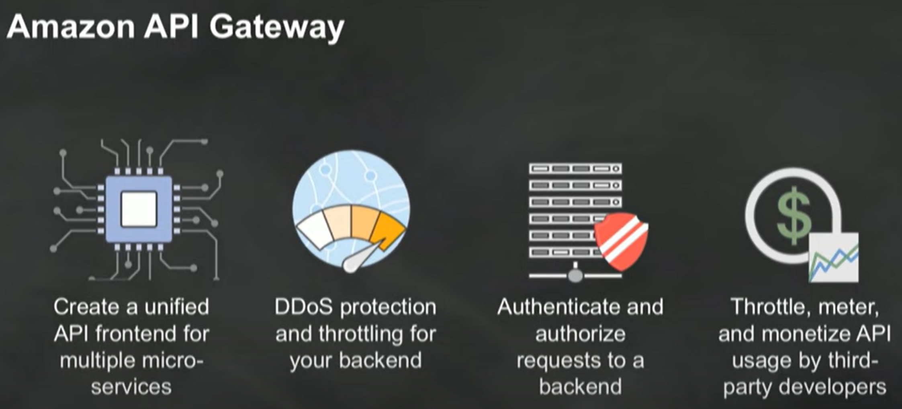

# Serverless

- No servers to provision or manage
- Scales with usage
- Pay for value
- Availability and fault tolerance built in

**Serverless means:**

- Greater agility
- Less overhead
- Better focus
- Increased scale
- More flexibility
- Faster time to market

## AWS Lambda

**Lambda Handles:**

- Load Balancing
- Auto Scaling
- Handling Failures
- Security Isolation
- OS Management
- Managing Utilization _(and many other things) for us_

### Serverless applications

## Anatomy of a Lambda function

- **Handler() function** - Function to be executed upon invocation
- **Event object** - Data sent during Lambda function invocation
- **Context object** - Methods available to interact with runtime information (request ID, log group, more)

### Fine-grained pricing

- Buy compute time in 100ms increments
- Low request charge
- No hourly, daily, or monthly minimums
- No per-device fees
- Never pay for idle

**Free Tier: 1M requests and 400,000 GBs of compute. Every month, every customer**

### Tweak your function's computer power

Lambda exposes only a memory control with the % of CPU core and network capacity allocated to a function proportionally
_Is your code CPU, Network or memory-bound? If so, it could be cheaper to choose more memory_

### Lambda execution model

## Lambda API

- API provided by the Lambda service
- Used by all other services that invoke Lambda across all models
- Supports sync and async
- Can pass any event payload structure you want
- Client included in every SDK

### Lambda permissions model

**Fine grained security controls for both execution and invocation:**

- Execution policies:
  - Define what AWS resources/API calls can use this function access via IAM
  - Used in streaming invocations
  - E.g. "Lambda function A can read from DynamoDB table users"
- Function policies:
  - Used for sync and async invocations
  - E.g. "Actions on bucket X can invoke Lambda function Z"
  - Resource policies allow for cross account access

### Common Lambda use cases

## Amazon API Gateway - Serverless

### API Gateway WebSockets

### Serverless web application with API Gateway

## Serverless Architecture

