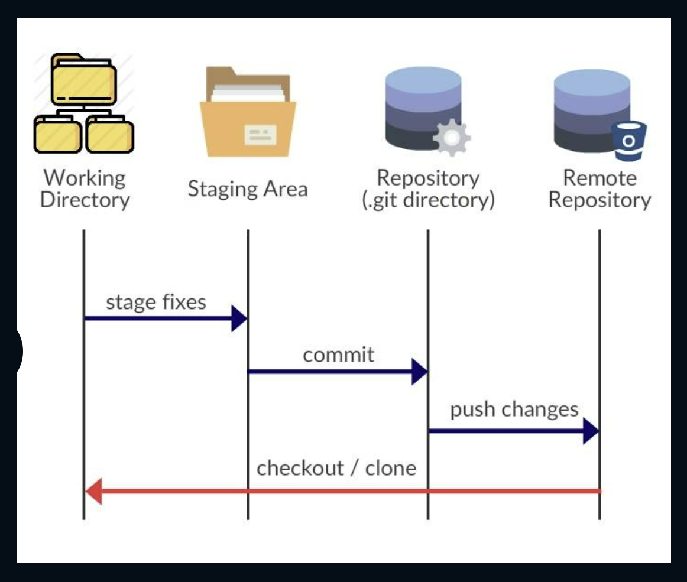
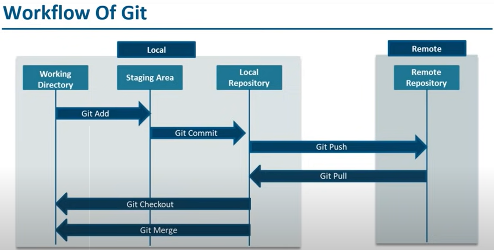

# Bitbucket

## Why Version Control System?

A Version Control System (VCS) is also called a Revision Control System or Source Control System. It helps in tracking and managing changes in a file system, and provides a **collaborative** platform to share and assimilate files to other users.

A VCS helps is tracking addition, deletion, and modification to files and directories.

**Types of Version Control Systems**
There are two types of VCS:

- Centralised VCS
- Distributed VCS

**Bitbucket is a web-based version control repository hosting service. It uses two types of Distributed Revision Control Systems:**

- Git
- Mercurial

Bitbucket is owned by **Atlassian**, and is written in **Python** using the Django Framework. It can be integrated with other softwares:

- Jira
- HipChat
- Confluence
- Bamboo

### Bitbucket - Plans and Models

**Plans** - Bitbucket offers both Commercial plans, and free accounts, and caters to an unlimited number of Private Repositories

**Models** - Bitbucket offer 3 deployment models:

- Bitbucket Server
- Bitbucket Cloud
- Bitbucket Datacenter

**Atlassian renamed Stash as Bitbucket Server**

## Basic Terminology

Some common terminology used in the Bitbucket domain are:

- Repository

  - Storage location
  - Contains all the project files
  - Can be either **Private** or **Public**

- Fork

  - Forking a project enables a user to have a personal copy of a remoate repository, or another user's repository
  - It allows users to experiment with changes in the project without altering the original project

- Clone

  - Aids in downloading an existing Git Repository in Bitbucket, Github, and so on, to your local machine

- Add

  - To add newly created or modified files to the index for the Git to track, **add** is used

- Commit

  - Helps in recording changes to the repository, since the previous commit

- Push

  - Push refers to the process of sending all your local committed changes to a remote repository hosted in Bitbucket or Github

- Fetch

  - Fetch aids in downloading the latest commits, files and references from the remote repository
  - It enables a user to know what the other users have been working on, after the user has cloned the repository to their local machine

- Pull
  - Pull refers to the process of **fetching** changes and **merging** them from remote to local, so that the local repository is up to date

## GIT

- Git is an example of a Distributed Version Control System
- It helps in tracking **Source Code** during the development phase of the SDLC
- Provides history of content changes
- Facilitates collaborative changes amoung developers
- It is a free and open source software

## States of Artifacts

- **Untracked** - User changes the artifact/files in this stage
- **Staged** - Artifacts are added to the index, and files are Staged
- **Committed** - Artifacts are stored in Git database

## Stages of Git Project

- **Working Directory** - It is the root directory of the Git Project in the local system

- **Staging Area** - It also called **Index**. All the changes are built here before being recorded to the Database

- **Git Repository** - The place where all committed files are recorded in the local system

- **Remote Repository** - Remote repository is where all the project files are stored in web by pushing them from the local Git Repository

## Working of Git





# Mercurial

- Mercurial is a distributed revision control tool for developers of software
- It can work on both HTTP and SSH protocol
- Implemented by using Python
- Cross-Platform: Windows, Unix, and MAC

## Basic Commands

**Initializing Repository**

- To initialize a Mercurial Repository, execute the following command to make the current directory as the Mercurial Repository

```
$ hg init
```

- When listing the contents fo the directory, a .hg directory is created

**Cloning Repository**

- To clone a remote repository to your local system, execute the following command:

```
$ hg clone <repo-url> <name-of-repo-in-local>
```

**History of Repository**
To view the repository history:

```
$ hg log
```

Output Parameters:
_ChangeSet_: A changeset is a logical unit which has a group of files that are modified.

1. **changeset**: Contains revision number details
2. **tag**: Symbolic name of a Changeset
3. **user**: Identifies the user who incorporated the changes
4. **date**: Describes the creation time of a Changeset
5. **summary**: Displays the first line of a Changeset

**Status of File**
To determine the status of a particular file, use the following command:

```
$ hg status
```

**Identify the changes made**
To know the actual changes made in a file, execute the following command:

```
$ hg diff
```

**Sharing a Change**
Mercurial allows you to share a change to another person

```
$ hg export tip
```

**Add files**
To add unknown files to a staging area:

```
$ hg add
```

**Commit**
To commit all changes to a new Changeset:

```
$ hg commit
```

**Pull**
To pull the change set from the remote repository:

```
$ hg pull <repo-name>
```

**Merge**
This command helps in merging new change sets from the remote repository, to the local repository

```
$ hg merge
```

Mercurial operations are invoked as arguments to its driver program hg, which is the chemical symbol of the element _mercury_.

## Git v/s Mercurial

Git is a free distributed revision control, or software source code management project with an emphasis on being fast. Git was initially created by Linus Trovalds for Linux kernel development

Mercurial is a cross-platform, distributed revision control tool for software developers. It is mainly implemented using the Python, but includes a binary diff implementation written in C

## Bitbucket Client

Bitbucket coordinates and works with many clients:

- Command Line Interface (CLI)
- SourceTree GUI

### CLI with Bitbucket

Bitbucket can be integrated with CLI by executing the standard set of Git commands.

Clone a repository from Bitbucket

```
$ git clone <Bitbucket_repo_url>
```

Add file to the index

```
$ get add <file_name>
```

Commit the changes

```
$ git commit -m <log-message> <filename>
```

Pull changes from remote reference

```
$ git pull
```

Push changes to Bitbucket

```
$ git push <remote> <local-branch-name>[:<new-remote-branch-name>]
```

## SourceTree

SourceTree is a free GUI client that works with both Mercurial and Git. It is compatible with **Windows** and **Mac** platforms, and is a fully-featured GUI that offers consistent and effective development process right out of the box

### Features of SourceTree

- SourceTree integrates **Git Large File System**, which allows developers to keep track and manage large assets in one single place
- SourceTree supports **Interactive Rebase tool** to undo commits
- SourceTree aids in **cloning** and **searching** a repository within its user interface
- It works with: Git and Mercurial
- Can be easily downloaded to your local desktop machine
- Provides powerful visualization through detailed branching diagrams to keep track of project progress

## Bitbucket Integrations with IDE's

- Bitbucket enables teams to have a single place for the entire Software Development Life Cycle phases:

  - Plan
  - Code
  - Test
  - Deploy

- Bitbucket has a built-in feature of being integrated with many IDEs:
  - Eclipse
  - Visual Studio
  - Jenkin
  - Android Studio

## Bitbucket Server

A Bitbucket server:

- Is a combination of **Git** and **Web Interface** developed in Java
- Has built-in Apache Maven
- Enables users to do basic Git operations
- Is a commercial software product
- Can integrate free projects and open source projects
- Helps in hosting your own server

**CI/CD Pipelines**

- DevOps is all about building and managing CI/CD pipelines
- To deliver a software successfully, developers must connect multiple tools, followed by writing the pipeline for it
- Automating CI/CD pipeline is always an ingredient in the too hard basket
- Bitbucket pipelines make the automation process of CI/CD pipeline easier
