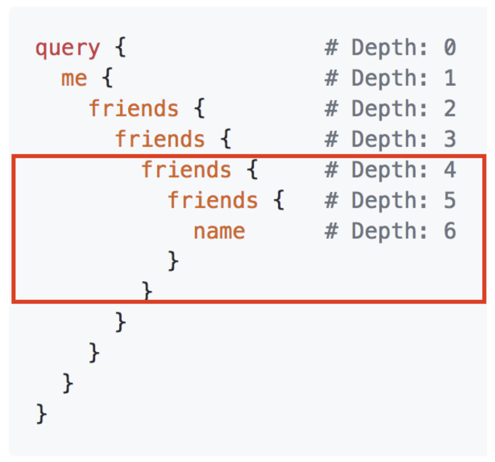

## What is GraphQL?

- new **API** standard that was invented & open-sourced by Facebook
- enables **declarative data fetching**
- GraphQL server exposes **single endpoint** and responds to **queries**

### A more efficient Alternative to REST

1. Increased mobile usage creates need for efficient data loading
2. Variety of different frontend frameworks and platforms on the client-side
3. Fast development speed & expectation for rapid feature development

### GraphQL is _not_ only for React Developers

- Facebook uses GraphQL since 2012 in their native mobile apps
- First time presented publicly at React.js Conf 2015
- GraphQL can be used with any programming language and framework

## GraphQL is the better REST

### GraphQL v/s REST

- **Great ideas in REST**: stateless servers & structured access to resources
- **REST is a strict specification**: but the concept was wildly interpreted
- Rapidly **changing requirements on client-side** don't go well with the static nature of REST

GraphQL was developed to cope with the **need for more flexibility and efficiency** in client-server communication

### REST example


### GraphQL example


We handle everything with a single request in GraphQL which is a POST request and in this request we mention the requirements of our application:

**Request**


**Response**


### Benefits of GraphQL over REST

- No more Overfetching and Underfetching

  - **Overfetching**: Downloading unnecessary data
  - **Underfetching**: An endpoint doesn't return enough of the right information; need to send multiple requests (n+1-requests problem)

- Rapid Production Iterations

  - **REST**: structure endpoints according to client's data needs
  - **GraphQL**: No need to adjust API when product requirements and design changes. Faster feedback cycles and product iterations

- Insightful Analytics

  - Fine-grained info about what data is read by clients
  - Enables evolving API and deprecating unneeded API features
  - Great opportunities for instrumenting and performance monitoring

- Benefits of Schema & Types

  - GraphQL uses strong type system to define capabilities of an API
  - _Schema_ serves as _contract_ between client and server
  - Frontend and backend teams can work completely independent from each other

# Core Concepts

## The Schema Definition Language (SDL)

GraphQL has its own type system that's used to define the schema of an API. The syntax for writing schemas is called **Schema Definition Language(SDL)**

Here is an example of how we can use the SDL to define a simple type called **Person**:

```
type Person {
    name: String!
    age: Int!
}
```

This type has two fields, they're called **name** and **age** and are respectively of type **String** and **Int**. The **!** following the type means that this field is required

It's also possible to express relationships between types. In this example of a blogging application, a **Person** could be associated with a **Post**:

```
type Post {
    title: String!
    author: Person!
}
```

Conversely, the other end of the relationship needs to be placed on the **Person** type:

```
type Person {
  name: String!
  age: Int!
  posts: [Post!]!
}
```

Note that we just created a one-to-many-relationship between **Person** and **Post** since the **posts** field on **Person** is actually an array of posts

## Fetching Data with Queries

When working with REST APIs, data is loaded from specific endpoints. Each endpoint has a clearly defined structure of the information that it returns. This means that the data requirements of a client are effectively encoded in the URL that it connects to.

The approach that's taken in GraphQL is radically different. Instead of having multiple endpoints that return fixed data structures, GraphQL APIs typically only expose a _single endpoint_. This works because the structure of the data that's returned is not fixed. Instead, it's completely flexible and lets the client decide what data is actually needed.

That means that the client needs to send more _information_ to the server to express its data needs - this information is called a _query_

**Basic Queries**
Let's take a look at an example query that a client could send to a server:

```
{
  allPersons {
    name
  }
}
```

The **allPersons** field in this query is called the _root_ field of the query. Everything that follows the root field, is called the _payload_ of the query. The only field that's specified in this query's payload is **name**

This query would return a list of all persons currently stored in the database. Here's an example response:

```
{
  "allPersons": [
    {"name": "Johnny"},
    {"name": "Sarah"},
    {"name": "Alice"}
  ]
}
```

Notice that each person only has the **name** in the response, but the **age** is not returned by the server. That's exactly because **name** was the only field that was specified in the query

If the client also needed the persons **age**, all it has to do is slightly adjust the query and include the new field in the query's payload:

```
{
  allPersons {
    name
    age
  }
}
```

One of the major advantages of GraphQL is that it allows for naturally querying _nested_ information. For example, if you wanted to load all the **posts** that a **Person** has written, you could simply follow the structure of your types to request this information:

```
{
  allPersons {
    name
    age
    posts {
      title
    }
  }
}
```

### Queries with Arguments

In GraphQL, each field can have zero or more arguments if that's specified in the _schema_. For example, the **allPersons** field could have a **last** parameter to only return up to a specific number of persons. Here's what a corresponding query would look like:

```
{
  allPersons(last: 2) {
    name
  }
}
```

### Writing Data with Mutations

Next to requesting information from a server, the majority of applications also need some way of making changes to the data that's currently stored in the backend. With GraphQL, these changes are made using so-called _mutations_. There generally are three kinds of mutations:

- creating new data
- updating existing data
- deleting existing data

Mutations follow the same syntactical structures as queries, but they always need to start with **mutation** keyword. Here's an example of how we might create a new **Person**:

```
mutation {
  createPerson(name: "Bob", age: 36) {
    name
    age
  }
}
```

Notice that similar to the query we wrote before, the mutation also has a _root field_ - in this case it's called **createPerson**. We also already learned about the concepts of arguments for fields. In this case, the **createPerson** field takes two arguments that specify the new person's **name** and **age**.

Like with a query, we're also able to specify a payload for a mutation in which we can ask for different properties of the new **Person** object. In our cse, we're asking for the **name** and **age** - though admittedly that's not super helpful in our example since we obviously already know them as we pass them into the mutation. However, being able to also query information when sending mutations can be a very powerful tool that allows you to retrieve new information from the server in a single roundtrip!

The server response for the above mutation would look as follows:

```
"createPerson": {
  "name": "Bob",
  "age": 36,
}
```

One pattern you'll often find is that GraphQL types have unique IDs that are generated by the server when new objects are created. Extending our **Person** type from before, we could add an **id** like this:

```
type Person {
  id: ID!
  name: String!
  age: Int!
}
```

Now, when a new **Person** is created, you could directly ask for the **id** in the payload of the mutation, since that is information that wasn't available on the client beforehand:

```
mutation {
  createPerson(name: "Alice", age: 36) {
    id
  }
}
```

## Realtime Updates with Subscriptions

Another important requirement for many applications today is to have a _realtime_ connection to the server in order to get immediately informed about important events. For this use case, GraphQL offers the concept of _subscriptions_.

When a client _subscribes_ to an event, it will initiate and hold a steady connection to the server. Whenever that particular event then actually happends, the server pushes the corresponding data to the client. Unlike queries and mutations that follow a typical _"request-response-cycle"_, subscriptions represent a _stream_ of data sent over to the client.

Subscriptions are written using the same syntax as queries and mutations. Here's an example where we subscribe on events happening on the **Person** type:

```
subscription {
  newPerson {
    name
    age
  }
}
```

After a client sent this subscription to a server, a connection is opened between them. Then, whenever a new mutation is performed that creates a new **Person**, the server send the information about this person over to the client

```
{
  "newPerson": {
    "name": "Jane",
    "age": 23
  }
}
```

## Defining a Schema

Now that you have a basic understanding of what queries, mutations, and subscriptions look like, let's put it all together and learn how you can write a schema that would allow you to execute the examples you've seen so far.

The _schema_ is one of the most important concepts when working with a GraphQL API. It specifies the capabilities of the API and defines how clients can request the data. It is often seen as a _contract_ between the server and the client.

Generally, a schema is simply a collection of GraphQL types. However, when writing the schema for an API, there are some special _root_ types:

```
type Query { ... }
type Mutation { ... }
type Subscription { ... }
```

The **Query, Mutation,** and **Subscription** types are the entry points for the requests sent by the client. To enable the **allPersons**-query that we saw before, the **Query** type would have to be written as follows:

```
type Query {
  allPersons: [Person!]!
}
```

**allPersons** is called a _root field_ of the API. Considering again the example where we added the **last** argument to the **allPersons** field, we'd have to write the **Query** as follows:

```
type Query {
  allPersons(last: Int): [Person!]!
}
```

Similarly, for the **createPerson**-mutation, we'll have to add a root field to the **Mutation** type:

```
type Mutation {
  createPerson(name: String!, age: Int!): Person!
}
```

Notice that this root field takes two arguments as well, the **name** and the **age** of the new **Person**.

Finally, for the subscriptions, we'd have to add the **newPerson** root field:

```
type Subscription {
  newPerson: Person!
}
```

Putting it all together, this is the full schema for all the queries and mutation that you have seen in this chapter:

```
type Query {
  allPersons(last: Int): [Person!]!
  allPosts(last: Int): [Post!]!
}

type Mutation {
  createPerson(name: String!, age: Int!): Person!
  updatePerson(id: ID!, name: String!, age: String!): Person!
  deletePerson(id: ID!): Person!
  createPost(title: String!): Post!
  updatePost(id: ID!, title: String!): Post!
  deletePost(id: ID!): Post!
}

type Subscription {
  newPerson: Person!
  updatedPerson: Person!
  deletedPerson: Person!
  newPost: Post!
  updatedPost: Post!
  deletedPost: Post!
}

type Person {
  id: ID!
  name: String!
  age: Int!
  posts: [Post!]!
}

type Post {
  id: ID!
  title: String!
  author: Person!
}
```

## Architectural Use Cases

1. GraphQL server with a connected database
2. GraphQL server to integrate existing system
3. A Hybrid approach with a connected database and integration of existing system

### 1. GraphQL server with a connected database

This architecture will be the most common for _greenfield_ projects. In the setup, you have a single (web) server that implements the GraphQL specification. When a query arrives at the GraphQL server, the server reads the query's payload and fetches the required information from the database. This is called _resolving_ the query. It then constructs the response object [as described in the official specification](https://spec.graphql.org/June2018/#sec-Response) and returns it to the client.

It's important to note that GraphQL is actually _transport-layer agnostic_. This means it can potentially be used with any available network protocol. So, it is potentially possible to implement a GraphQL server based on TCP, WebSockets, etc.

GraphQL also doesn't care about the database or the format that is used to store the data. You could use a SQL database like AWS Aurora or a NoSQL database like MongoDB

<figure>
    
    <figcaption>A standard greenfield architecture with one GraphQL server that connects to a single database</figcaption>
</figure>

### 2. GraphQL layer that integrates existing systems

Another major use case for GraphQL is the integration of multiple existing systems behind a single, coherent GraphQL API. This is particularly compelling for companies with legacy infrastructures and many different APIs that have grown over years and now impose a high maintenance burden. One major problem with these legacy systems is that they make it practically impossible to build innovative products that need access to multiple systems.

In that context, GraphQL can be used to _unify_ these existing systems and hide their complexity behind a nice GraphQL API. This way, new client applications can be developed that simply talk to the GraphQL server to fetch the data they need. The GraphQL server is then responsible for fetching the data from the existing systems and package it up in the GraphQL response format.

Just like in the previous architecture where the GraphQL server didn't care about the type of database being used, this time it doesn't care about the data sources that it needs to fetch the data that's needed to _resolve_ a query.

<figure>
    
    <figcaption>GraphQL allows you to hide the complexity of existing systems, such as microservices, legacy infrastructures or third-party APIs behind a single GraphQL interface</figcaption>
</figure>

### 3. Hybrid approach with connected database and integration of existing system

Finally, it's possible to combine the two approaches and build a GraphQL server that has a connected database but still talks to legacy or third-party systems. When a query is received by the server, it will resolve it and either retrieve the required data from the connected database or some of the integrated APIs.

<figure>
    
    <figcaption>Both approaches can also be combined and the GraphQL server can fetch data from a single database as well as from an existing system - allowing for complete flexibility and pushing all data management complexity to the server</figcaption>
</figure>

## Resolver Functions

But how do we gain this flexibility with GraphQL? How is it that it's such a great fit for these very different kinds of use cases?

As we saw previously, the payload of GraphQL query(or mutation) consists of a set of fields. In the GraphQL server implementation, each of these fields actually corresponds to exactly one function that's called a _resolver_. The sole purpose of a resolver function is to fetch the data for its field.

When the server receives a query, it will call all the functions for the fields that are specified in the query's payload. It thus _resolves_ the query and is able to retrieve the correct data for each field. Once all resolvers returned, the server will package data up in the format that was described by the query and send it back to the client.

<figure>
    
    <figcaption>The above screenshot contains some of the resolved field names. Each field in the query corresponds to a resolver function. The GraphQL calls all required resolvers when a query comes in to fetch the specified data</figcaption>
</figure>

## GraphQL Client Libraries

GraphQL is particularly great for frontend developers since it completely eliminates many of the inconveniences and shortcomings that are experienced with REST APIs, such as over-fetching and under-fetching. Complexity is pushed to the server-side where powerful machines can take care of the heavy computation work. The client doesn't have to know where the data that it fetches is actually coming from and can use a single, coherent, and flexible API.

Let's consider the major change that's introduced with GraphQL in going from a rather imperative data fetching approach to a purely declarative one. When fetching data from a REST API, most applications will have to go through the following steps:

1. construct and send HTTP request (e.g. with **fetch** in Javascript)
2. receive and parse server response
3. store data locally (either simply in memory or persistent)
4. display data in the UI

With the ideal _declarative data fetching_ approach, a client shouldn't be doing more than the following two steps:

1. describe data requirements
2. display data in UI

All the lower-level networking tasks as well as storing the data should be abstracted away and the declaration of data dependencies should be the dominant part.

This is precisely what GraphQL client libraries like Relay or Apollo will enable you to do. They provide the abstraction that you need to be able to focus on the important parts of your application rather than having to deal with the repetitive implementation of infrastructure.

## Advanced Tutorial - Clients

Working with a GraphQL API on the frontend is a great opportunity to develop new abstractions and help implement common functionality on the client-side. Let's consider some "infrastructure" features that you probably want to have in your app:

- send queries and mutations directly without constructing HTTP requests
- view-layer integration
- caching
- validation and optimization of queries based on the schema

Of course, nothing stops you from using plain HTTP to fetch your data and then shifting all the bits yourself until the right information ends up in your UI. But, GraphQL provides the ability to abstract away a lot of the manual work you'd usually have to do during that process and lets you focus on the real important parts of the app.

There are two major GraphQL clients available at the moment. The first one is **Apollo Client**, which is a community-driven effort to build a powerful and flexible GraphQL client for all major development platforms. The second one is called **Relay** and it is Facebook's homegrown GraphQL client that heavily optimizes for performance and is only available on the web.

### Send Queries and Mutations Directly

One major benefit of GraphQL is that it allows you to fetch and update data in a _declarative manner_. Put differently, we climb up one step higher on the API abstraction ladder and don't have to deal with low-level networking tasks ourselves anymore.

Where you previously used plain HTTP (like **fetch** in Javascript or **NSURLSession** on iOS) to load data from an API, all you need with GraphQL is a query where you declare your data requirements and let the system take care of sending the request and handling the response for you. This is precisely what a GraphQL client will do.

### View Layer Integrations & UI updates

Once the server response is received and handled by the GraphQL client, the requested data somehow needs to end up in our UI. Depending on the platforms and frameworks you're developing with, there will be different approaches to how UI updates are handled in general.

Taking React as an example, GraphQL clients use the concept of **higher-order components** to fetch the needed data under the hood and make it available in the **props** of your components. In general, the declarative nature of GraphQL ties in particularly well with **functional reactive programming techniques**. These two form a powerful combination where a view simply declares its data dependencies and the UI is wired up with an FRP layer of your choice.

### Caching Query Results: Concepts and Strategies

In the majority of applications, you'll want to maintain a cache of the data that was previously fetched from the server. Caching information locally is essential to provide a fluent user experience and also takes the load off your user's data plans.

Generally, when caching data, the intuition is to put information that's fetched remotely into a local _store_ from where it can be retrieved later on. With GraphQL, the naive approach would be to simply put the results of GraphQL queries into the store and simply return them whenever the same query is sent. It turns out this approach is very inefficient for most applications.

A more beneficial approach is to _normalize_ the data beforehand. That menas that the (potentially nested) query result gets flattened and the store will only contain individual records that can be referenced with a globally unique ID. If you want to learn more about this, the **Apollo blog** has a great write-up on the topic.

### Build-time Schema Validation & Optimizations

Since the schema contains _all_ information about what a client can potentially do with a GraphQL API, there is a great opportunity to validate and potentially optimize the queries that a client wants to send already at build-time.

When the build environment has access to the schema, it can essentially parse all the GraphQL code that's located in the project and compare it against the information from the schema. This catches typos and other errors before an application gets into the hands of actual users where the consequences of an error would be a lot more drastic.

### Colocating Views and Data Dependencies

A powerful concept of GraphQL is that it allows you to have UI code and data requirements side-by-side. The tight coupling of views and their data dependencies greatly improves the developer experience. The mental overhead of thinking about how the right data ends up in the right parts of the UI is eliminated.

How well colocation works depend on the platform you're developing on. For example in JavaScript applications it's possible to actually put data dependencies and UI code into the same file.

## Server

GraphQL is often explained as a frontend-focused API technology because it enables client to get data in a much nicer way than before. But the API itself is, of course, implemented on the server side. There are a lot of benefits to be had on the server as well because GraphQL enables the server developer to focus on describing the data available rather than implementing and optimizing specific endpoints.

### GraphQL execution

GraphQL doesn't just specify a way to describe schemas and a query language to retrieve data from those schemas, but an actual execution algorithm for how those queries are transformed into results. This algorithm is quite simple at its core: The query is traversed field by field, executing "resolvers" for each field. So, let's say we have the following schema:

```
type Query {
  author(id: ID!): Author
}

type Author {
  posts: [Post]
}

type Post {
  title: String
  content: String
}
```

The following is a query we would be able to send to a server with that schema:

```
query {
  author(id: "abc") {
    posts {
      title
      content
    }
  }
}
```

The first thing to see is that every field in the query can be associated with a type:

```
query: Query {
  author(id: "abc"): Author {
    posts: [Post] {
      title: String
      content: String
    }
  }
}
```

Now, we can easily find the resolvers in our server to run for every field. The execution starts at the query type and goes breadth-first. This means we run the resolver for **Query.author** first. Then, we take the result of that resolver, and pass it into its child, the resolver for **Author.posts**. At the next level, the result is a list, so in that case, the execution algorithm runs on one item at a time. So the execution works like this:

```
Query.author(root, {id: 'abc'}, context) -> author
Author.posts(author, null, context) -> posts
for each post in posts
  Post.title(post, null, context) -> title
  Post.content(post, null, context) -> content
```

At the end, the execution algorithm puts everything together into the correct shape for the result and returns that. One thing to note is that most GraphQL server implementations will provide "default resolvers" - so you don't have to specify a resolver function for every single field. In GraphQL.js, for example, you don't need to specify resolvers when the parent object of the resolver contains a field with the correct name.

### Batched Resolving

One thing you might notice about the execution strategy above is that it's somewhat naive. For example, if you have a resolver that fetches from a backend API or database, that backend might get called many time during the execution of one query. Let's imagine we wanted to get the authors of several posts, like so:

```
query {
  posts {
    title
    author {
      name
      avatar
    }
  }
}
```

If these are posts on a blog, it's likely that many of the posts will have the same authors. So, if we need to make an API call to get each author object, we might accidentally make multiple requests for the same one. For example:

```
fetch('/authors/1')
fetch('/authors/2')
fetch('/authors/1')
fetch('/authors/2')
fetch('/authors/1')
fetch('/authors/2')
```

How do we solve this? By making our fetching a bit smarter. We can wrap our fetching function in a utility that will wait for all of the resolvers to run, then make sure to only fetch each item once:

```
authorLoader = new AuthorLoader()

// Queue up a bunch of fetches
authorLoader.load(1);
authorLoader.load(2);
authorLoader.load(1);
authorLoader.load(2);

// Then, the loader only does the minimal amount of work
fetch('/authors/1');
fetch('/authors/2');
```

Can we do even better? Yes, if our API supports batched requests, we can do only one fetch to the backend, like so:

```
fetch('/authors?ids=1,2');
```

This can also be encapsulated in the loader above.

## More GraphQL Concepts

### Enhancing Reusability with Fragments

Fragments are a handy feature to help to improve the structure and reusability of your GraphQL code. A fragment is a collection of fields on a specific type.

Let's assume we have the following type:

```
type User {
  name: String!
  age: Int!
  email: String!
  street: String!
  zipcode: String!
  city: String!
}
```

Here, we could represent all the information that relates to the user's physical address into a fragment:

```
fragment addressDetails on User {
  name
  street
  zipcode
  city
}
```

Now, when writing a query to access the address information of a user, we can use the following syntax to refer to the fragment and save the work to actually spell out the four fields:

```
{
  allUsers {
    ... addressDetails
  }
}
```

This query is equivalent to writing:

```
{
  allUsers {
    name
    street
    zipcode
    city
  }
}
```

### Parameterizing Fields with Arguments

In GraphQL type definitions, each field can take zero or more _arguments_. Similar to arguments that are passed into functions in typed programming languages, each argument needs to have a _name_ and a _type_. In GraphQL, it's also possible to specify _default values_ for arguments.

As an example, let's consider a part of the schema that we saw in the beginning:

```
type Query {
  allUsers: [User!]!
}

type User {
  name: String!
  age: Int!
}
```

We could now add an argument to the **allUsers** field that allows us to pass an argument to filter users and include only those above a certain age. We also specify a default value so that by default all users will be returned:

```
type Query {
  allUsers(olderThan: Int = -1): [User!]!
}
```

This **olderThan** argument can now be passed into the query using the following syntax:

```
{
  allUsers(olderThan: 30) {
    name
    age
  }
}
```

### Named Query Results with Aliases

One of GraphQL's major strengths is that it lets you send multiple queries in a single request. However, since the response data is shaped after the structure of the fields being requested, you might run into naming issues when you're sending multiple queries asking for the same fields:

```
{
  User(id: "1") {
    name
  }
  User(id: "2") {
    name
  }
}
```

In fact, this will produce an error with a GraphQL server, since it's the same field but different arguments. The only way to send a query like that would be use aliases, i.e. specifying names for the query results:

```
{
  first: User(id: "1") {
    name
  }
  second: User(id: "2") {
    name
  }
}
```

In the result, the server would now name each **User** object according to the specified alias:

```
{
  "first": {
    "name": "Alice"
  },
  "second": {
    "name": "Sarah"
  }
}
```

### Advanced SDL

The SDL offers a couple of language features that weren't discussed in the previous chapter. In the following, we'll discuss those by practical examples.

**Object & Scaler Types**

In GraphQL, there are two different kinds of types

- _Scaler_ types represents concrete units of data. The GraphQL spec has five predefined scalars: as **String, Int, Float, Boolean, and ID**.
- _Object_ types have fields that express the properties of that type and are composable. Examples of object types are the **User** or **Post** types we saw in the previous section.

In every GraphQL schema, you can define your own scalar and object types. An often cited example for a custom scalar would be a **Date** type where the implementation needs to define how that type is validated, serialized, and deserialized.

**Enums**

GraphQL allows you to define _enumerations_ types (short enums), a language feature to express the semantics of a type that has a fixed set of values. We could thus define a type called **Weekday** to represent all the days of a week:

```
enum Weekday {
  MONDAY
  TUESDAY
  WEDNESDAY
  THURSDAY
  FRIDAY
  SATURDAY
  SUNDAY
}
```

Note that technically enums are special kinds of scalar types.

**Interface**

An _interface_ can be used to describe a type in an abstract way. It allows you to specify a set of fields that any concrete type, which _implements_ this interface, needs to have. In many GraphQL schemas, every type is required to have an **id** field. Using interfaces, this requirement can be expressed by defining an interface with this fields and then making sure that all custom types implement it:

```
interface Node {
  id: ID!
}

type User implements Node {
  id: ID!
  name: String!
  age: Int!
}
```

**Union Types**

_Union types_ can be used to express that a type should be _either_ of a collection of other types. They are best understood by means of an example. Let's consider the following types:

```
type Adult {
  name: String!
  work: String!
}

type Child {
  name: String!
  school: String!
}
```

Now, we could define a **Person** type to be the union of **Adult** and **Child**:

```
union Person = Adult | Child
```

This brings up a different problem: In a GraphQL query where we ask to retrieve information about a **Child** but only have a **Person** type to work with, how do we know whether we can actually access this field?

The answer to this is called _conditional fragments_:

```
{
  allPersons {
    name # words for 'Adult' and 'Child'
    ... on Child {
      school
    }
    ... on Adult {
      work
    }
  }
}
```

## Tooling and Ecosystem

As you probably realized already, the GraphQL ecosystem is growing at an amazing speed right now. One of the reasons that this is happening is because GraphQL makes it really easy for us to develop great tools. In this section, we will see why this is the case, and a few amazing tools we already have in the ecosystem.

If you are familiar with GraphQL basics, you probably know how GraphQL's Type System allows us to quicly define the surface area of our APIs. I allows developers to clearly define the capabilities of an API, but also to validate incoming queries against a schema.

An amazing things with GraphQL is that these capabilities are not only known to the server. GraphQL allows clients to ask a server for information about its schema. GraphQL calls this **introspection**.

### Introspection

The designers of the schema already know what the schema looks like but how can clients discover what is accessible through a GraphQL API? We can ask GraphQL for this information by querying the \_\_schema meta-field, which is always available on the root type of a Query per the spec.

```
query {
  __schema {
    types {
      name
    }
  }
}
```

Take this schema definition for example:

```
type Query {
  author(id: ID!): Author
}

type Author {
  posts: [Post!]!
}

type Post {
  title: String!
}
```

If we were to send the introspection query mentioned above, we would get the following results:

```
{
  "data": {
    "__schema": {
      "types": [
        {
          "name": "Query"
        },
        {
          "name": "Author"
        },
        {
          "name": "Post"
        },
        {
          "name": "ID"
        },
        {
          "name": "String"
        },
        {
          "name": "__Schema"
        },
        {
          "name": "__Type"
        },
        {
          "name": "__TypeKind"
        },
        {
          "name": "__Field"
        },
        {
          "name": "__InputValue"
        },
        {
          "name": "__EnumValue"
        },
        {
          "name": "__Directive"
        },
        {
          "name": "__DirectiveLocation"
        }
      ]
    }
  }
}
```

As you can see, we queried for all types on the schema. We get both the object types we defined and scalar types. We can even introspect the introspection types!

There's much more than name available on introspection types. Here's another example:

```
{
  __type(name: "Author") {
    name
    description
  }
}
```

In this example, we query a single type using the **\_\_type** meta-field and we ask for its name and description. Here's the result for this query:

```
{
  "data": {
    "__type": {
      "name": "Author",
      "description": "The author of a post.",
    }
  }
}
```

As you can see, introspection is an extremely powerful feature of GraphQL, and we’ve only scratched the surface. The specification goes into much more detail about what fields and types are available in the introspection schema.

A lot of tools available in the GraphQL ecosystem use the introspection system to provide amazing features. Think of documentation browsers, autocomplete, code generation, everything is possible! One of the most useful tools you will need as you build and use GraphQL APIs uses introspection heavily. It is called GraphiQL.

## Security

GraphQL gives enormous power to clients. But with great power come great responsibilities. Since clients have the possibility to craft very complex queries, our servers must be ready to handle them properly. These queries may be abusive queries from evil clients, or may simply be very large queries used by legitimate clients. In both of these cases, the client can potentially take your GraphQL server down.

There are a few strategies to mitigate these risks. We will cover them in this chapter in order from the simplest to the most complex, and look at their pros and cons.

### Timeout

The first strategy and the simplest one is using a timeout to defend against large queries. This strategy is the simplest since it does not require the server to know anything about the incoming queries. All the server knows is the maximum time allowed for a query. For example, a server configured with a 5 seconds timeout would stop the execution of any query that is taking more than 5 seconds to execute.

**Timeout Pros**

- Simple to implement
- Most strategies will still use a timeout as a final protection

**Timeout Cons**

- Damange can already be done even when the timeout kicks in
- Sometimes hard to implement. Cutting connections after a certain time may result in strage behaviours

### Maximum Query Depth

As we covered earlier, clients using GraphQL may craft any complex query they want. Since GraphQL schemas are often cyclic graphs, this means a client could craft a query like this one:

```
query IAmEvil {
  author(id: "abc") {
    posts {
      author {
        posts {
          author {
            posts {
              author {
                # that could go on as deep as the client wants!
              }
            }
          }
        }
      }
    }
  }
}
```

What if we could prevent clients from abusing query depth like this? Knowing your schema might give you an idea of how deep a legitimate query can go. This is actually possible to implement and is often called Maximum Query Depth

By analyzing the query document's abstract syntax tree(AST), a GraphQL server is able to reject or accept a request based on its depth

Take for example a server configured with a Maximum Query Depth of **3**, and the following query document. Everything within the red marker is considered too deep and the query is invalid



Using **graphql-ruby** with the max query depth setting, we get the following result:

```
{
  "errors": [
    {
      "message": "Query has depth of 6, which exceeds max depth of 3"
    }
  ]
}
```

**Maximum Query Depth Pros**

- Since the AST of the document is analyzed statically, the query does not even execute, which adds no load on your GraphQL server.

**Maximum Query Depth Cons**

- Depth alone is often not enough to cover all abusive queries. For example, a query requesting an enormous amount of nodes on the root will be very expensive but unlikely to be blocked by a query depth analyzer

### Query Complexity

Sometimes, the depth of query is not enough to truly know large or expensive a GraphQL query will be. In a lot of cases, certain fields in our schema are known to be more complex to compute than others.

Query complexity allows you to define how complex these fields are, and to restrict queries with a maximum complexity. The idea is to define how complex each field is by using a simple number. A common default is to give each field a complexity of **1**. Take this query for example:

```
query {
  author(id: "abc") { # complexity: 1
    posts {           # complexity: 1
      title           # complexity: 1
    }
  }
}
```

A simple addition gives us a total of **3** for the complexity of this query. If we were to set a max complexity of **2** on our schema, this query would fail.

What if the **posts** field is actually much more complex than the **author** field? We can set a different complexity to the field. We can even set a different complexity depending on arguments! Let's take a look at a similar query, where **posts** has a variable complexity depending on its arguments:

```
query {
  author(id: "abc") {    # complexity: 1
    posts(first: 5) {    # complexity: 5
      title              # complexity: 1
    }
  }
}
```

**Query Complexity Pros**

- Covers most cases than a simple query depth
- Reject queries before executing them by statically analyzing the complexity

**Query Complexity Cons**

- Hard to implement perfectly
- If complexity is estimated by developers, how do we keep it up to date? How do we find the costs in the first place?
- Mutations are hard to estimate. What if they have a side effect that is hard to measure, like queuing a background job?

## Throttling

The solutions we've seen so far are great to stop abusive queries from taking your servers down. The problem with using them alone like this is that they will stop large queries, but won't stop clients that are making a lot of medium sized queries!

In most APIs, a simple throttle is used to stop clients from requesting resources too often. GraphQL is a bit special because throttling on the number of requests does not really help us. Even a few queries might be too much if they are very large.

In fact, we have no idea what amount of requests is acceptable since they are defined by the clients. So what can we use to throttle clients?

**Throttling Based on Server Time**

A good estimate of how expensive a query is the server time it needs to complete. We can use this heuristic to throttle queries. With a good knowledge of your system, you can come up with a maximum server time a client can use over a certain time frame.

We also decide on how much server time is added to a client over time. This is a classic leaky bucket algorithm. Note that there are other throttling algorithms out there, but they are out of scope for this chapter. We will use a leaky bucket throttle in the next examples.

Let's image our maximum server time (Bucket Size) allowed is set to **1000ms**, that clients gain **100ms** of server time per second (Leak Rate) and this mutation:

```
mutation {
  createPost(input: { title: "GraphQL Security" }) {
    post {
      title
    }
  }
}
```

takes on average 200ms to complete. In reality, the time may vary but we’ll assume it always takes 200ms to complete for the sake of this example.

It means that a client calling this operation more than 5 times within 1 second would be blocked until more available server time is added to the client.

After two seconds (100ms is added by second), our client could call the createPost a single time

As you can see, throttling based on time is a great way to throttle GraphQL queries since complex queries will end up consuming more time meaning you can call them less often, and smaller queries may be called more often since they will be very fast to compute.

It can be good to express these throttling constraints to clients if your GraphQL API is public. In that case, server time is not always the easiest thing to express to clients, and clients cannot really estimate what time their queries will take without trying them first.

Remember the Max Complexity we talked about earlier? What if we throttled based on that instead?

### Throttling Based on Query Complexity

Throttling based on Query Complexity is a great way to work with clients and help them respect the limits of your schema.

Let’s use the same complexity example we used in the Query Complexity section:

```
query {
  author(id: "abc") {    # complexity: 1
    posts {              # complexity: 1
      title              # complexity: 1
    }
  }
}
```

We know that this query has a cost 3 based on complexity. Just like a time throttle, we can come up with a maximum cost (Bucket Size) per time a client can use.

With a maximum cost of 9, our clients could run this query only three times, before the leak rate forbids them to query more.

The principles are the same as our time throttle, but now communicating these limits to clients is much nicer. Clients can even calculate the costs of their queries themselves without needing to estimate server time!

## Common Questions

### Is GraphQL a Database Technology?

No. GraphQL is often confused with being a database technology. This is a misconception, GraphQL is a query language for APIs - not databases. In that sense it’s database agnostic and can be used with any kind of database or even no database at all.

### Is GraphQL only for React/Javascript Developers?

No. GraphQL is an API technology so it can be used in any context where an API is required.

On the backend, a GraphQL server can be implemented in any programming language that can be used to build a web server. Next to Javascript, there are popular reference implementations for Ruby, Python, Scala, Java, Clojure, Go and .NET.

Since a GraphQL API is usually operated over HTTP, any client that can speak HTTP is able to query data from a GraphQL server.

Note: GraphQL is actually transport layer agnostic, so you could choose protocols other than HTTP to implement your server.

### How to do Server-side Caching?

One common concern with GraphQL, especially when comparing it to REST, are the difficulties to maintain server-side cache. With REST, it’s easy to cache the data for each endpoint, since it’s sure that the structure of the data will not change.

With GraphQL on the other hand, it’s not clear what a client will request next, so putting a caching layer right behind the API doesn’t make a lot of sense.

Server-side caching still is a challenge with GraphQL.

### How to do Authentication and Authorization?

Authentication and authorization are often confused. Authentication describes the process of claiming an identity. That’s what you do when you log in to a service with a username and password, you authenticate yourself. Authorization on the other hand describes permission rules that specify the access rights of individual users and user groups to certain parts of the system.

Authentication in GraphQL can be implemented with common patterns such as OAuth.

To implement authorization, it is recommended to delegate any data access logic to the business logic layer and not handle it directly in the GraphQL implementation. If you want to have some inspiration on how to implement authorization, you can take a look at this blogpost on [how to implement authorization using GraphQL directives.](https://www.prisma.io/blog/graphql-directive-permissions-authorization-made-easy-54c076b5368e)

### How to do Error Handling?

A successful GraphQL query is supposed to return a JSON object with a root field called "data". If the request fails or partially fails (e.g. because the user requesting the data doesn’t have the right access permissions), a second root field called "errors" is added to the response:

```
{
  "data": { ... },
  "errors": [ ... ]
}
```

### Does GraphQL Support Offline Usage?

GraphQL is a query language for (web) APIs, and in that sense by definition only works online. However, offline support on the client-side is a valid concern. The caching abilities of Relay and Apollo might already be enough for some use cases, but there isn’t a popular solution for actually persisting stored data yet. You can gain some more insights in the GitHub issues of Relay and Apollo where offline support is discussed.

<table>
  <tr>
    <th>API Gateway</th>
    <th>AWS AppSync</th>
  </tr>
  <tr>
    <td>
      <ul>
        <li>Fully-managed service</li>
        <li>Supports caching and WAF at the API level</li>
        <li>Has custom authorizer/lambda authorizer support</li>
        <li>No native support fo Cognito group based authorization</li>
        <li>Difficult to handle real-time communication with web-sockets</li>
        <li>Direct integration with a lot of AWS services</li>
        <li>No direct support for response validation</li>
      </ul>
    </td>
    <td>
      <ul>
        <li>Fully-managed service</li>
        <li>Supports API caching and WAF at the API level</li>
        <li>No lambda authorizer</li>
        <li>Native support for Cognito group-based authorization</li>
        <li>Easy realtime communication with websockets at scale using Subscriptions</li>
        <li>Not many direct integrations</li>
        <li>Response validation with GraphQL out of the box</li>
      </ul>
    </td>
  </tr>
</table>
