## What is GraphQL?

- new **API** standard that was invented & open-sourced by Facebook
- enables **declarative data fetching**
- GraphQL server exposes **single endpoint** and responds to **queries**

### A more efficient Alternative to REST

1. Increased mobile usage creates need for efficient data loading
2. Variety of different frontend frameworks and platforms on the client-side
3. Fast development speed & expectation for rapid feature development

### GraphQL is _not_ only for React Developers

- Facebook uses GraphQL since 2012 in their native mobile apps
- First time presented publicly at React.js Conf 2015
- GraphQL can be used with any programming language and framework

## GraphQL is the better REST

### GraphQL v/s REST

- **Great ideas in REST**: stateless servers & structured access to resources
- **REST is a strict specification**: but the concept was wildly interpreted
- Rapidly **changing requirements on client-side** don't go well with the static nature of REST

GraphQL was developed to cope with the **need for more flexibility and efficiency** in client-server communication

### REST example

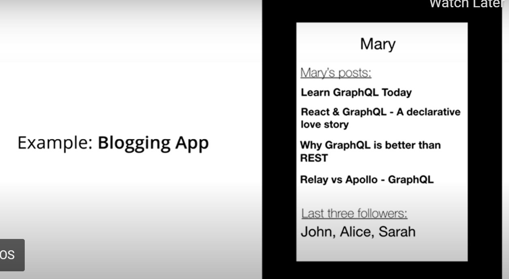

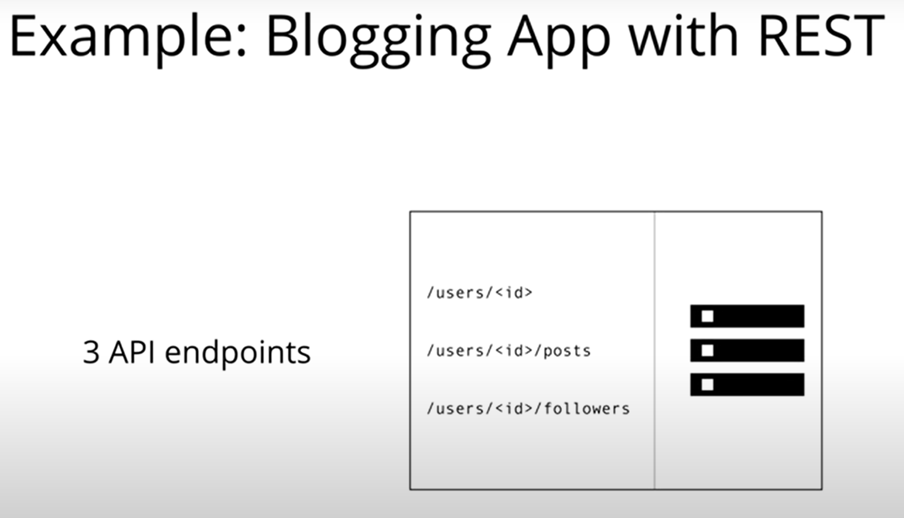

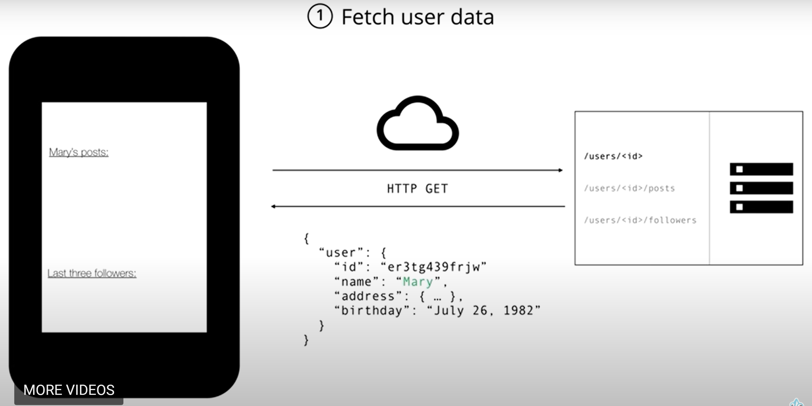

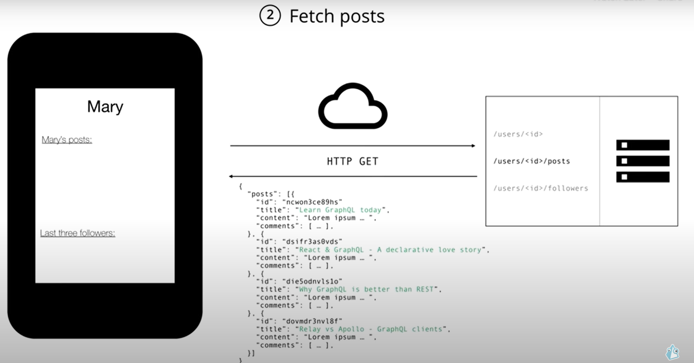

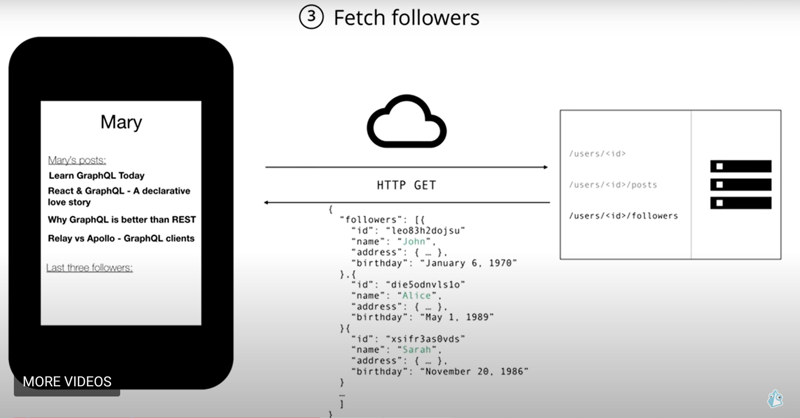

### GraphQL example

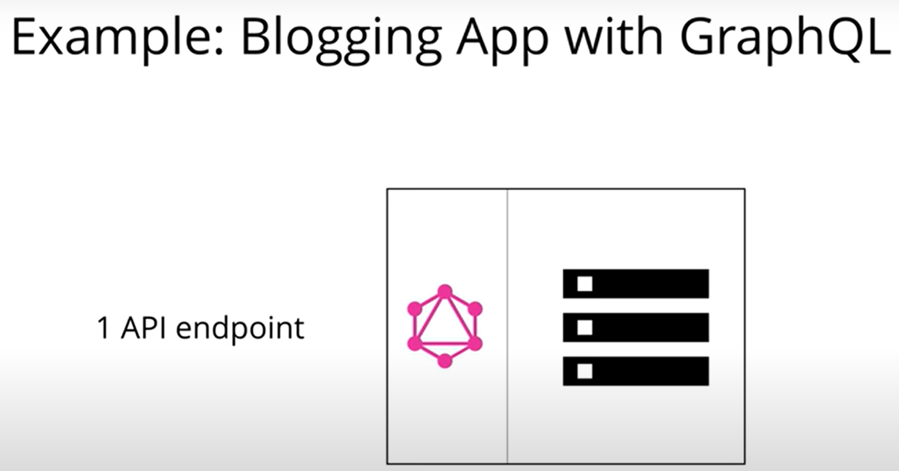

We handle everything with a single request in GraphQL which is a POST request and in this request we mention the requirements of our application:

**Request**

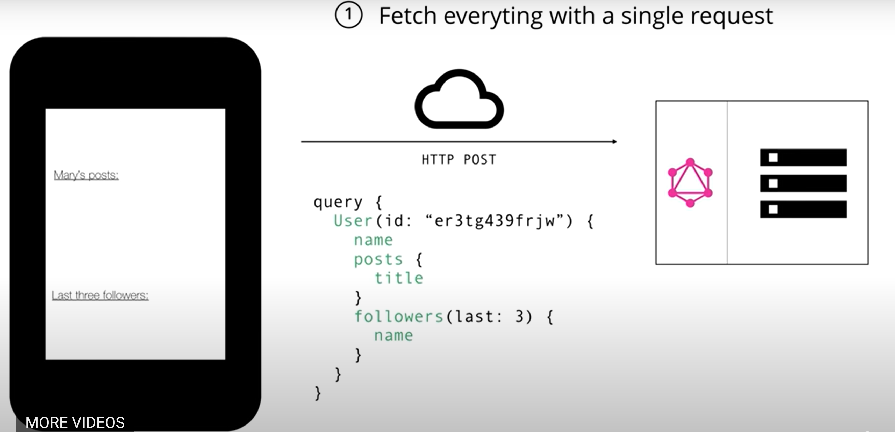

**Response**

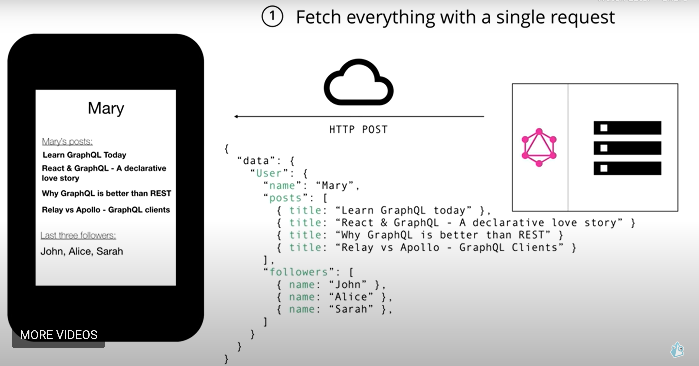

### Benefits of GraphQL over REST

- No more Overfetching and Underfetching

  - **Overfetching**: Downloading unnecessary data
  - **Underfetching**: An endpoint doesn't return enough of the right information; need to send multiple requests (n+1-requests problem)

- Rapid Production Iterations

  - **REST**: structure endpoints according to client's data needs
  - **GraphQL**: No need to adjust API when product requirements and design changes. Faster feedback cycles and product iterations

- Insightful Analytics

  - Fine-grained info about what data is read by clients
  - Enables evolving API and deprecating unneeded API features
  - Great opportunities for instrumenting and performance monitoring

- Benefits of Schema & Types

  - GraphQL uses strong type system to define capabilities of an API
  - _Schema_ serves as _contract_ between client and server
  - Frontend and backend teams can work completely independent from each other

# Core Concepts

## The Schema Definition Language (SDL)

GraphQL has its own type system that's used to define the schema of an API. The syntax for writing schemas is called **Schema Definition Language(SDL)**

Here is an example of how we can use the SDL to define a simple type called **Person**:

```
type Person {
    name: String!
    age: Int!
}
```

This type has two fields, they're called **name** and **age** and are respectively of type **String** and **Int**. The **!** following the type means that this field is required

It's also possible to express relationships between types. In this example of a blogging application, a **Person** could be associated with a **Post**:

```
type Post {
    title: String!
    author: Person!
}
```

Conversely, the other end of the relationship needs to be placed on the **Person** type:

```
type Person {
  name: String!
  age: Int!
  posts: [Post!]!
}
```

Note that we just created a one-to-many-relationship between **Person** and **Post** since the **posts** field on **Person** is actually an array of posts

## Fetching Data with Queries

When working with REST APIs, data is loaded from specific endpoints. Each endpoint has a clearly defined structure of the information that it returns. This means that the data requirements of a client are effectively encoded in the URL that it connects to.

The approach that's taken in GraphQL is radically different. Instead of having multiple endpoints that return fixed data structures, GraphQL APIs typically only expose a _single endpoint_. This works because the structure of the data that's returned is not fixed. Instead, it's completely flexible and lets the client decide what data is actually needed.

That means that the client needs to send more _information_ to the server to express its data needs - this information is called a _query_

**Basic Queries**
Let's take a look at an example query that a client could send to a server:

```
{
  allPersons {
    name
  }
}
```

The **allPersons** field in this query is called the _root_ field of the query. Everything that follows the root field, is called the _payload_ of the query. The only field that's specified in this query's payload is **name**

This query would return a list of all persons currently stored in the database. Here's an example response:

```
{
  "allPersons": [
    {"name": "Johnny"},
    {"name": "Sarah"},
    {"name": "Alice"}
  ]
}
```

Notice that each person only has the **name** in the response, but the **age** is not returned by the server. That's exactly because **name** was the only field that was specified in the query

If the client also needed the persons **age**, all it has to do is slightly adjust the query and include the new field in the query's payload:

```
{
  allPersons {
    name
    age
  }
}
```

One of the major advantages of GraphQL is that it allows for naturally querying _nested_ information. For example, if you wanted to load all the **posts** that a **Person** has written, you could simply follow the structure of your types to request this information:

```
{
  allPersons {
    name
    age
    posts {
      title
    }
  }
}
```

### Queries with Arguments

In GraphQL, each field can have zero or more arguments if that's specified in the _schema_. For example, the **allPersons** field could have a **last** parameter to only return up to a specific number of persons. Here's what a corresponding query would look like:

```
{
  allPersons(last: 2) {
    name
  }
}
```

### Writing Data with Mutations

Next to requesting information from a server, the majority of applications also need some way of making changes to the data that's currently stored in the backend. With GraphQL, these changes are made using so-called _mutations_. There generally are three kinds of mutations:

- creating new data
- updating existing data
- deleting existing data

Mutations follow the same syntactical structures as queries, but they always need to start with **mutation** keyword. Here's an example of how we might create a new **Person**:

```
mutation {
  createPerson(name: "Bob", age: 36) {
    name
    age
  }
}
```

Notice that similar to the query we wrote before, the mutation also has a _root field_ - in this case it's called **createPerson**. We also already learned about the concepts of arguments for fields. In this case, the **createPerson** field takes two arguments that specify the new person's **name** and **age**.

Like with a query, we're also able to specify a payload for a mutation in which we can ask for different properties of the new **Person** object. In our cse, we're asking for the **name** and **age** - though admittedly that's not super helpful in our example since we obviously already know them as we pass them into the mutation. However, being able to also query information when sending mutations can be a very powerful tool that allows you to retrieve new information from the server in a single roundtrip!

The server response for the above mutation would look as follows:

```
"createPerson": {
  "name": "Bob",
  "age": 36,
}
```

One pattern you'll often find is that GraphQL types have unique IDs that are generated by the server when new objects are created. Extending our **Person** type from before, we could add an **id** like this:

```
type Person {
  id: ID!
  name: String!
  age: Int!
}
```

Now, when a new **Person** is created, you could directly ask for the **id** in the payload of the mutation, since that is information that wasn't available on the client beforehand:

```
mutation {
  createPerson(name: "Alice", age: 36) {
    id
  }
}
```

## Realtime Updates with Subscriptions

Another important requirement for many applications today is to have a _realtime_ connection to the server in order to get immediately informed about important events. For this use case, GraphQL offers the concept of _subscriptions_.

When a client _subscribes_ to an event, it will initiate and hold a steady connection to the server. Whenever that particular event then actually happends, the server pushes the corresponding data to the client. Unlike queries and mutations that follow a typical _"request-response-cycle"_, subscriptions represent a _stream_ of data sent over to the client.

Subscriptions are written using the same syntax as queries and mutations. Here's an example where we subscribe on events happening on the **Person** type:

```
subscription {
  newPerson {
    name
    age
  }
}
```

After a client sent this subscription to a server, a connection is opened between them. Then, whenever a new mutation is performed that creates a new **Person**, the server send the information about this person over to the client

```
{
  "newPerson": {
    "name": "Jane",
    "age": 23
  }
}
```

## Defining a Schema

Now that you have a basic understanding of what queries, mutations, and subscriptions look like, let's put it all together and learn how you can write a schema that would allow you to execute the examples you've seen so far.

The _schema_ is one of the most important concepts when working with a GraphQL API. It specifies the capabilities of the API and defines how clients can request the data. It is often seen as a _contract_ between the server and the client.

Generally, a schema is simply a collection of GraphQL types. However, when writing the schema for an API, there are some special _root_ types:

```
type Query { ... }
type Mutation { ... }
type Subscription { ... }
```

The **Query, Mutation,** and **Subscription** types are the entry points for the requests sent by the client. To enable the **allPersons**-query that we saw before, the **Query** type would have to be written as follows:

```
type Query {
  allPersons: [Person!]!
}
```

**allPersons** is called a _root field_ of the API. Considering again the example where we added the **last** argument to the **allPersons** field, we'd have to write the **Query** as follows:

```
type Query {
  allPersons(last: Int): [Person!]!
}
```

Similarly, for the **createPerson**-mutation, we'll have to add a root field to the **Mutation** type:

```
type Mutation {
  createPerson(name: String!, age: Int!): Person!
}
```

Notice that this root field takes two arguments as well, the **name** and the **age** of the new **Person**.

Finally, for the subscriptions, we'd have to add the **newPerson** root field:

```
type Subscription {
  newPerson: Person!
}
```

Putting it all together, this is the full schema for all the queries and mutation that you have seen in this chapter:

```
type Query {
  allPersons(last: Int): [Person!]!
  allPosts(last: Int): [Post!]!
}

type Mutation {
  createPerson(name: String!, age: Int!): Person!
  updatePerson(id: ID!, name: String!, age: String!): Person!
  deletePerson(id: ID!): Person!
  createPost(title: String!): Post!
  updatePost(id: ID!, title: String!): Post!
  deletePost(id: ID!): Post!
}

type Subscription {
  newPerson: Person!
  updatedPerson: Person!
  deletedPerson: Person!
  newPost: Post!
  updatedPost: Post!
  deletedPost: Post!
}

type Person {
  id: ID!
  name: String!
  age: Int!
  posts: [Post!]!
}

type Post {
  id: ID!
  title: String!
  author: Person!
}
```

## Architectural Use Cases

1. GraphQL server with a connected database
2. GraphQL server to integrate existing system
3. A Hybrid approach with a connected database and integration of existing system

### 1. GraphQL server with a connected database

This architecture will be the most common for _greenfield_ projects. In the setup, you have a single (web) server that implements the GraphQL specification. When a query arrives at the GraphQL server, the server reads the query's payload and fetches the required information from the database. This is called _resolving_ the query. It then constructs the response object [as described in the official specification](https://spec.graphql.org/June2018/#sec-Response) and returns it to the client.

It's important to note that GraphQL is actually _transport-layer agnostic_. This means it can potentially be used with any available network protocol. So, it is potentially possible to implement a GraphQL server based on TCP, WebSockets, etc.

GraphQL also doesn't care about the database or the format that is used to store the data. You could use a SQL database like AWS Aurora or a NoSQL database like MongoDB

<figure>
    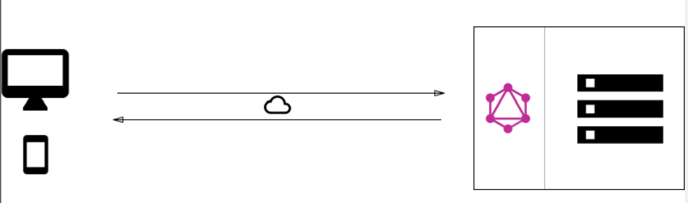
    <figcaption>A standard greenfield architecture with one GraphQL server that connects to a single database</figcaption>
</figure>

### 2. GraphQL layer that integrates existing systems

Another major use case for GraphQL is the integration of multiple existing systems behind a single, coherent GraphQL API. This is particularly compelling for companies with legacy infrastructures and many different APIs that have grown over years and now impose a high maintenance burden. One major problem with these legacy systems is that they make it practically impossible to build innovative products that need access to multiple systems.

In that context, GraphQL can be used to _unify_ these existing systems and hide their complexity behind a nice GraphQL API. This way, new client applications can be developed that simply talk to the GraphQL server to fetch the data they need. The GraphQL server is then responsible for fetching the data from the existing systems and package it up in the GraphQL response format.

Just like in the previous architecture where the GraphQL server didn't care about the type of database being used, this time it doesn't care about the data sources that it needs to fetch the data that's needed to _resolve_ a query.

<figure>
    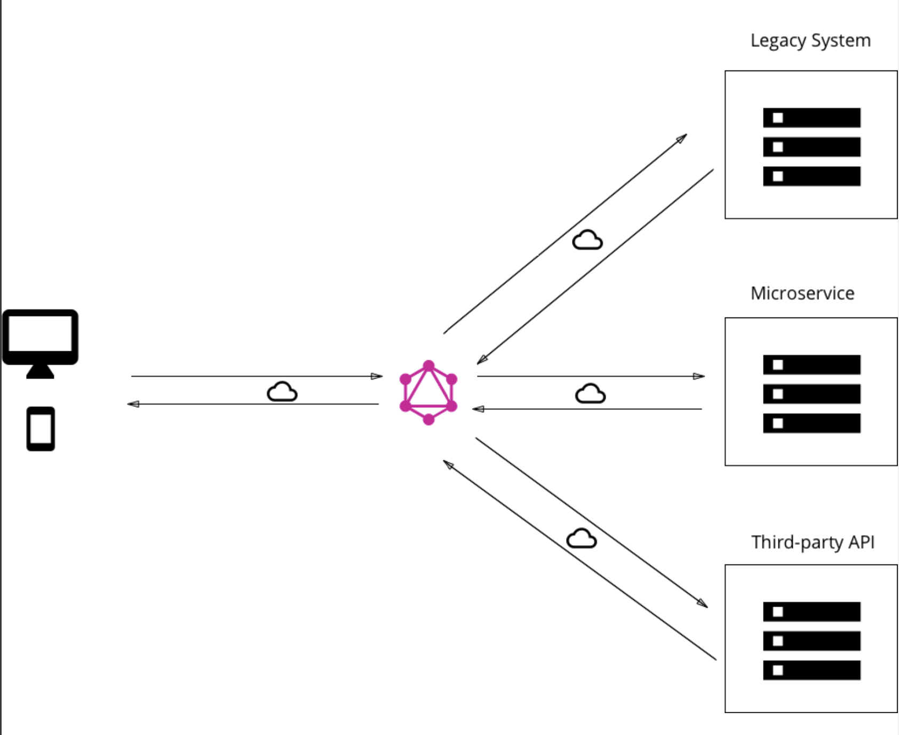
    <figcaption>GraphQL allows you to hide the complexity of existing systems, such as microservices, legacy infrastructures or third-party APIs behind a single GraphQL interface</figcaption>
</figure>

### 3. Hybrid approach with connected database and integration of existing system

Finally, it's possible to combine the two approaches and build a GraphQL server that has a connected database but still talks to legacy or third-party systems. When a query is received by the server, it will resolve it and either retrieve the required data from the connected database or some of the integrated APIs.

<figure>
    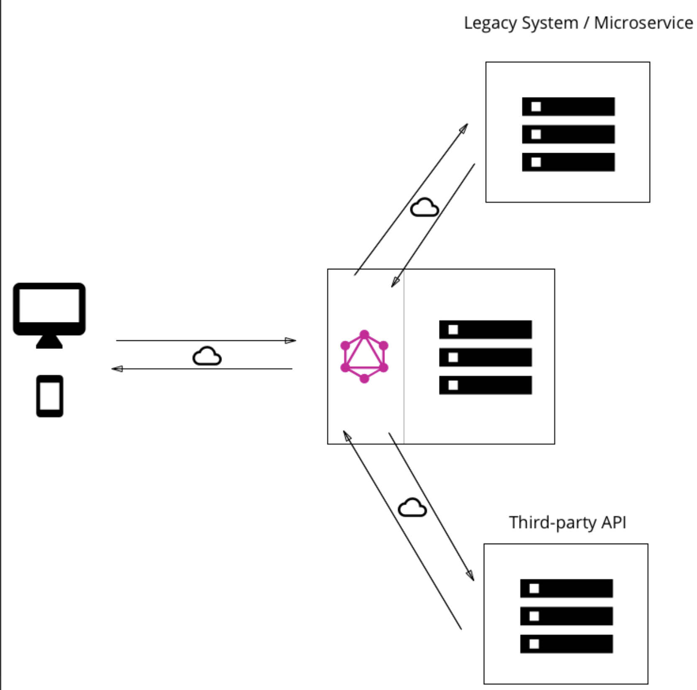
    <figcaption>Both approaches can also be combined and the GraphQL server can fetch data from a single database as well as from an existing system - allowing for complete flexibility and pushing all data management complexity to the server</figcaption>
</figure>

## Resolver Functions

But how do we gain this flexibility with GraphQL? How is it that it's such a great fit for these very different kinds of use cases?

As we saw previously, the payload of GraphQL query(or mutation) consists of a set of fields. In the GraphQL server implementation, each of these fields actually corresponds to exactly one function that's called a _resolver_. The sole purpose of a resolver function is to fetch the data for its field.

When the server receives a query, it will call all the functions for the fields that are specified in the query's payload. It thus _resolves_ the query and is able to retrieve the correct data for each field. Once all resolvers returned, the server will package data up in the format that was described by the query and send it back to the client.

<figure>
    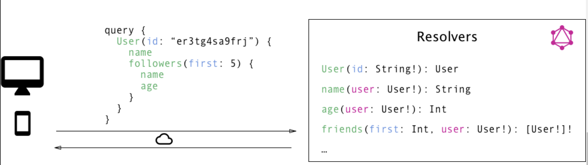
    <figcaption>The above screenshot contains some of the resolved field names. Each field in the query corresponds to a resolver function. The GraphQL calls all required resolvers when a query comes in to fetch the specified data</figcaption>
</figure>

## GraphQL Client Libraries

GraphQL is particularly great for frontend developers since it completely eliminates many of the inconveniences and shortcomings that are experienced with REST APIs, such as over-fetching and under-fetching. Complexity is pushed to the server-side where powerful machines can take care of the heavy computation work. The client doesn't have to know where the data that it fetches is actually coming from and can use a single, coherent, and flexible API.

Let's consider the major change that's introduced with GraphQL in going from a rather imperative data fetching approach to a purely declarative one. When fetching data from a REST API, most applications will have to go through the following steps:

1. construct and send HTTP request (e.g. with **fetch** in Javascript)
2. receive and parse server response
3. store data locally (either simply in memory or persistent)
4. display data in the UI

With the ideal _declarative data fetching_ approach, a client shouldn't be doing more than the following two steps:

1. describe data requirements
2. display data in UI

All the lower-level networking tasks as well as storing the data should be abstracted away and the declaration of data dependencies should be the dominant part.

This is precisely what GraphQL client libraries like Relay or Apollo will enable you to do. They provide the abstraction that you need to be able to focus on the important parts of your application rather than having to deal with the repetitive implementation of infrastructure.

## Advanced Tutorial - Clients

Working with a GraphQL API on the frontend is a great opportunity to develop new abstractions and help implement common functionality on the client-side. Let's consider some "infrastructure" features that you probably want to have in your app:

- send queries and mutations directly without constructing HTTP requests
- view-layer integration
- caching
- validation and optimization of queries based on the schema

Of course, nothing stops you from using plain HTTP to fetch your data and then shifting all the bits yourself until the right information ends up in your UI. But, GraphQL provides the ability to abstract away a lot of the manual work you'd usually have to do during that process and lets you focus on the real important parts of the app.

There are two major GraphQL clients available at the moment. The first one is **Apollo Client**, which is a community-driven effort to build a powerful and flexible GraphQL client for all major development platforms. The second one is called **Relay** and it is Facebook's homegrown GraphQL client that heavily optimizes for performance and is only available on the web.

### Send Queries and Mutations Directly

One major benefit of GraphQL is that it allows you to fetch and update data in a _declarative manner_. Put differently, we climb up one step higher on the API abstraction ladder and don't have to deal with low-level networking tasks ourselves anymore.

Where you previously used plain HTTP (like **fetch** in Javascript or **NSURLSession** on iOS) to load data from an API, all you need with GraphQL is a query where you declare your data requirements and let the system take care of sending the request and handling the response for you. This is precisely what a GraphQL client will do.

### View Layer Integrations & UI updates

Once the server response is received and handled by the GraphQL client, the requested data somehow needs to end up in our UI. Depending on the platforms and frameworks you're developing with, there will be different approaches to how UI updates are handled in general.

Taking React as an example, GraphQL clients use the concept of **higher-order components** to fetch the needed data under the hood and make it available in the **props** of your components. In general, the declarative nature of GraphQL ties in particularly well with **functional reactive programming techniques**. These two form a powerful combination where a view simply declares its data dependencies and the UI is wired up with an FRP layer of your choice.

### Caching Query Results: Concepts and Strategies

In the majority of applications, you'll want to maintain a cache of the data that was previously fetched from the server. Caching information locally is essential to provide a fluent user experience and also takes the load off your user's data plans.

Generally, when caching data, the intuition is to put information that's fetched remotely into a local _store_ from where it can be retrieved later on. With GraphQL, the naive approach would be to simply put the results of GraphQL queries into the store and simply return them whenever the same query is sent. It turns out this approach is very inefficient for most applications.

A more beneficial approach is to _normalize_ the data beforehand. That menas that the (potentially nested) query result gets flattened and the store will only contain individual records that can be referenced with a globally unique ID. If you want to learn more about this, the **Apollo blog** has a great write-up on the topic.

### Build-time Schema Validation & Optimizations

Since the schema contains _all_ information about what a client can potentially do with a GraphQL API, there is a great opportunity to validate and potentially optimize the queries that a client wants to send already at build-time.

When the build environment has access to the schema, it can essentially parse all the GraphQL code that's located in the project and compare it against the information from the schema. This catches typos and other errors before an application gets into the hands of actual users where the consequences of an error would be a lot more drastic.

### Colocating Views and Data Dependencies

A powerful concept of GraphQL is that it allows you to have UI code and data requirements side-by-side. The tight coupling of views and their data dependencies greatly improves the developer experience. The mental overhead of thinking about how the right data ends up in the right parts of the UI is eliminated.

How well colocation works depend on the platform you're developing on. For example in JavaScript applications it's possible to actually put data dependencies and UI code into the same file.

## Server
