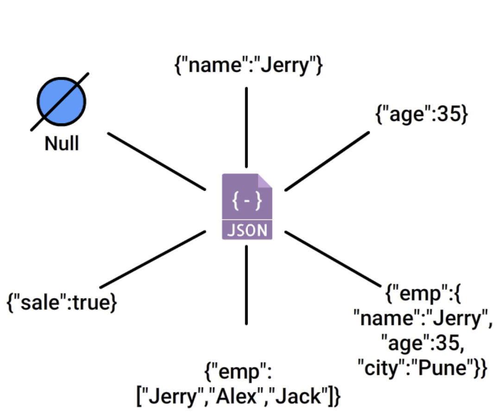
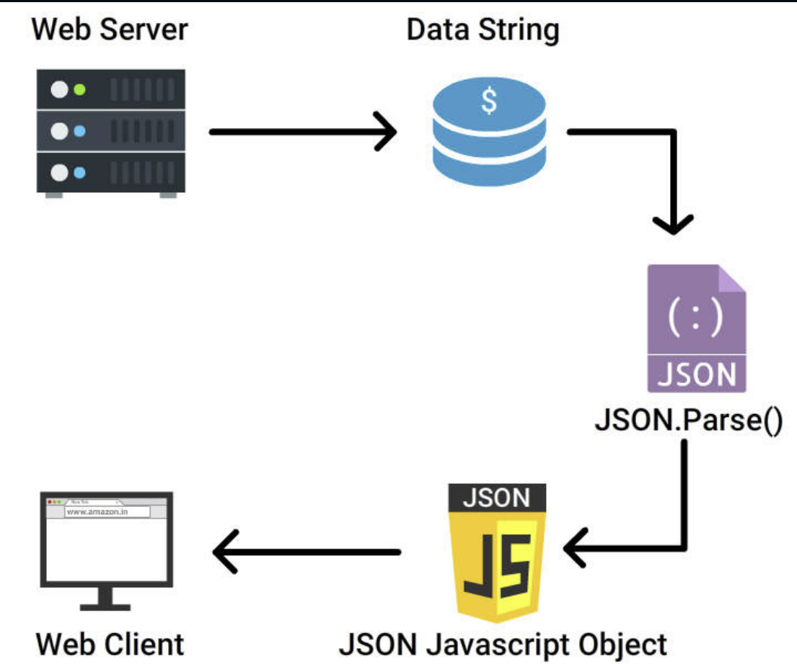
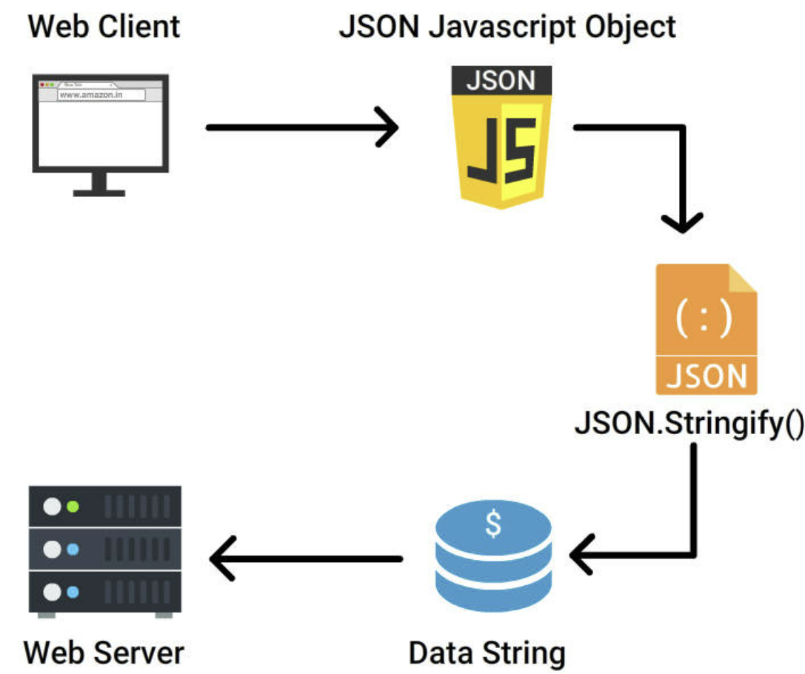

- **JavaScript Object Notation**, commonly known as **"JSON"**, is heavily leveraged as a data-interchage format
- JSON is a subset of the JavaScript Progamming language, \*_Standard ECMA-262 3rd Edition-December 1999_ where both,
- **Humans** can read/write it easily
- **Machines** can parse and generate

JSON is a lightweight text format that is independent of any progamming Languages thus making it an **ideal option** for data-intercahnge in today's Business world

## What is JSON?

- JSON (javascript object notation) is a way to represent the data in the form of key value pairs
- It is used to share data among server and client side devices. Many platforms like mobile, desktop and web can use same structured data
- Many different languages (like python, ruby, Javascript, etc) can parse and use JSON as an alternative to XML
- It is derived from javascript and its structure is similar to javascript objects except 2 3 basic differences

## Structure of JSON

Keys are on the left side and values are on the right side. We can access values with the help of keys. Following is the structure of json data

```
{
    "name": "umair",
    "degree": "BSCS",
    "rollno": "23422",
    "subjects": [
        "Computer Vision",
        "Microcontrollers",
        "Image Processing"
    ]
}
```

```
var obj = JSON.parse(data);
```

To get roll number of this student, we can write **obj.rollno;** and for the first subject write **obj.subjects[0];**

## JavaScript Object v/s JSON

- JSON data is platform independent, but javascript object is only for javascript itself
- Keys of json must be in double quotes, whereas keys of javascript objects can be without double quotes
- Json values can only contain integers, strings, arrays, object, null and boolean whereas in javascript objects, keys can also contain values like functions
- We need to parse json data before its usage, whereas javascript object can be directly used in javascript

### JavaScript Object v/s JSON - Example

**JSON**

```
{
    "name": "umair",
    "degree": "BE",
    "rollno": "12345",
    "subjects": [
        "Computer Vision",
        "Microcontrollers",
        "Image Processing"
    ]
}
```

**JavaScript Object**

```
{
    name: "umair",
    degree: "BE",
    rollno: "12345",
    subjects: [
        "Computer Vision",
        "Microcontrollers",
        "Image Processing"
    ],
    getName: function() {
        return this.name;
    }
}
```

## JSON Advantages

- Uses a fewer number of standardized Syntax
- More Self-describing (readable by humans and machines)
- JSON Properties and values can be accessed immediately by using JavaScript
- Code for parsing and interchanging JSON data is readily available in almost all modern programming languages
- Hierarchical (values con contain a list of objects or values)
- Unlike JavaScript, JSON can **retrieve values from anywhere as it supports all languages**
- JSON uses **arrays and Objects**

## JSON Usage

- **Transfers data** between a server and various web applications
- **Performs asynchronous** data calls without requiring a page refresh. This is widely used for **asynchronous browser/server communication**
- **APIs and web services** use JSON to **transfer real-time sensitive data**
- **Compiles** user data for local storage
- JSON is now being supported by almost all **Programming languages**
- JSON supports for **sending, reading and receiving** texts available in all the real-world business
- **JSON-RPC** is a Remote Procedure call(RPC) protocol built on JSON, which allows system to send multiple notifications to the server

## JSON v/s XML

- JSON almost **replaced XML** which was previously leveraged as the **only data interchange format**

JSON is preferred because of the following two important reasons:

- JSON transfers data **faster** than XML because XML uses tags to describe data which increases their data size
- JSON uses **typed Objects**, which can be **parsed by any standard JavaScript function**. Whereas, XML uses type-less strings, which must be parsed by **XML parser(XPath)** during run-time, which makes it more complex

## JSON Limitations

- **JSON cannot handle large data**. (Need to leverage other formats)
- Not suitable for **handling different multimedia formats**
- JSON does not have a feature to support **comments**. This could be included as an additional attribute alone

## JSON Syntax

In JSON, values should strictly use one of the following data types:

- **String**
- **Number**
- **Object**
- **Array**
- **Boolean**
- **Null**

## JSON Syntax Rules

In JSON syntax,

- Keys must necessarily be strings, written with double quotes, Example: "Name"
- Data can be a name/value pairs that consist of a field name inside double quotes, followed by a colon, and then by a value inside double quotes. Example: "Name": "Peter"
- Data must be separated by Commas **(,)**, Example: "Ram", "Peter"
- Curly brackets **{}** to hold objects Example: {"Name": "Joseph"}
- Square brackets **[]** hold arrays Example: {"employees": ["Ram", "Peter", "Joseph"]}

## JSON DataTypes



Valid Data Types in JSON

- **Strings** - Strings should be written in double quotes
- **Numbers** - Numbers should be an integer or a floating point
- **Object** - Values in JSON can be objects
- **Array** - Values in JSON can be arrays
- **Boolean** - Values in JSON can be true/false
- **Null** - Values in JSON can be null

## JSON Invalid DataTypes

JSON values cannot use any of the following data types:

- function
- date
- Undefined

## Object and Arrays

JSON is built on two important structures:

- **Object** - A collection of name/value pairs
- **Array** - An ordered list of values. An array could be a combination of multiple objects

# JSON Objects

- JSON objects are surrounded by curly braces **{}** written in key/value pairs
- **Keys** should be strings and **Values** can use any of **valid JSON data type**
- Colon separator (:) separates key and values
- Comman separator (,) separates each key/value pair

## Accessing Object Values

- dot **(.)** and bracket **[]** notation is used to access Object Values

**Example**

```
<p>Access a JSON object using bracket notation:</p>
<p id="Sample"></p>
<script>
    var myObj, x;

    myObj = { "name":"Arun", "age":28, "Company":"TCS"};

    x = myObj["Company"];

    document.getElementById("Sample").innerHTML = x;
</script>
```

**OR**

```
x = myObj.Company;
```

## Looping an Object

**for-in** loop can be used to loop in object properties

**Example**

```
<p>How to loop through all properties in a JSON object.</p>
<p id="sample"></p>
<script>
    var myObj, x;

    myObj = { "name":"Arun", "age":28, "Company":"TCS"};

    for (x in myObj) {
        document.getElementById("sample").innerHTML += x + "<br>";
    }
</script>
```

**Example** - Utilize the bracket notation for accessing the property values

```
for (x in myObj) {
    document.getElementById("sample").innerHTML += myObj[x] + "<br>";
}
```

## Nested Objects

- Values in a JSON object could also be another JSON object

**Example**

```
<p>How to access nested JSON objects.</p>
<p id="Sample"></p>
<script>
    var myObj = {
        "name":"Arun",
        "age":30,
        "cars": {
            "car1":"Volkswagen",
            "car2":"Hyundai",
            "car3":"Fiat"
        }
    }
    document.getElementById("Sample").innerHTML += myObj.cars.car2 + "<br>";
</script>
```

- Nested JSON objects can be accessed by using the dot notation or bracket notation

**Example**

```
x = myObj.cars.car2;

//or:

x = myObj.cars["car2"];
```

## Delete Objects

- **delete** keyword is used to delete properties from a JSON object

**Example**

```
delete myObj.cars.car2;
```

# JSON Arrays

- JSON Arrays can store multiple values
- Values should be comma-separated
- The square bracket **[]** is used to represent an arry

In JSON, array values should use one of the following data types:

> string, number, object, array, boolean, null

**Example**

- **Array of Strings** - ["Sun", "Mon", "Tue", "Wed", "Thu", "Fri", "Sat"]

## Accessing an Array

**Example**

```
<p>Access an array value of a JSON object</p>
<p id="Sample"></p>
<script>
    var myObj, x;
    myObj = {
        "name":"Arun",
        "age":29,
        "cars":["Hyundai", "Volkswagen", "Maruti Suzuki"]
    };
    x = myObj.cars[0];
    document.getElementById("Sample").innerHTML = x;
</script>
```

- You can access the array values by using the index number as x = myObj.cars[0];

## Looping an Array

**Example**

```
<p>Looping through an array using a for in loop:</p>
<p id="Sample"></p>
<script>
    var myObj, i, x = "";
    myObj = {
        "name":"Arun",
        "age":29,
        "cars":["Hyundai", "Volkswagen", "Maruti Suzuki"]
    };
    for (i in myObj.cars) {
        x += myObj.cars[i] + "<br>";
    }
    document.getElementById("Sample").innerHTML = x;
</script>
```

## Modify an Array

**To Modify Array Values**

- Use the index number to modify array values

```
myObj.cars[1] = "Maruti Suzuki";
```

**Example**

```
<p>Looping through an array using a for in loop:</p>
<p id="Sample"></p>
<script>
    var myObj, i, x = "";
    myObj = {
        "name":"Arun",
        "age":29,
        "cars":["Hyundai", "Volkswagen", "Maruti Suzuki"]
    };
    myObj.cars[1] = "Mercedes";
    for (i in myObj.cars) {
        x += myObj.cars[i] + "<br>";
    }
    document.getElementById("Sample").innerHTML = x;
</script>
```

## Nested Array

In Nested arrays, to access arrays inside arrays, use a for-in loop for each array

**Example**

```
<p>Looping through arrays inside arrays.</p>
<p id="Sample"></p>
<script>
    var myObj, i, j, x = "";
    myObj = {
        "name":"Arun",
        "age":28,
        "cars": [
            { "name":"Ford", "models":[ "Fiesta", "Focus", "Mustang" ] },
            { "name":"BMW", "models":[ "320", "X3", "X5" ] },
            { "name":"Fiat", "models":[ "500", "Panda" ] }
        ]
    }

    for (i in myObj.cars) {
        x += "<h2>" + myObj.cars[i].name + "</h2>";
        for (j in myObj.cars[i].models) {
            x += myObj.cars[i].models[j] + "<br>";
        }
    }
    document.getElementById("Sample").innerHTML = x;
</script>
```

## Delete Array items

**To Delete Array Items** - Use the delete keyword to delete items from an array

```
<p>How to delete properties of an array.</p>
<p id="Sample"></p>
<script>
    var myObj, i, x = "";
    myObj = {
        "name":"Arun",
        "age":29,
        "cars": ["Ford","BMW","Fiat"]
    }

    delete myObj.cars[1];

    for (i in myObj.cars) {
        x += myObj.cars[i] + "<br>";
    }

    document.getElementById("Sample").innerHTML = x;
</script>
```

# JSON Parse



- **JSON.parse()** function was developed as a safer alternative to eval
- While receiving data from the web server, the data is always in the string format, we have to parse the data with **JSON.parse()** and the data becomes a JavaScript object

**Example** - Let's imagine that you receive the following text string from a web server

```
json '{ "name":"Arun", "age":28, "city":"Chennai"}'
```

You have to use JavaScript function **JSON.parse()** to convert this text into a JavaScript object:

```
<h2>Create Object from JSON String</h2>
<p id="sample"></p>
<script>
    var obj = JSON.parse('{ "name":"Arun", "age":28, "city":"Chennai"}');
    document.getElementById("sample").innerHTML = obj.name + ", " + obj.age+ ", " + obj.city;
</script>
```

# JSON Stringify



While sending data back to web server,

- The data has to be a **string** always
- You should convert a JavaScript object into a string with **JSON.stringify()** function

For example, let's Stringify a JavaScript Object

```
var obj = { "Country":"India", Location":"Agra", "Distance":200, "Monument":"Taj Mahal"}
```

- Use the JavaScript function **JSON.stringify()** to convert it into a string

```
var myJSON = JSON.stringify(obj);
```

**Example** - To Stringify a JavaScript Array

```
<h2>Create JSON string from a JavaScript object.</h2>
<p id="sample"></p>
<script>
    var obj = { "Country":"India", "Location":"Agra", "Distance":200, "Monument":"Taj Mahal"}
    var myJSON = JSON.stringify(obj);
    document.getElementById("sample").innerHTML = myJSON;
</script>
```

# JSON Applications

There is a powerful npm package by the name **json-rules-engine**, which has rules built of simple JSON structures and it is very light-weighted

Apart from the regular JSON, we have other versions of JSON in use as well

- **Google's GSON** - Java library from Google to convert Java Objects into JSON and vice versa. In addition, it paves room for simpler implementation by not requiring to annotate your classes
- **Oracle's JSONP** - is Java API for JSON processing. This consumes/produces streaming JSON text
- **FasterXML's Jackson** - Can handle both JSON/non-JSON encodings. It is a set of data processing tools powered with streaming JSON parser and generator library

## JSON Security Concerns

Cross-Site Request Forgery (CSRF)

It is an exploit which takes advantage of a website trust in any user browser

Cross-Site Scripting (XSS) attack

A type of injection attack that is injecting data into a web application to facilitate the execution or interpretation of malicious data that takes advantage of any normal website by a third party with a malicious script

## How to overcome these threats while using JSON

- **Avoid** using **Top-level arrays** which are valid JavaScript that can be linked to a script tag
- Use **HTTP POST** instead of **HTTP GET** in JSON, because in GET request can be linked to any URL with a script tag which is a web threat
- Use **JSON.parse()** instead of **eval()**, because **eval()** function will compile and execute any given set of string, which an open your code during web attacks, where JSON.parse() only parses JSON
