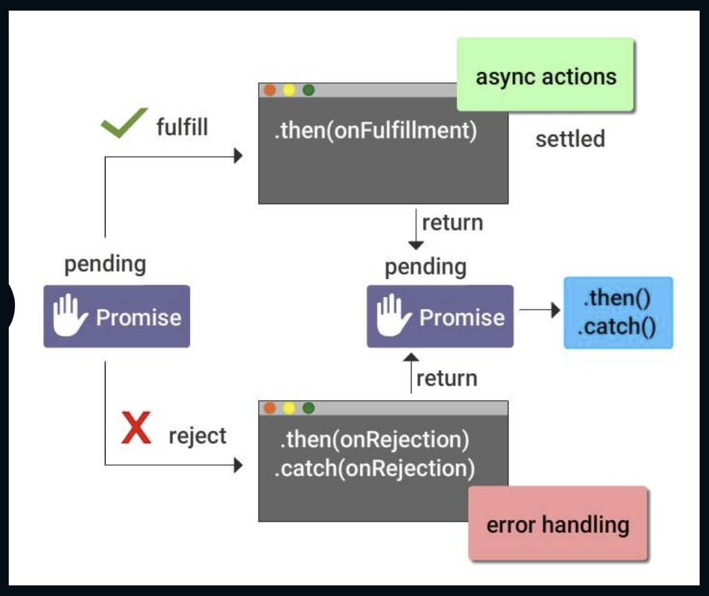

# Callback Hell

- As you know by now, **Node.js** is **asynchronous and nonblocking**. Multiple requests at a server are facilitated by callback functions
- Using such multiple callback functions will make the code complex and hard to maintain. This is known as **Callback hell**
- One way to avoid this callback hell is the use of **Promises**

## What is Promise?

Promises are alternatives to callbacks. They provide a way to write async code and handle more errors effectively

According to the definition,

_A promise is an abstraction for asynchronous programming. It's an object that proxies for the return value or the exception thrown by a function that has to do some asynchronous processing_

## How Promise Works?



**Promises offer us with a cleaner and more efficient way of handling async code**

Instead of offering a callback, a promise possesses its own methods that you call to tell the promise. But what will happen when it fails or succeed

Promise offers the following methods:
i) **then(...)** - when a successful result is available
ii) **catch(...)** - when something goes wrong

## States in Promise

A promise can exist in one of three different states

- **Pending** - The initial state of a promise
- **Fulfilled** - The state of a promise signifying a successful operation
- **Rejected** - The state of a promise signifying a failed operation

## Quick Facts About Promise

- A Promise is settled, in other words, the computation it denotes has ended if it either rejected or fulfilled
- A Promise can be settled only once and then it remains settled. Subsequent attempts to settle has no effect

## How to Create Promise

The creation of a Promise object is done via the Promise constructor by calling **new Promise()**. This takes a function as an argument and it gets passed on two callbacks:

- one for notifying when the operation is successful (resolve)
- one for notifying when the operation has failed (reject)

```
var myPromise = new Promise(function(resolve, reject) {
    ...
});
```

**Example**

```
function getAsyncData(someValue){
  return new Promise(function(resolve, reject){
    getData(someValue, function(error, result){
      if(error){
        reject(error);
      }
      else{
        resolve(result);
      }
    })
  });
}

getAsyncData(“someValue”)
// Calling resolve in the Promise will get us here, to the first then(…)
.then(function(result){
    // Do stuff
})

// Calling reject in the Promise will get us here, to the catch(…)
// Also if there is an error in any then(..) it will end up here
.catch(function(error){
    // Handle error
});
```

## Chaining Promises

**getAsyncData().then** returns a new promise (say Q). It means that you can keep the Promise-based control flow going by invoking then() on Q:

- Q is resolved with what is returned by either resolve or reject
- Q is rejected if either resolve or reject throw an exception

## Chaining Example

```
// Callback approach
async1(function(){
    async2(function(){
        async3(function(){
            ....
        });
    });
});

// Promise approach
var task1 = async1();
var task2 = task1.then(async2);
var task3 = task2.then(async3);

task3.catch(function(){
  /*Solve your thrown errors
   from task1, task2, task3 here*/
})

// Promise approach with chaining
async1(function(){..})
    .then(async2)
    .then(async3)
    .catch(function(){
      // Solve your thrown errors here
    })

```

## What is Async/Await?

- Async/await is one of the latest features making into Nodejs like promises. Async/await makes the code look synchronous
- Async function declarations return an AsyncFunction object
- These are built on Promises
- These are similar to Generators these function's execution can be stopped at any time
- They return a Promise whereas generators generate { value: any, done: Boolean } object

## Difference with Promise

Instead of using **Promise.then()** to resolve your promise to a value, prefixing **await** to promise makes your code to pause until the value is available. Then proceeds execution as the value were synchronous. This should be enclosed inside an **async** function

## Promise v/s Async/Await

Below example depicts the difference between promise and async/await :

**Async operations with promises:**

```
app.post('/messages', (req, res) => {
  var message = new Message(req.body)

  message.save()
  .then(() => {
    console.log('saved')
    return Message.findOne({message: 'badword'})
  })
  .then( censored => {
    if(censored) {
      console.log('censored words found', censored)
      return Message.remove({_id: censored.id})
    }
    io.emit('message', req.body)
    res.sendStatus(200)
  })
  .catch((err) => {
    res.sendStatus(500)
    return console.error(err)
  })
})
```

**This example rewritten with async/await would look something like this:**

```
app.post('/messages', async (req, res) => {
  var message = new Message(req.body)
  var savedMessage = await message.save()

  console.log('saved')

  var censored = await Message.findOne({ message: 'badword' })

  if (censored)
    await Message.remove({ _id: censored.id })
  else
    io.emit('message', req.body)

  res.sendStatus(200)
})
```

## Why Async/Await?

The reasons for growing popularity of async/await include:

- The code written is **concise and clean** than that of using promises and callback
- There are better **error handling** capabilities
- The **intermediate values** produced by promises which are needed for nesting can be avoided making the code simple
- One major concern of promises **error stakes** can be easily pointed to the function containing them using async/await
- The killer advantage of async/await is its easy **debugging** capabilities

## Common Async/Await Design Patterns

- Retrying Failed Requests
- Processing a MongoDB Cursor
- Multiple Request in Parallel

### Retrying Failed Requests

**Await** lets us write an asynchronous code using synchronous language constructors. In this, you might retry a failed HTTP request using the Superagent HTTP libraries using callbacks

```
const superagent = require('superagent');

const NUM_RETRIES = 3;

request('http://google.com/this-throws-an-error', function(error, res) {
  console.log(error.message); // "Not Found"
});

function request(url, callback) {
  _request(url, 0, callback);
}

function _request(url, retriedCount, callback) {
  superagent.get(url).end(function(error, res) {
    if (error) {
      if (retriedCount >= NUM_RETRIES) {
        return callback && callback(error);
      }
      return _request(url, retriedCount + 1, callback);
    }
    callback(res);
  });
}
```

But this involves recursion which is not convenient to deal with for beginners. Now if Superagent.get().end() throws a synchronous exception the \_request call is to be wrapped in try/catch block

**Now using async/await we can write a function with a for and try/catch block**

```
const superagent = require('superagent');

const NUM_RETRIES = 3;

test();

async function test() {
  let i;
  for (i = 0; i < NUM_RETRIES; ++i) {
    try {
      await superagent.get('http://google.com/this-throws-an-error');
      break;
    } catch(err) {}
  }
  console.log(i); // 3
}
```

**await** must always be in **async** function

### Processing a MongoDB Cursor

MongoDB's **find()** function returns a cursor. This is an object with an asynchronous **next()** function that gets the next document in the query result. If there are no more results, next() resolves to null

MongoDB cursors have several helper functions like each(), map(), toArray() and the mongoose ODM adds an additional eachAsync() function. Without using aync/await, calling next() would be similar to the retry failure example. But by using async/await, you need not use any helper functions but jst a simple for loop

```
const mongodb = require('mongodb');

test();

async function test() {
  const db = await mongodb.MongoClient.connect('mongodb://localhost:27017/test');

  await db.collection('Movies').drop();
  await db.collection('Movies').insertMany([
    { name: 'Enter the Dragon' },
    { name: 'Ip Man' },
    { name: 'Kickboxer' }
  ]);

  // Don't `await`, instead get a cursor
  const cursor = db.collection('Movies').find();
  // Use `next()` and `await` to exhaust the cursor
  for (let doc = await cursor.next(); doc != null; doc = await cursor.next()) {
    console.log(doc.name);
  }
}
```

### Multiple Requests in Parallel

Now we deal with multiple asychronous tasks in parallel, say, we want to hash multiple plaintext passwords in parallel with bcrypt.

bcrypt is nothing but a password hashing function based on Blowfish cipher.

Let us take a look at the example below:

```
const bcrypt = require('bcrypt');

const NUM_SALT_ROUNDS = 8;

test();

async function test() {
  const pws = ['password', 'password1', 'passw0rd'];

  // `promises` is an array of promises, because `bcrypt.hash()` returns a
  // promise if no callback is supplied.
  const promises = pws.map(pw => bcrypt.hash(pw, NUM_SALT_ROUNDS));

  /**
   * Prints hashed passwords, for example:
   * [ '$2a$08$nUmCaLsQ9rUaGHIiQgFpAOkE2QPrn1Pyx02s4s8HC2zlh7E.o9wxC',
   *   '$2a$08$wdktZmCtsGrorU1mFWvJIOx3A0fbT7yJktRsRfNXa9HLGHOZ8GRjS',
   *   '$2a$08$VCdMy8NSwC8r9ip8eKI1QuBd9wSxPnZoZBw8b1QskK77tL2gxrUk.' ]
   */
  console.log(await Promise.all(promises));
}
```

promise.all() function takes an array of promises and returns a promise that waits for every promise in array to resolve and it resolves into array that contains the value each promise in the original array resolved to. and await Promise.all(promises) is the result of each of the bcrypt.hash() calls.

This is not only way to handle multiple async functions in parallel,there is promise.race().

Take a look at the example with promise.race() using async/await:

```
/**
 * Prints below:
 * waited 250
 * resolved to 250
 * waited 500
 * waited 1000
 */
test();

async function test() {
  const promises = [250, 500, 1000].map(ms => wait(ms));
  console.log('resolved to', await Promise.race(promises));
}

async function wait(ms) {
  await new Promise(resolve => setTimeout(() => resolve(), ms));
  console.log('waited', ms);
  return ms;
}
```
