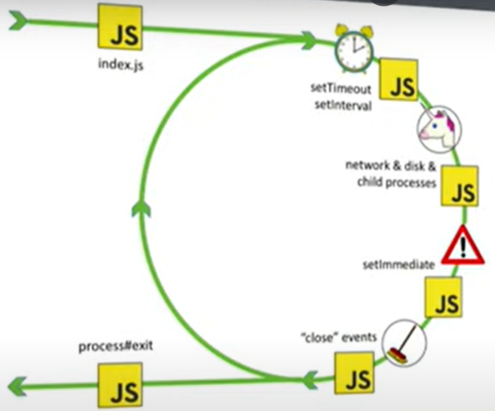

# Node JS

**Difference between Browser and Node.js**

    Browser				Node.js

- DOM No DOM
- Window No Window
- Interactive Apps Server Side Apps
- No Filesystem Filesystem
- Fragmentation Versions
- ES6 Modules CommonJS

To open the REPL we write **node** on the terminal

## NPM

- npm - global command, comes with node

```
npm --version
```

- local dependency - use it only in this particular project

```
npm i <packageName>
```

- global dependency - use it in any project

```
npm install -g <packageName>
sudo npm install -g <packageName> (mac)
```

- package.json - manifest file (stores important info about project/package)
  1.  manual approach (create package.json in the root, create properties etc)
  2.  npm init (step by step, press enter to skip)
  3.  npm init -y (everything default)

**Note: We always need to install the external dependencies before we use it in the project**

When we are pushing the code to the GIT repository it's important to ignore the node_modules folder. If we were to clone or use the project on any other device then we can install the required packages used in our project by using the command **npm install** as it will install all the **dependencies** mentioned in the **package.json** file.

To install the dependency for the development environment we use the command:

```
npm i nodemon -D
```

OR

```
npm i nodemon --save-dev
```

### Uninstalling a package

Syntax: npm uninstall packageName
ex:

```
npm uninstall bootstrap
```

Alternatively, we can also delete the package-lock.json file, delete node_modules folder, and remove the dependency from the package.json and run **npm install** to uninstall a package

# Event Loop in Node JS



JavaScript is Synchronous and Single Threaded

Ex: In the example below the next task will take more time to execute

```
console.log('first task');
console.time();
for(let i = 0; i < 10000000; i++) {
	const h3 = document.querySelector('h3');
	h3.textContent = `Hey, everyone is waiting on me`;
}
console.timeEnd();

console.log('next task');
```

Ex: We can use the API provided by the browser to offload some of the tasks

```
console.log('first task');
setTimeout(() => {
	console.log('second task');
}, 0);
console.log('next task');
```
