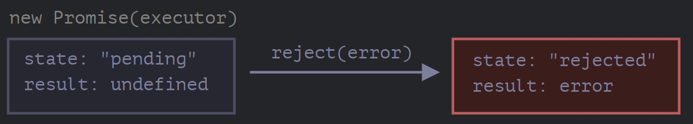

# Introduction: Callbacks

Many functions are provided by JavaScript host environments that allow you to schedule asynchronous actions. In other words, actions that we initiate now, but they finish later.

For instance, one such function is the **setTimeout** function.

Take a look at the function loadScript(src), that loads a script with the given src:

```
function loadScript(src) {
  // creates a <script> tag and append it to the page
  // this causes the script with given src to start loading and run when complete
  let script = document.createElement('script');
  script.src = src;
  document.head.append(script);
}
```

It inserts into the document a new, dynamically created, tag

```
<script src="…">
```

with the given src. The browser automatically starts loading it and executes when complete.

We can use this function like this:

```
// load and execute the script at the given path
loadScript('/my/script.js');
```

The script is executed “asynchronously”, as it starts loading now, but runs later, when the function has already finished.

If there's any code below **loadScript(...)**, it doesn't wait until the script loading finishes

```
loadScript('/my/script.js');
// the code below loadScript
// doesn't wait for the script loading to finish
// ...
```

Let’s say we need to use the new script as soon as it loads. It declares new functions, and we want to run them.

But if we do that immediately after the **loadScript(…)** call, that wouldn’t work:

```
loadScript('/my/script.js'); // the script has "function newFunction() {…}"

newFunction(); // no such function!
```

Naturally, the browser probably didn’t have time to load the script. As of now, the **loadScript** function doesn’t provide a way to track the load completion. The script loads and eventually runs, that’s all. But we’d like to know when it happens, to use new functions and variables from that script.

Let's add a **callback** function as a second argument to **loadScript** that should execute when the script loads:

```
function loadScript(src, callback) {
  let script = document.createElement('script');
  script.src = src;

  script.onload = () => callback(script);

  document.head.append(script);
}
```

The **onload** event basically executes a function after the script is loaded and executed

Now if we want to call new functions from the script, we should write that in the callback:

```
loadScript('/my/script.js', function() {
  // the callback runs after the script is loaded
  newFunction(); // so now it works
  ...
});
```

That's the idea: the second argument is a function (usually anonymous) that runs when the action is completed

Here's a runnable example with a real script:

```
function loadScript(src, callback) {
  let script = document.createElement('script');
  script.src = src;
  script.onload = () => callback(script);
  document.head.append(script);
}

loadScript('https://cdnjs.cloudflare.com/ajax/libs/lodash.js/3.2.0/lodash.js', script => {
  alert(`Cool, the script ${script.src} is loaded`);
  alert( _ ); // _ is a function declared in the loaded script
});
```

That's called a "callback-based" style of asynchronous programming. A function that does something asynchronously should provide a callback argument where we put the function to run after it's complete. Here we did it in **loadScript**, but of course it's a general approach

## Callback in callback

How can we load two scripts sequentially: the first one, and then the second one after it?

The natural solution would be to put the second **loadScript** call inside the callback, like this:

```
loadScript('/my/script.js', function(script) {

  alert(`Cool, the ${script.src} is loaded, let's load one more`);

  loadScript('/my/script2.js', function(script) {
    alert(`Cool, the second script is loaded`);
  });

});
```

After the outer **loadScript** is complete, the callback initiates the inner one. What if we want one more script?

```
loadScript('/my/script.js', function(script) {
  loadScript('/my/script2.js', function(script) {
    loadScript('/my/script3.js', function(script) {
      // ...continue after all scripts are loaded
    });
  });
});
```

So, every new action is inside a callback. That’s fine for few actions, but not good for many, so we’ll see other variants soon.

## Handling errors

In the above examples we didn't consider errors. What is the script loading fails? Our callback should be able to react on that

Here's an improved version of **loadScript** that tracks loading errors:

```
function loadScript(src, callback) {
  let script = document.createElement('script');
  script.src = src;

  script.onload = () => callback(null, script);
  script.onerror = () => callback(new Error(`Script load error for ${src}`));

  document.head.append(script);
}
```

It calls **callback(null, script)** for successful load and **callback(error)** otherwise.

The usage:

```
loadScript('/my/script.js', function(error, script) {
  if (error) {
    // handle error
  } else {
    // script loaded successfully
  }
});
```

Once again, the recipe that we used for **loadScript** is actually quite common. It's called the "error-first callback" style

The convention is:

1. The first argument of the **callback** is reserved for an error if it occurs. Then **callback(err)** is called
2. The second argument(and the next ones if needed) are for the successful result. Then **callback(null, result1, result2)...** is called

So the single **callback** function is used both for reporting errors and passing back results

## Pyramid of Doom

At first glance, it looks like a viable approach to asynchronous coding. And indeed it is. For one or maybe two nested calls it looks fine.

But for multiple asynchronous actions that follow one after another, we’ll have code like this:

```
loadScript('1.js', function(error, script) {

  if (error) {
    handleError(error);
  } else {
    // ...
    loadScript('2.js', function(error, script) {
      if (error) {
        handleError(error);
      } else {
        // ...
        loadScript('3.js', function(error, script) {
          if (error) {
            handleError(error);
          } else {
            // ...continue after all scripts are loaded (*)
          }
        });

      }
    });
  }
});
```

In the code above:

1. We load 1.js, then if there’s no error…
2. We load 2.js, then if there’s no error…
3. We load 3.js, then if there’s no error – do something else (\*).

As calls become more nested, the code becomes deeper and increasingly more difficult to manage, especially if we have real code instead of **...** that may include more loops, conditional statements and so on.

That's sometimes called "callback hell" or "pyramid of doom"

The "pyramid" of nested calls grows to the right with every asynchronous action. Soon it spirals out of control. So this way of coding isn't very good. We can try to alleviate the problem by making every action a standalone function, like this:

```
loadScript('1.js', step1);

function step1(error, script) {
  if (error) {
    handleError(error);
  } else {
    // ...
    loadScript('2.js', step2);
  }
}

function step2(error, script) {
  if (error) {
    handleError(error);
  } else {
    // ...
    loadScript('3.js', step3);
  }
}

function step3(error, script) {
  if (error) {
    handleError(error);
  } else {
    // ...continue after all scripts are loaded (*)
  }
}
```

See? It does the same thing, and there’s no deep nesting now because we made every action a separate top-level function.

It works, but the code looks like a torn apart spreadsheet. It’s difficult to read, and you probably noticed that one needs to eye-jump between pieces while reading it. That’s inconvenient, especially if the reader is not familiar with the code and doesn’t know where to eye-jump.

Also, the functions named **step** are all of single use, they are created only to avoid the “pyramid of doom.” No one is going to reuse them outside of the action chain. So there’s a bit of namespace cluttering here.

We’d like to have something better.

Luckily, there are other ways to avoid such pyramids. One of the best ways is to use “promises”, described in the next chapter.

# Promise

Imagine that you’re a top singer, and fans ask day and night for your upcoming song.

To get some relief, you promise to send it to them when it’s published. You give your fans a list. They can fill in their email addresses, so that when the song becomes available, all subscribed parties instantly receive it. And even if something goes very wrong, say, a fire in the studio, so that you can’t publish the song, they will still be notified.

Everyone is happy: you, because the people don’t crowd you anymore, and fans, because they won’t miss the song.

This is a real-life analogy for things we often have in programming:

1. A “producing code” that does something and takes time. For instance, some code that loads the data over a network. That’s a “singer”.
2. A “consuming code” that wants the result of the “producing code” once it’s ready. Many functions may need that result. These are the “fans”.
3. A _promise_ is a special JavaScript object that links the “producing code” and the “consuming code” together. In terms of our analogy: this is the “subscription list”. The “producing code” takes whatever time it needs to produce the promised result, and the “promise” makes that result available to all of the subscribed code when it’s ready.

The analogy isn’t terribly accurate, because JavaScript promises are more complex than a simple subscription list: they have additional features and limitations. But it’s fine to begin with.

The constructor syntax for a promise object is:

```
let promise = new Promise(function(resolve, reject) {
  // executor (the producing code, "singer")
});
```

The function passed to **new Promise** is called the \*executor. When **new Promise** is created, the executor runs automatically. It contains the producing code which should eventually produce the result. In terms of the analogy above: the executor is the "singer"

It's arguments **resolve** and **reject** are callbacks provided by JavaScript itself. Our code is only inside the executor

When the execotor obtains the result, be it soon or late, doesn't matter, it should call one of these callbacks:

- **resolve(value)** - If the job is finished successfully, with result **value**
- **reject(error)** - If an error has occurred, **error** is the error object

So to summarize: the executor runs automatically and attempts to perform a job. When it is finished with the attempt, it calls **resolve** if it was successful or **reject** if there was an error

The **promise** object returned by the **new Promise** constructor has these internal properties:

- **state** - initially **pending**, then changes to either **fulfilled** when **resolve** is called or **rejected** when **reject** is called
- **result** - initially **undefined**, then changes to **value** when **resolve(value)** called or **error** when **reject(error)** is called

So the executor eventually moves **promise** to one of these states:


Later we'll see how "fans" can subscribe to these changes

Here's an example of a promise constructor and a simple executor function with "producing code" that takes time

```
let promise = new Promise(function(resolve, reject) {
  // the function is executed automatically when the promise is constructed

  // after 1 second signal that the job is done with the result "done"
  setTimeout(() => resolve("done"), 1000);
});
```

We can see two things by running the code above:

1. The executor is called automatically and immediately (by **new Promise**)
2. The executor receives two arguments: **resolve** and **reject**. These functions are pre-defined by the JavaScript engine, so we don't need to create them. We should only call one of them when ready

After one second of "processing", the executor calls **resolve("done")** to produce the result. This changes the state of the **promise** object


That was an example of a successful job completion, a "fulfilled promise"

And now an example of the executor rejecting the promise with an error:

```
let promise = new Promise(function(resolve, reject) {
  // after 1 second signal that the job is finished with an error
  setTimeout(() => reject(new Error("Whoops!")), 1000);
});
```

The call to **reject(...)** moves the promise object to **rejected** state:



To summarize, the executor should perform a job (usually something that takes time) and then call **resolve** or **reject** to change the state of the corresponding promise object

A promise that is either resolved or rejected is called "settled", as opposed to an initially "pending" promise

There can be only a single result or an error

The executor should call only one **resolve** or one **reject**. Any state change is final. All further calls of **resolve** and **reject** are ignored:

```
let promise = new Promise(function(resolve, reject) {
  resolve("done");

  reject(new Error("…")); // ignored
  setTimeout(() => resolve("…")); // ignored
});
```

The idea is that a job done by the executor may have only one result or an error. Also **resolve/reject** expect only one argument(or none) and will ignore additional arguments

**Reject with Error objects**

In case something goes wrong, the executor should call **reject**. That can be done with any type of argument (just like **resolve**). But it is recommended to use **Error** objects (or objects that inherit from **Error**). The reasoning for that will become apparent

**Immediately calling resolve/reject**

In practice, an executor usually does something asynchronously and calls **resolve/reject** after some time, but it doesn't have to. We also can call **resolve** or **reject** immediately, like this

```
let promise = new Promise(function(resolve, reject) {
  // not taking our time to do the job
  resolve(123); // immediately give the result: 123
});
```

For instance, this might happen when we start to do a job but then see that everything has already been completed and cached

The **state** and **result** are internal

The properties **state** and **result** of the Promise object are internal. We can't directly access them. We can use the methods **.then/.catch/.finally** for that. They are described below

## Consumers: then, catch

A Promise object serves as a link between the executor (the "producing code" or "singer") and the consuming functions (the "fans") which will receive the result or error. Consuming functions can be registered (subscribed) using the methods **.then** and **.catch**

**.then**

The most important fundamental one is **.then**

The syntax is:

```
promise.then(
  function(result) { /* handle a successful result */ },
  function(error) { /* handle an error */ }
);
```

The first argument of **.then** is a function that runs when the promise is resolved and receives the result. The second argument of **.then** is a function that runs when the promise is rejected and receives the error

For instance, here’s a reaction to a successfully resolved promise:

```
let promise = new Promise(function(resolve, reject) {
  setTimeout(() => resolve("done!"), 1000);
});

// resolve runs the first function in .then
promise.then(
  result => alert(result), // shows "done!" after 1 second
  error => alert(error) // doesn't run
);
```

The first function was executed. And in the case of a rejection, the second one:

```
let promise = new Promise(function(resolve, reject) {
  setTimeout(() => reject(new Error("Whoops!")), 1000);
});

// reject runs the second function in .then
promise.then(
  result => alert(result), // doesn't run
  error => alert(error) // shows "Error: Whoops!" after 1 second
);
```

If we're interested only in successful completions, then we can provide only one function argument to **.then**:

```
let promise = new Promise(resolve => {
  setTimeout(() => resolve("done!"), 1000);
});

promise.then(alert); // shows "done!" after 1 second
```

**.catch**

If we are interested only in errors, then we can use **null** as the first argument **.then(null, errorHandlingFunction)**. Or we can use **.catch(errorHandlingFunction)**, which is exactly the same:

```
let promise = new Promise((resolve, reject) => {
  setTimeout(() => reject(new Error("Whoops!")), 1000);
});

// .catch(f) is the same as promise.then(null, f)
promise.catch(alert); // shows "Error: Whoops!" after 1 second
```

The call **.catch(f)** is a complete analog of **.then(null, f)**, it's just a shorthand

## Cleanup: finally

Just like there's **finally** clause in a regular **try{...} catch{...}**, there's **finally** in promises. The call **.finaly(f)** is similar to **.then(f, f)** in the sense that **f** runs always, when the promise is settled: be it resolve or reject

The idea of **finally** is to set up a handler for performing cleanup/finalizing after the previous operations are complete

E.g. stopping loading indicators, closing no longer needed connections, etc

Think of it as a party finisher. No matter was a party good or bad, how many friends were in it, we stil need (or at least should) do a cleanup after it

The code may look like this:

```
new Promise((resolve, reject) => {
  /* do something that takes time, and then call resolve or maybe reject */
})
  // runs when the promise is settled, doesn't matter successfully or not
  .finally(() => stop loading indicator)
  // so the loading indicator is always stopped before we go on
  .then(result => show result, err => show error)
```

Please note that **finally(f)** isn't exactly an alias of **then(f, f)** though

There are important differences:

1. A **finally** handler has no arguments. In **finally** we don't know whether the promise is successful or not. That's all right, as our task is usually to perform "general" finalizing procedures. Please take a look at the example above: as you can see, the **finally** handler has no arguments, and the promise outcome is handled by the next handler
2. A **finally** handler "passes through" the result or error to the next suitable handler

For instance, here the result is passed through **finally** to **then**:

```
new Promise((resolve, reject) => {
  setTimeout(() => resolve("value"), 2000);
})
  .finally(() => alert("Promise ready")) // triggers first
  .then(result => alert(result)); // <-- .then shows "value"
```

As you can see, the **value** returned by the first promise is passed through **finally** to the next **then**

That's very convenient, because **finally** is not meant to process a promise result. As said, it's a place to do generic cleanup, no matter what the outcome was

And here's an example of an error, for us to see how it's passed through **finally** to **catch**:

```
new Promise((resolve, reject) => {
  throw new Error("error");
})
  .finally(() => alert("Promise ready")) // triggers first
  .catch(err => alert(err));  // <-- .catch shows the error
```

3. A **finally** handler also shouldn't return anything. If it does, the returned value is silently ignored. The only exception to this rule is when a **finally** handler throws an error. Then this error goes to the next handler, instead of any previous outcome

To summarize:

- A **finally** handler doesn't get the outcome of the previous handler(it has no arguments). This outcome is passed through instead, to the next suitable handler
- If a **finally** handler returns something, it's ignored
- When **finally** throws an error, then the execution goes to the nearest error handler

These features are helpful and make things work just the right way if we **finally** how it's supposed to be used: for generic cleanup procedures

## We can attach handlers to settled promises

If a promise is pending **.then/catch/finally** handlers wait for its outcome. Sometimes, it might be that a promise is already settled when we add a handler to it. In such case, these handlers just run immediately

```
// the promise becomes resolved immediately upon creation
let promise = new Promise(resolve => resolve("done!"));

promise.then(alert); // done! (shows up right now)
```

Note that this makes promises more powerful than the real life “subscription list” scenario. If the singer has already released their song and then a person signs up on the subscription list, they probably won’t receive that song. Subscriptions in real life must be done prior to the event.

Promises are more flexible. We can add handlers any time: if the result is already there, they just execute.

### Example: loadScript

Next, let’s see more practical examples of how promises can help us write asynchronous code.

We’ve got the loadScript function for loading a script from the previous chapter.

Here’s the callback-based variant, just to remind us of it:

```
function loadScript(src, callback) {
  let script = document.createElement('script');
  script.src = src;

  script.onload = () => callback(null, script);
  script.onerror = () => callback(new Error(`Script load error for ${src}`));

  document.head.append(script);
}
```

Let’s rewrite it using Promises.

The new function loadScript will not require a callback. Instead, it will create and return a Promise object that resolves when the loading is complete. The outer code can add handlers (subscribing functions) to it using .then:

```
function loadScript(src) {
  return new Promise(function(resolve, reject) {
    let script = document.createElement('script');
    script.src = src;

    script.onload = () => resolve(script);
    script.onerror = () => reject(new Error(`Script load error for ${src}`));

    document.head.append(script);
  });
}
```

**Usage:**

```
let promise = loadScript("https://cdnjs.cloudflare.com/ajax/libs/lodash.js/4.17.11/lodash.js");

promise.then(
  script => alert(`${script.src} is loaded!`),
  error => alert(`Error: ${error.message}`)
);

promise.then(script => alert('Another handler...'));
```

We can immediately see a few benefits over the callback-based pattern:

<table>
  <tr>
    <th>Promises</th>
    <th>Callbacks</th>
  </tr>
  <tr>
    <td>Promises allow us to do things in the natural order. First, we run <b>loadScript(script)</b>, and <b>.then</b> we write what to do with the result</td>
    <td>We must have a <b>callback</b> function at our disposal when calling <b>loadScript(script, callback)</b>. In other words, we must know what to do with the result before <b>loadScript</b> is called</td>
  </tr>
  <tr>
    <td>We can call <b>.then</b> on a Promise as many times as we want. Each time, we're adding a new "fan", a new subscribing function, to the "subscription list"</td>
    <td>There can be only one callback</td>
  </tr>
</table>

# Promise Chaining

Let's return to the problem mentioned earlier, we have a sequence of asynchronous tasks to be performed one after another - for instance, loading scripts

Promises provide a couple of recipes to do that

It looks like this:

```
new Promise(function(resolve, reject) {

  setTimeout(() => resolve(1), 1000); // (*)

}).then(function(result) { // (**)

  alert(result); // 1
  return result * 2;

}).then(function(result) { // (***)

  alert(result); // 2
  return result * 2;

}).then(function(result) {

  alert(result); // 4
  return result * 2;

});
```

The idea is that the result is passed through the chain of **.then** handlers

Here the flow is:

1. The initial promise resolves in 1 second
2. Then the **.then** handler is called, which in turn creates a new promise (resolved with **2** value)
3. The next **.then** gets the result of the previous one, processes it (doubles) and passes it to the next handler
4. ...and so on

As the result is passed along the chain of handlers, we can see a sequence of **alert** calls: 1 -> 2 -> 4


The whole thing works, because every call to a **.then** returns a new promise, so that we can call the next **.then** on it

When a handler returns a value, it becomes the result of that promise, so the next **.then** is called with it

**A classic newbie error: technically we can add many .then to a single promise. This is not chaining**

For example:

```
let promise = new Promise(function(resolve, reject) {
  setTimeout(() => resolve(1), 1000);
});

promise.then(function(result) {
  alert(result); // 1
  return result * 2;
});

promise.then(function(result) {
  alert(result); // 1
  return result * 2;
});

promise.then(function(result) {
  alert(result); // 1
  return result * 2;
});
```

What we did here is just several handlers to one promise. They don't pass the result to each other; instead they process it independently

Here's the picture (compare it with the chaning above):


All **.then** on the same promise get the same result - the result of that promise. So in the code above all **alert** show the same: **1**

In practice we rarely need multiple handlers for one promise. Chaining is used much more often

## Returning promises

A handler, used in **.then(handler)** may create and return a promise. In that case further handlers wait until it settles, and then get its result

For instance:

```
new Promise(function(resolve, reject) {

  setTimeout(() => resolve(1), 1000);

}).then(function(result) {

  alert(result); // 1

  return new Promise((resolve, reject) => { // (*)
    setTimeout(() => resolve(result * 2), 1000);
  });

}).then(function(result) { // (**)

  alert(result); // 2

  return new Promise((resolve, reject) => {
    setTimeout(() => resolve(result * 2), 1000);
  });

}).then(function(result) {

  alert(result); // 4

});
```

Here the first **.then** shows **1** and returns **new Promise(...)**. After one second it resolves, and the result is passed on to the handler of the second **.then**. That handler shows 2 and does the same thing. So the output is the same as in the previous example: 1 -> 2 -> 4, but now with 1 second delay between **alert** calls

Returning promises allows us to build chains of asynchronous actions

## Example: loadScript

Let's use this feature with the promisified **loadScript**, to load scripts one by one, in sequence:

```
loadScript("/article/promise-chaining/one.js")
  .then(function(script) {
    return loadScript("/article/promise-chaining/two.js");
  })
  .then(function(script) {
    return loadScript("/article/promise-chaining/three.js");
  })
  .then(function(script) {
    // use functions declared in scripts
    // to show that they indeed loaded
    one();
    two();
    three();
  });
```

This code can be made bit shorter with arrow functions:

```
loadScript("/article/promise-chaining/one.js")
  .then(script => loadScript("/article/promise-chaining/two.js"))
  .then(script => loadScript("/article/promise-chaining/three.js"))
  .then(script => {
    // scripts are loaded, we can use functions declared there
    one();
    two();
    three();
  });
```

Here each **loadScript** call returns a promise, and the next **.then** runs when it resolves. Then it initiates the loading of the next script. So scripts are loaded one after another

We can add more asynchronous actions to the chain. Please note that the code is still "flat" - it grows down, not to the right. There are no signs of the "pyramid of doom"

Technically, we could add **.then** directly to each **loadScript**, like this:

```
loadScript("/article/promise-chaining/one.js").then(script1 => {
  loadScript("/article/promise-chaining/two.js").then(script2 => {
    loadScript("/article/promise-chaining/three.js").then(script3 => {
      // this function has access to variables script1, script2 and script3
      one();
      two();
      three();
    });
  });
});
```

This code does the same; loads 3 scripts in sequence. But it "grows to the right". So we have the same problem as with callbacks

People who start to use promises sometimes don't know about chaining, so they write it this way. Generally, chaining is preferred

Sometimes, it's ok to write **.then** directly, because the nested function has access to the outer scope. In the example above the most nested callback has access to all variables **script1, script2, script3**. But that's an exception rather than a rule

## Bigger example: fetch

In frontend programming promises are often used for network requests. So let's see an extended example of that

We'll use the fetch method to load the information about the user from the remote server. It has a lot of optional parameters covered in separate chapters, but the basic syntax is quite simple:

```
let promise = fetch(url);
```

This makes a network request to the **url** and returns a promise. The promise resolves with a **response** object when the remote server responds with headers, but _before the full response is downloaded_

To read the full response, we should call the method **response.text()**: it returns a promise that resolves when the full text is downloaded from the remote server, with that text as a result

The code below makes a request to **user.json** and loads its text from the server:

```
fetch('/article/promise-chaining/user.json')
  // .then below runs when the remote server responds
  .then(function(response) {
    // response.text() returns a new promise that resolves with the full response text
    // when it loads
    return response.text();
  })
  .then(function(text) {
    // ...and here's the content of the remote file
    alert(text); // {"name": "iliakan", "isAdmin": true}
  });
```

The **response** object returned from **fetch** also includes the method **response.json()** that reads the remote data and parses it as JSON. In our case that's even more convenienct, so let's switch to it

We'll also use arrow functions for brevity:

```
// same as above, but response.json() parses the remote content as JSON
fetch('/article/promise-chaining/user.json')
  .then(response => response.json())
  .then(user => alert(user.name)); // iliakan, got user name
```

Now let's do something with the loaded user. For instance, we can make one more request to GitHub, load the user profile and show the avatar:

```
// Make a request for user.json
fetch('/article/promise-chaining/user.json')
  // Load it as json
  .then(response => response.json())
  // Make a request to GitHub
  .then(user => fetch(`https://api.github.com/users/${user.name}`))
  // Load the response as json
  .then(response => response.json())
  // Show the avatar image (githubUser.avatar_url) for 3 seconds (maybe animate it)
  .then(githubUser => {
    let img = document.createElement('img');
    img.src = githubUser.avatar_url;
    img.className = "promise-avatar-example";
    document.body.append(img);

    setTimeout(() => img.remove(), 3000); // (*)
  });
```

The code works; see comments about the details. However, there's a potential problem in it, a typical error for those who begin to use promises

Look at the line: how can we do something _after_ the avatar has finished showing and gets removed? For instance, we'd like to show a form for editing that user or something else. As of now, there's no way

To make the chain extendable, we need to return a promise that resolves when the avatar finishes showing. Like this:

```
fetch('/article/promise-chaining/user.json')
  .then(response => response.json())
  .then(user => fetch(`https://api.github.com/users/${user.name}`))
  .then(response => response.json())
  .then(githubUser => new Promise(function(resolve, reject) { // (*)
    let img = document.createElement('img');
    img.src = githubUser.avatar_url;
    img.className = "promise-avatar-example";
    document.body.append(img);

    setTimeout(() => {
      img.remove();
      resolve(githubUser); // (**)
    }, 3000);
  }))
  // triggers after 3 seconds
  .then(githubUser => alert(`Finished showing ${githubUser.name}`));
```

That is, the **.then** handler in line now returns **new Promise**, that becomes settled only after the call of **resolve(githubUser)** in **setTimeout()**. The next **.then** in the chain will wait for that

As a good practice, an asynchronous action should always return a promise. That makes it possible to plan actions after it; even if we don't plan to extend the chain now, we may need it later

Finally, we can split the code into reusable functions:

```
function loadJson(url) {
  return fetch(url)
    .then(response => response.json());
}

function loadGithubUser(name) {
  return loadJson(`https://api.github.com/users/${name}`);
}

function showAvatar(githubUser) {
  return new Promise(function(resolve, reject) {
    let img = document.createElement('img');
    img.src = githubUser.avatar_url;
    img.className = "promise-avatar-example";
    document.body.append(img);

    setTimeout(() => {
      img.remove();
      resolve(githubUser);
    }, 3000);
  });
}

// Use them:
loadJson('/article/promise-chaining/user.json')
  .then(user => loadGithubUser(user.name))
  .then(showAvatar)
  .then(githubUser => alert(`Finished showing ${githubUser.name}`));
  // ...
```

## Summary

If a **.then** (or **catch/finally**, doesn't matter) handler returns a promise, the rest of the chain waits until it settles. When it does, its result (or error) is passed further

Here's full picture:


## Promise: then versus catch

Are these code fragments equal? In other words, do they behave the same way in any circumstances, for any handler functions?

# Error handling with promises

Promise chains are great at error handling. When a promise rejects, the control jumps to the closest rejection handler. That's very convenienct in practice

For instance, in the code below the URL to **fetch** is wrong(no such site) and **.catch** handles the error:

```
fetch('https://no-such-server.blabla') // rejects
  .then(response => response.json())
  .catch(err => alert(err)) // TypeError: failed to fetch (the text may vary)
```

As you can see, the **.catch** doesn't have to be immediate. It may appear after one or maybe several **.then**. Or, maybe everything is all right with the site, but the response is not valid JSON. The easiest way to catch all errors is to append **.catch** to the end of chain:

```
fetch('/article/promise-chaining/user.json')
  .then(response => response.json())
  .then(user => fetch(`https://api.github.com/users/${user.name}`))
  .then(response => response.json())
  .then(githubUser => new Promise((resolve, reject) => {
    let img = document.createElement('img');
    img.src = githubUser.avatar_url;
    img.className = "promise-avatar-example";
    document.body.append(img);

    setTimeout(() => {
      img.remove();
      resolve(githubUser);
    }, 3000);
  }))
  .catch(error => alert(error.message));
```

Normally, such **.catch** doesn't trigger at all. But if any of the promises above rejects (a network problem or invalid json or whatever), then it would catch it

## Implicit try...catch

The code of a promise executor and promise handlers has an "invisible **try...catch**" around it. If an exception happens, it gets caught and treated as a rejection

For instance, this code:

```
new Promise((resolve, reject) => {
  throw new Error("Whoops!");
}).catch(alert); // Error: Whoops!
```

Works exactly the same as this:

```
new Promise((resolve, reject) => {
  reject(new Error("Whoops!"));
}).catch(alert); // Error: Whoops!
```

The "invisible **try...catch** around the executor automatically catches the error and turns it into rejected promise

This happens not only in the executor function, but in its handlers as well. If we **throw** inside a **.then** handler, that means a rejected promise, so the control jumps to the nearest error handler

Here's an example:

```
new Promise((resolve, reject) => {
  resolve("ok");
}).then((result) => {
  throw new Error("Whoops!"); // rejects the promise
}).catch(alert); // Error: Whoops!
```

This happens for all errors, not just those caused by the **throw** statement. For example, a programming error:

```
new Promise((resolve, reject) => {
  resolve("ok");
}).then((result) => {
  blabla(); // no such function
}).catch(alert); // ReferenceError: blabla is not defined
```

The final **.catch** not only catches explicit rejections, but also accidental errors in the handlers above

## Rethrowing

As we already noticed, **.catch** at the end of the chain is similar to **try..catch**. We may have as many **.then** handlers as we want, and then use a single **.catch** at the end to handle errors in all of them

In a regular **try..catch** we can analyze the error and maybe rethrow it if it can't be handled. The same thing is possible for promises

If we **throw** inside **.catch**, then the control goes to the next closest error handler. And if we handle the error and finish normally, then it continues to the next closes successful **.then** handler

In the example below the **.catch** successfully handles the error:

```
// the execution: catch -> then
new Promise((resolve, reject) => {

  throw new Error("Whoops!");

}).catch(function(error) {

  alert("The error is handled, continue normally");

}).then(() => alert("Next successful handler runs"));
```

Here the **.catch** block finishes normally. So the next successful **.then** handler is called

In the example below we see the other situation with **.catch**. The handler catches the error and just can't handle it (e.g. it only knows how to handle **URIError**), so it throws it again:

```
// the execution: catch -> catch
new Promise((resolve, reject) => {

  throw new Error("Whoops!");

}).catch(function(error) { // (*)

  if (error instanceof URIError) {
    // handle it
  } else {
    alert("Can't handle such error");

    throw error; // throwing this or another error jumps to the next catch
  }

}).then(function() {
  /* doesn't run here */
}).catch(error => { // (**)

  alert(`The unknown error has occurred: ${error}`);
  // don't return anything => execution goes the normal way

});
```

The execution jumps from the first **.catch()** to the next one down the chain

## Unhandled rejections

What happens when an error is not handled? For instance, we forgot to append **.catch** to the end of the chain, like here:

```
new Promise(function() {
  noSuchFunction(); // Error here (no such function)
})
  .then(() => {
    // successful promise handlers, one or more
  }); // without .catch at the end!
```

In case of an error, the promise becomes rejected, and the execution should jump to the closest rejection handler. But there is none. So the error gets "stuck". There's no code to handle it

In practice, just like with regular unhandled errors in code, it means that something has gone terribly wrong

What happens when a regular error occurs and is not caught by **try..catch**? The script dies with a message in the console. A similar thing happens with unhandled promise rejections

The JavaScript engine tracks such rejections and generates a global error in that case. You can see it in the console if you run the example above

In the browser we can catch such errors using the event **unhandledrejection**:

```
window.addEventListener('unhandledrejection', function(event) {
  // the event object has two special properties:
  alert(event.promise); // [object Promise] - the promise that generated the error
  alert(event.reason); // Error: Whoops! - the unhandled error object
});

new Promise(function() {
  throw new Error("Whoops!");
}); // no catch to handle the error
```

The event is the part of the HTML standard.

If an error occurs, and there's no **.catch**, the **unhandledrejection** handler triggers, and gets the **event** object with the information about the error, so we can do something

Usually such errors are unrecoverable, so our best way is to inform the user about the problem and probably report the incident to the server

In non-browser environments like Node.js there are other ways to track unhandled errors

## Summary

- **.catch** handles errors in promises of all kinds: be it a **reject()** call, or an error thrown in a handler
- **.then** also catches errors in the same manner, if given the second argument (which is the error handler)
- We should place **.catch** exactly in places where we want to hanlde errors and know how to handle them. The handler should analyze errors (custom error classes help) and rethrow unknown ones (maybe they are programming mistakes)
- It's ok not to use **.catch** at all, if there's no way to recover from an error
- In any case we should have the **unhandlerejection** event handler (for browsers, and analogs for other environments) to track unhandled errors and inform the user (and probably our server) about them, so that our app never "just dies"
