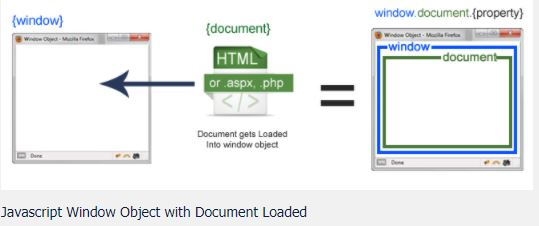

# JavaScript

Playing around with JS by creating mini projects

## Difference between document and window object

The difference can be visualized by the image given below:



The **window** object is the first thing that gets loaded into the browser. This **window** object has the majority of the properties like length, innerWidth, innerHeight, name, etc

The **document** object is the html, aspx, php, or other document that will be loaded into the browser. The document object actually gets loaded inside the window object and has properties available to it like title, URL, cookie, etc. That means if you want to access a property for the window it is window. property, if it is document it is window.document.property which is also available in short as document.property

# ECMAScript6

ECMAScript is a language specification standardized by European Computer Manufacturers Association(ECMA).

All major JavaScript implementations adhere to the ECMAScript standard.

## ECMAScript Defines

Language Syntax - parsing rules, keywords, statements, declarations, operators, etc.
Types - boolean, number, string, object, etc.
Prototypes and Inheritance
Standard Library of built-in objects and functions

## Block Scope Variables

- Block is a group of zero or more statements delimited by a pair of curly brackets {}.
- Block scope variables are the ones that exist only within the innermost block that surrounds them.
- In JavaScript, **var** is used to create variables. ES6, introduces 2 other keywords for declaring **Block scope variables**
  - let
  - const

## Understanding Let

- **let** keyword in ES6 is used to create **Block scope variables**
- It works like **var**, but differs in few aspects

## Let vs Var

**let** doesn't allow properties to be added to the global(window) object.

```
var x = 10;
console.log(window.x)    // 10
let x = 10;
console.log(window.x)    // undefined
```

**let** provides **Block scope** rather than function/global scope.

**Using var:**

```
function sum([array of args]) {
    for(var i = 0; i < [array of args].length; i++) {
        // some code
    }
    // variable is is available here
}
```

**Using let:**

```
function sum([array of args]) {
    for(let i = 0; i < [array of args].length; i++) {
        // some code
    }
    // variable i is not available here
}
```

**let** doesn't allow re-declaring a variable in global situation

```
var x = 10;
var x = 11;
console.log(x) // 11

let x = 10;
let x = 11;
// Uncaught SyntaxError: Identifier 'x' has already been declared
```

## Understanding Const

**const** keyword is also used to declare Block Scope variables in ES6. **These variables can not be changed once declared** unlike **let** or **var**.

```
let x = 10;
x = 20;
// console.log(x) => 20

const x = 10;
x = 20;
// Uncaught TypeError: Assignment to constant variable.
```

## Freeze

**Const make objects immutable, but it's value can still be modified**. To prevent the modification and make object immutable, use the **freeze()** function.

```
const x = {name: "Abc", age: 20};
x.age = 25;
console.log(x);
// {name: "Abc", age: 25}

const x = Object.freeze({name: "Abc", age: 20});
x.age = 25;
console.log(x);
// {name: "Abc", age: 20}
```

## Parameters and Arguments

**Parameters** (or formal parameters) are given in the function declaration, whereas **Arguments** (or actual parameters) are passed to the function.

```
function foo(a, b) {
    // do something
}
foo(10, 20);
```

In this function, a and b are **parameters**, while 10 and 20 are the **arguments**.

## Default Parameters

**Default parameters** are the parameters with an initialised value.

Invoking a function without passing any arguments, would assume default values and process the request.

**Example in JavaScript**

```
function foo(a, b) {
    console.log(a, b);
}
foo();  // undefined undefined
for(5, 10);     // 5 10
```

**Example in ES6:**

```
function foo(a = 10, b = 20) {
    console.log(a, b);
}
foo();  // 10 20
foo(5, 10); // 5 10
```

## Rest Parameter

**Rest** allows **indefinite number of parameters** in one single array. Notation **...<paramname>** is used to define Rest Parameter.

**Example in JavaScript**

```
function sum() {
    var args = Array.prototype.slice.call(arguments);
    // converts args to array
    var result = 0;
    args.forEach(function (args) {
        result += args;
    });
    return result;
}
```

**Example in ES6**

```
// args is rest parameter
function sum(...args) {
    var result = 0;
    args.forEach(function(args) { result += args; })
    return result;
}
let [x, y, z] = [1, 2, 3];
let add = sum(x, y, z);
console.log(add); // output: 6
```

## Spread Operator

**Spread Operator( ... )** is used to **spread** an **array elements into parameters.**

**Usage in code:** ...array_variable_name

**Example in JavaScript**

```
function sum(x, y, z) {
    return x + y + z;
}
let args = [1, 2, 3];
let add = sum.apply(null, args);
console.log(add);
```

**Example in ES6**

```
function sum(x, y, z) {
    return x + y + z;
}
let args = [1, 2, 3];
let add = sum(...args);
console.log(add);
```

## Using Spread Operator

Spread Operator can be used for

- Concatenation of arrays

```
var parts = ["shoulder", "knees"];
var bodyParts = ["head", ...parts, "and", "toes"];
console.log(bodyParts);
```

**Output:** ["head", "shoulder", "knees", "and", "toes"]

- Math Functions

```
let numbers = [9, 4, 7, 1];
console.log(Math.max(...numbers));
```

**Output:** 9

- Destructing arrays and objects

```
let [x, y, ...z] = [1, 2, 3, 4, 5, 6];
would mean x = 1, y = 2, z = [3, 4, 5, 6]

let {x, y, ...z} = {x: 1, y: 2, z: 3, a: 4};
would mean x = 1, y = 2, z = {z: 3, a: 4}
```

## Destructuring Content

Destructuring is a convenient way of extracting multiple values from data stored in **arrays** or **objects** into distinct variables.

JavaScript allows constructing arrays/objects, one property at a time or multiple properties at a time.

```
const name = {first: 'Kin', last: 'Johnson'};
```

However, extracting data had to be done one property at a time. There was no way to extract multiple properties at a time.

```
const firstname = name.first;
const lastname = name.last;
```

Destructuring in ES6, addressess this problem!

## Destructing Arrays

- Taking array elements directly into variables:

```
var [one, two, three, four] = ["chennai", "mumbai", "goa", "cochin"];
// console.log(one); => chennai
```

- Skipping values and taking second array element in variable two:

```
var [, two, , ] = ["chennai", "mumbai", "goa", "cochin"];
// console.log(two); => mumbai
```

- Destructuring Nested Arrays:

```
const [one, two, three] = [1, [2, 3], [4, 5]];
// one => 1, two => [2, 3], three => [4, 5]
```

## Destructing Objects

In Objects, variables can be skipped using commas.

Example of taking object elements directly into variables:

```
var {firstName:first, lastName:last, ...details} = {
    firstName: "Neha",
    lastName: "Singh",
    age: 40,
    city: "chennai",
    phone: 980000000
}
console.log(first, details);
// output: Neha {age: 40, city: "chennai", phone: 980000000}
```

## Destructing Nested Objects

- Declaration below would assign values a = 1, b = 2, and c = {four: 4, five: 5}

```
const {one: a, two: b, three: c} = {one: 1, two: 2, three: {four: 4, five: 5}};
```

- For readability we can use one:one instead of one:a. Declaration below would assign: one = 1, two = 2 and three = {four: 4, five: 5}

```
const {one: one, two: two, three: three} = {one: 1, two: 2, three: {four: 4, five: 5}};
```

- Similarly, the declaration below will assign: one = 1, two = 2 and three = 3

```
const {one, two, three} = {one: 1, two: 2, three: 3};
```

- Default values can also be used in destructing

```
const {one, two, three, four=4} = {one: 1, two: 2, three: 3};
```

## Arrow Functions

- Arrow functions in ES6 are the modified and abbreviated syntax of JavaScript functions
- These functions make use of => **token** and hence known as **Fat Arrow functions**
- Also, Arrow functions are less verbose than the traditional function expressions

## Function Definition

**JavaScript** functions with **multiple, single** and **no parameters**

```
var add = function(x, y) { return x + y;}
var square = function(x) {return x*x;}
function sub() => {return expression;}
```

**ES6 Equivalent**

```
var add = (x, y) => {return x + y;}
var square = (x) => {return x * x;}
or
var square = x => {return x * x;}
// Parenthesis are optional for single parameter
var sub = () => expression
// return and {} are optional for function with single statement
```

## Function Expression

**Arrow functions can also be used as function expressions** to return object literals. The function body should be wrapped in **parentheses()** to achieve this.

**Example in JavaScript**

```
var bio = function(name, age, country) {
    return {name: name, age: age, country: country};
};
```

**Example in ES6**

```
var bio = (name, age, country) => ({name: name, age: age, country: country})
```

## Template Literals

Template string makes it easy to create strings that are longer and have lot of dynamic content (variables) with exact amount of spaces, line breaks and indentation.

Template literals allows to:

- Create complex strings easily
- Evaluate an expression in templates
- Build complex html and xml templates (template functions)

Instead of single quotes or double quotes, ES6 uses **BACKTICK** or **OPENQUOTE**("`") character to create template literals

## Creating complex strings

Creating multiline strings no longer requires slash n (\n)

**Creating a multiline string in JS**:

```
let bio = "Wendy Harper \n Software Engineer - TCS \n 3 Years in Web development"
```

**Creating the same in ES6**

```
let bio = `Wendy Harper
           Software Engineer - TCS
           3 Years in Web development`
```

## Evaluating Expressions

The **literal** is delimited by **backticks** and the **interpolated expressions** inside the literal are delimited by **${variable}**
Template literals always produce strings.

**Example of interpolation of Expressions:**

```
let fN = `Wendy`;
let lN = `Harper`;
console.log(`My name is ${fN} ${lN}`);
```

**Alternatively we can also use more complex object.**

```
let person = {
    fN: `Wendy`,
    lN: `Harper`,
    name: function() {
        return `My name is ${this.fN} ${this.lN}`;
    }
};
person.name();
```

**Output in both cases would be:** My name is Wendy Harper

## Creating HTML Templates

Without using any templating libraries such as **moustache** or **handlebars**, we can **create template using template literals**, which can be reused

```
const wendy = {"id": 1, "firstName": "Wendy", "lastName": "Harper", "city": "Tulsa"}

function bio(person) {
    return `<p>
        <h1>
            <span>${person.firstName}</span>
            <span>${person.lastName}</span>
        </h1>
            <address>${person.city}</address>
    </p>`
}
bio(wendy)
```

**Output**

```
<p>
    <h1>
        <span>Wendy</span>
        <span>Harper</span>
    </h1>
    <address>Tulsa</address>
</p>
```

## Class

Class is just syntactical sugar over JavaScript prototype based inheritance
ES6 classes provide simple and clear syntax for creating objects and deal with inheritance

Class Definition Includes:

- **Class Declaration**:

```
class ArithmeticOperations {
    constructor(x, y) {
        this.x = x;
        this.y = y;
    }
    multiply() {
        return this.x * this.y;
    }
}
```

- **Class Expression**:

```
let ArithmeticOperations = class{
    // same as class definition above
}
```

## Types of Methods

**Constructor**: is a special method for **initializing and creating objects** with a class. A class can have at the most one constructor

**Static Methods**: are method on constructor function itself. They can be created using **static** keyword. They cannot be invoked using instances

```
class Food {
    static describe() {
        console.log("Food is a data type for storing macronutrient information.");
    }
}
Food.describe();
```

**Prototype Methods**: are any methods which are not constructor or static method

## Inheritance - SubClassing

**extends** keyword can be used to make a class a subclass(child) of another class

```
class ArithmeticOperations {
    constructor(x, y) {
        this.x = x;
        this.y = y;
    }

    multiply() {
        return this.x * this.y;
    }
}

class Addition extends ArithmeticOperations {
    sum() {
        return this.x + this.y;
    }
}

let operation = new Addition(2, 3);
operation.sum(); // 5
operation.multiply(); // 6
```

## Inheritance - SuperClassing

Parent class methods can be invoked using **super** keyword.

```
class DoubleAdd extends Addition {
    doubleAdd() {
        return 2 * super.sum();
    }
}

var x = new DoubleAdd(2, 3);
x.doubleAdd(); // 10
```

## Maps and Sets

Maps

- Maps are objects that associate a key to a value
- Maps allows both **primitives** and **objects** as **key** and **value**. But object allows only string keys

Set

- It is a **collection of unique values**
- Values can be **primitive** or **objects**

## WeakSet and WeakMap

**WeakSet** and **WeakMap** are similar to Set and Map repectively except that:

- **Values are easily garbage collected** in WeakSet or WeakMap
- They cannot be iterated
- Set references are strong pointers, while WeakSet references are weak pointers and vice versa for map
- Accepts only objects as keys, no primitives
- Few methods such as: .values(), .keys, .entries, and .size do not work

## Symbols

Symbols are new unique, immutable, primitive data type just like Number, String, and Boolean. They were originally meant to provide private properties

- **Symbol()** function can be used to create symbols

```
const mySymbol = Symbol();
```

- Symbol can not be instantiated using new keyword

```
var sym = new Symbol();
```

- Each time the Symbol() function is called, a **new unique symbol** is returned

```
let symbol1 = Symbol();
let symbol2 = Symbol();
console.log(symbol1 === symbol2);   // false
```

## Global Scope Symbols

**Symbol() function will not create a global symbol** that is available in the whole codebase

To create **global scope** Symbols, use following methods

- 'Symbol.for()'
- 'Symbol.keyFor()'

These methods can be used to set and retrieve symbols from the global symbol registry

## Global Scope Symbols

**Symbol.for(key)** method searches for existing symbols with the given key and returns it, if found. Otherwise, it creates a new symbol in the **global symbol registry** with this key and then returns the symbol.

```
Symbol.for('bar') === Symbol.for('bar');
// true, both are same

Symbol('bar') === Symbol('bar');
// false, as Symbol() creates new Symbol each time it is called
```

## Global Scope Symbols

**Symbol.keyFor(key)** method is essentially **opposite of Symbol.for(key)**

Instead of passing a key to get a symbol, **pass a symbol to get a key**

```
var sym1 = Symbol("desc");
// Local symbol
var sym2 = Symbol.for("desc");
// Global symbol

console.log(Symbol.keyFor(sym1));
// undefined
console.log(Symbol.keyFor(sym2));
// desc
```

## Symbols as Object Keys

Symbols can be used as object keys to have **(semi) private properties** in JavaScript.

```
// Defining symbol
let email = Symbol();
// Defining object "user"
let user = {
    name: "praveen",
    age: 30,
    // Symbol as key in array
    [email]: "praveen@gmail.com"
};
```

**Symbols are visible if accessed directly**

```
console.log(user[email]);
// praveen@gmail.com
```

## Accessing Object Symbols

Iterating **Object.keys()** and **Object.getOwnPropertyNames()**, using for loop or methods, would list just the name and age.

**Email will not be displayed as it is private**.

```
for(var i in user) { console.log(i); }
Object.keys(user);
Object.getOwnPropertyNames(user); // Output: ["name", "age"]
```

## Accessing Object Symbols

Symbols in Objects can be accessed via **Object.getOwnPropertySymbols** or **Reflect.ownKeys**, thus making them public for all to see.

**Object.getOwnPropertySymbols()** returns an array of **symbol-based keys**

```
Object.getOwnPropertySymbols(user);
// Output: [Symbol()]
```

**Reflect.ownKeys()** will return an array of **all keys & symbols**

```
Reflect.ownKeys(user)
// Output: ["name", "age", Symbol()]
```

## Promise

Promise is a **design pattern** that is useful in asynchronous programming

\*\*Promise in ES6 is an implementation of this pattern with functions(or methods) that return results asynchronously

**A promise is in one of the following 3 states**

- Pending
- Resolved
- Rejected

## Creating a Promise

A Promise has two functions:

- resolve
- reject

**Creating a Promise**

```
var promise = new Promise(function(resolve, reject) {
    if(condition) {
        resolve(value); // success
    } else {
        reject(reason); // failure
    }
});
```

## Chaining

**Chaining Promises** then() always returns a Promise, which enables chaining of method calls:

```
asyncFunc().then(function(value1) {
    return 123;
}).then(function(value2) {
    console.log(value2);   // 123
});
```

**Chaining Errors:** There can be one or more then() method calls that don't provide an error handler. Then the error is passed on until there is an error handler

```
asyncFunc1().then(asyncFunc2).then(asyncFunc3).catch(function(reason) {
    // Something went wrong in asyncFunc2 or asyncFunc3
});
```

## Promise.all

**Promise.all** can be used to trigger multiple asynchronous calls, at the same time and notify once all results come in.

Syntax:

```
Promise.all(promise1, promise2, ...)
```

It returns array containing results of all promises when all are resolved. And a reject with the value, if any one of the promise gets rejected.

```
Promise.all([firstAction(), secondAction()]).then(function() {
    finalAction();
});
```

**finalAction()** will be invoked only when **firstAction()** and **secondAction()** promises are resolved.

Example of using the Promise to get the data:

```
function getData(method, url) {
    return new Promise(function(resolve, reject) {
        var xhr = new XMLHttpRequest();
        xhr.open(method, url);
        xhr.onload = function() {
            if(this.status >= 200 && this.status < 300) {
                resolve(xhr.response);
            } else {
                reject({
                    status: this.status,
                    statusText: xhr.statusText
                });
            }
        };
        xhr.onerror = function() {
            reject({
                status: this.status,
                statusText: xhr.statusText
            });
        };
        xhr.send();
    })
}

getData('GET', 'https://jsonplaceholder.typicode.com/todos').then(function(data) {
    let todos = JSON.parse(data);
    let output = '';
    for(let todo of todos) {
        output += `
            <li>
                <h3>${todo.title}</h3>
                <p>Completed: ${todo.completed}</p>
            </li>
        `;
    }

    document.getElementById('template').innerHTML = output;
}).catch(function(err) {
    console.log(err);
});
```

## Modules

- **Module** is a file that contains all the code related to a specific functionality
- **These files export functions** for other modules to consume
- The functions or variables defined in a module are not visible outside unless they are explicitly exported

**It is always a good practice to physically separate the code based on functionality**

## Exports

Use the keyword **export** to export certain variables from a module,
ES6 Modules gives a **fine grain control to import/export** just what is required for a particular module
Example module that exports functions:

```
common_methods.js

function sum(a, b) {
    return a + b;
}
function difference(a, b) {
    return a - b;
}
export {sum, difference} // separate methods using comma
export {sum as add, difference as minus} // aliasing
```

## Imports

Use **import** keyword to consume the exported variables in a different module

**Example of a module that imports functions: app.js**

- Importing all methods:

```
import {sum, difference} from 'common_methods'
console.log(sum(2, 3));         // 5
console.log(difference(5, 2));  // 3
```

- Importing only certain methods:

```
import {sum} from 'common_methods'
```

- Importing modules as objects

```
import 'common_methods' as utils;
console.log(utils.sum(2, 3));        // 5
console.log(utils.difference(5, 2)); // 3
```

## Default Exports

Default exports are one of the main ways to export modules. However, a file can have only one default export.

```
var utils = {
    sum: function(a, b) {
        return a + b;
    }
    difference: function(a, b) {
        return a - b;
    }
}
export default utils;
```

**app.js**

```
import utils from 'common_methods';
console.log(utils.sum(2, 3));           // 5
console.log(utils.difference(5, 2));    // 3
export default utils;
// Re-exports the imported module
```

## Generators

Generators are also functions. However, unlike functions, we can pause the execution and later resume the code execution using a generator function

Generators also allow us to turn asynchronous code in to synchronous-looking code

```
function* name(params) {}
function *name(params) {}
function*name(params) {}
```

## Creating Generator Function

```
function *foo() {
    yield 'hi';
    yield 'dude';
}

let iterator = foo();
iterator.next(); // Object {value: "hi", done: false}
iterator.next(); // Object {value: "dude", done: false}
iterator.next(); // Object {value: undefined, done: true}
```

- **Calling a generator function** does not execute its body immediately. An **iterator object** for the function is returned instead
- **Calling next()** on iterator object will execute the code till it finds the first yield expression and pauses it
- **Calling next()** again on iterator object will execute until the next yield expression and pauses again

## Yield Multiple Values

**yield** can be used to **recursively iterate** over an iterable

```
function *foo() {
    yield* ['hi', 'hello'];
}

let iterator = foo()
iterator.next();    // Object {value: "hi", done: false}
iterator.next();    // Object {value: "hello", done: false}
iterator.next();    // Object {value: undefined, done: true}
```

## Return in Generators

```
function *foo() {
    yield 'hi';
    yield 'dude';
    return "bye";
}

let iterator = foo();
iterator.next(); // Object {value: "hi", done: false}
iterator.next(); // Object {value: "dude", done: false}
iterator.next(); // Object {value: "bye", done: true}
iterator.next(); // Object {value: undefined, done: true}
```

## Yielding Other Generators

Not only primitives, we can also yield other generator functions. Example:

```
function *foo() {
    yield* ['hi', 'hello'];
}
function *bar() {
    yield* foo();
    yield "bye";
}
let iterator = bar()
iterator.next(); // Object {value: "hi", done: false}
iterator.next(); // Object {value: "hello", done: false}
iterator.next(); // Object {value: "bye", done: false}
iterator.next(); // Object {value: undefined, done: true}
```

## Generator with arguments

```
function* person() {
    let age = yield 'Age please';
    console.log(age);
    let location = yield 'Your age is ' + age + 'Your location please....';
    console.log(location);
    return location;
}

let iterator = person();
iterator.next();
// Object {value: "Age please", done: false}
iterator.next(10);
// Object {value: "Your age is 10 Your location please...", done: false}
iterator.next('LA');
// Object {value: "LA", done: true}
```

## Transpiling

**Transpiling** is a specific term for taking source code written in one language and transforming into another language.

As not all browsers support all ES6 features, ES6 code is converted into ES5 so it can be read by all browsers.

## Popular Transpiling Tools

Few of the popular Transpiling tools are: Babel.js, Webpack, Closure and Traceur.

**Babel** offers better readability and understandability of the ES5 code it generates, after transpiling and makes the work of any JavaScript developer easy.

## Sample of how Transpiling Works

Function to add any number of integer arguments **Code in ES6:**

```
let additionResult=(...arr)=> {
    var sum = 0;
    for(var i = 0; i < arr.length; i++) {
        sum += arr[i];
    }
    return sum;
}
```

**Code Transpiled by Babel into ES5**:

```
var additionResult = function additionalResult() {
    for(var _len = arguments.length, arr = Array(_len), _key = 0; _key < _len; _key++) {
        arr[_key] = arguments[_key];
    }
    var sum = 0;
    for(var i = 0; i < arr.length; i++) {
        sum += arr[i];
    }
    return sum;
};
// Output of both these functions would be same. additionResult(1, 2, 7, 5, 6); // output: 21
```

**Using Babel**

- Add below script code in <head> section of HTML page.

```
<script src="https://cdnjs.cloudflare.com/ajax/libs/babel-core/6.1.19/browser.js"></script>
```

// source: https://cdnjs.com/libraries/babel-core

- Rename "text/javascript" to "text/babel"

```
<script type="text/babel">
var nameBuilder = (firstName="Michael", lastName="Jackson") => {
    console.log(`${firstname} ${lastName}`);
}
</script>
```

- This approach enables in-browser transformation without a need to install anything
- However, it convert whole code in ES5 during runtime of project, which might make the application slow

# Node.JS

Allows you to build scalable network applications using JavaScript on the server-side. It's fast because it's mostly **C** code

**What could you built?**

- Websocket Server (Like a chat server)
- Fast File Upload Client
- Ad Server
- Any Real-Time Data Apps

**What is Node.JS not?**

- A Web Framework
- For Beginners - It's very low level
- Multi-threaded - You can think of it as a single threaded server

**Objective: Print File Contents**

- Blocking Code

```
Read file from Filesystem, set equal to "contents"
Print contents
Do something else
```

- Non-Blocking Code

```
Read file from Filesystem
  whenever you're complete, print the contents // This is a Callback
Do Something else
```

## Blocking v/s Non-Blocking

- Blocking Code

```
var contents = fs.readFileSync('/etc/hosts');
console.log(contents);
console.log('Doing something else');
```

- Non-Blocking Code

```
fs.readFile('/etc/hosts', function(err, contents) {
    console.log(contents);
});
console.log('Doing something else');
```

### Callback Alternate Syntax

```
fs.readFile('/etc/hosts', function(err, contents) {
    console.log(contents);
});
```

**Same as**

```
var callback = function(err, contents) {
    console.log(contents);
}
fs.readFile('/etc/hosts', callback);
```

## Node.JS Hello Dog

```
hello.js

var http = require('http'); // How we require modules
http.createServer(function(request, response) {
    response.writeHead(200); // Status code in header
    response.write("Hello, this is dog."); // Response body
    response.end(); // Close the connection
}).listen(8080); // Listen for connections on this port
console.log("Listening on port 8080...");

command line

$ node hello.js # This command will run the file and it prints: Listening on port 8080
$ curl http://localhost:8080 # This command will print: Hello, this is dog.
```

## The Event Loop: Two Callbacks Here

```
var http = require('http');

http.createServer(function(request, response) {
    response.writeHead(200);
    response.write("Dog is running.");
    setTimeout(function() {
        response.write("Dog is done.");
        response.end();
    }, 5000);
}).listen(8080);
```

## Node.js Usage

Node.js shines in real-time web applications employing push technology over web sockets. It can be used for the following purposes:

- Web applications (especially real-time web apps)
- Network applications
- Distributed systems
- General purpose applications

## Advantage of using node.js

- Provides an easy way to build scalable network programs
- Easy to install and run locally
- Generally fast
- Great concurrency
- Asynchronous everything
- Almost never blocks
- Unified programming language and data types

## REPL

REPL stands for **Read Eval Print Loop** and it represents a computer environment like a Windows console or Unix/Linux shell where a command is entered and the system responds with and output in an interactive mode.

- Read - Reads user's input, parses the input into JavaScript data-structure, and stores in memory
- Eval - Takes and evaluates the data structure
- Print - Prints the result
- Loop - Loops the above command until the user presses ctrl-c twice

## REPL Commands

- Ctrl + C - terminate the current command
- Ctrl + C twice - terminate the Node REPL
- Ctrl + D - terminate the Node REPL
- Up/Down Keys - see command hisotry and modify previous commands
- Tab Keys - List of current commands
- .help - list of all commands
- .break - exit from multiline expression
- .clear - exit from multiline expression
- .save filename - save the current Node REPL session to a file
- .load filename - load file content in current Node REPL session

## Concept of function

```
function printstuff(stuff) {
    console.log(stuff);
}

// The function with no name are known as anonymous functions.
var printstuff = function(stuff) {
    console.log(stuff);
}

function mainfunction(anotherfunction, value) {
    anotherfunction(value);
}
mainfunction(printstuff, "World");

// In JavaScript the anonymous functions can also be passed in as a parameter
mainfunction(function(stuff) {console.log(stuff);}, "anonymous");
```

## NPM

**Node Package Manager(NPM)** provides two main functionalities:

- Online repositories for node.js package/modules which are searchable on search.nodejs.org
- Command line utility to install Node.js packages, do version management and dependency management of Node.js packages

NPM comes bundled with Node.js installables after v0.6.3 version. There is a simple syntax to install any Node.js module:

```
npm install <Module Name>
```

We can use **npm ls** command to list down all the locally installed modules

## Node.js as single thread

For async processing, Node.js was done as an experiment. It is believed that better performance and scalability can be achieved by async processing on a single thread under typical web load than the typical thread based implementation

## Node.js over Java

Node.js is quickly gaining attention as it is loop-based server for JavaScript. Node.js gives user the ability to write the JavaScript on the server, which has access to things like HTTP stack, file I/O, TCP, and databases

## Node JS global objects

```
/*
__filename - represents the filename of the code being executed
__dirname - represents the name of the directory of the file under execution
*/

console.log(__filename);
console.log(__dirname);

/*
setTimeout() - It takes two parameters, the first argument is the function and the second argument is the time in milliseconds
*/

function printstuff() {
    console.log("This was from setTimeout/setInterval");
}
setTimeout(printstuff, 5000);
setInterval(printstuff, 2000);
```

## Callback Functions

Callback function is used in Node.js to deal with multiple requests made to the server. If a server takes a long time to read a large file and if you don't want a server to get engaged in reading that large file while dealing with other requests, the callback funciton is used. The callback function allows the server to deal with the pending requests first and call a function when it is completed.

## Modules

```
module.exports = {
    relay: function() {
        console.log("This is the relay function");
    },
    longjump: function() {
        console.log("This is the longjump function");
    }
}
```

### http module

```
// It's a good convention to name the variable the same as that of the name of the module
var http = require('http');
http.createServer(function(request, response) {
    response.writeHead(200, {"Content-Type": "text/plain});
    response.write("Hello World");
    response.end();
}).listen(8888);
```

```
input.txt
----------
This is the input file. Contains nothing useful. Just read this stuff.


app.js
----------
var fs = require('fs');
fs.readFile('input.txt', function(err, data) {
    if(err) {
        console.log(err);
    } else {
        console.log('Async data is ' + data.toString());
    }
});

var data = fs.readFileSync('input.txt');
console.log('Sync data is ' + data.toString());
console.log('This is the end');


output
----------
Sync data is This is the input file. Contains nothing useful. Just read this stuff.
This is the end
Async data is This is the input file. Contains nothing useful. Just read this stuff.
```

### Events

```
app.js

var events = require('events');
var eventEmitter = new events.EventEmitter();

var ringbell = function() {
    console.log("Ring ring ring");
}

eventEmitter.on("doorOpen", ringbell);
eventEmitter.on("bellrings", function(message) {
    console.log(message);
});
eventEmitter.emit("doorOpen");
eventEmitter.emit("bellrings", "Welcome");
```

## Event Listeners

Event listeners are similar to callback functions, but are associated with some event. For example, when a server listens to http request on a given port, an event will be generated and to specify http server has received and will invoke corresponding event listener. Basically, Event Listeners are also call backs for a corresponding event.

## Streams

To use the streams we will use the **fs** module

```
var fs = require('fs');
var readableStream = fs.createReadStream('input.txt');
var data = '';
readableStream.setEncoding('UTF8');
// Streams are also event emitters. Readable stream emits data. And streams reads data bit-by-bit
// This is an Asynchronous function
readableStream.on('data', function(chunk) {
    data += chunk;
});
// This is an Asynchronous function
readableStream.on('end', function() {
    console.log(data);
});
var writeData = "Hello World";
var writeableStream = fs.createWriteStream('output.txt');
writeableStream.write(writeData, 'UTF8');
writeableStream.end();
writeableStream.on('finish', function() {
    console.log("Write completed");
});
```

## Types of streams

There are four types of streams:

- Readable - For read operation
- Writable - For write operation
- Duplex - For both read and write operation
- Transform - When the output is computed based on the input

## Piping in Node

**Piping** is a mechanism to connect output of one stream to another stream. It is normally used to get data from one stream and to pass the output of that stream to another stream. There is no limit on piping operations.

```
var fs = require('fs');
var readableStream = fs.createReadStream('in.txt');
var writeableStream = fs.createWriteStream('out.txt');
readableStream.pipe(writeableStream);
```

## Chaining in Node

**Chaining** is a mechanism to connect output of one stream to another stream and create a chain of multiple stream operations. It is normally used with piping operations.

## NodeJS App

- What?
  - A Review Application
- Requirements?
  - http://localhost:8888/home (Review form)
  - http://localhost:8888/review (Display review)
- Implementation
  - Server
  - View
  - Routers
  - Request Handlers

```
server.js

var http = require('http');
// Here the reason why we are passing the function as an argument in the createServer is because we are leveraging the node JS callback model to make sure that we call the function only when the request arrives. When there's no request it will continue executing the remaining part of the code
http.createServer(function(request, response) {
    console.log("Request received");
    response.writeHead(200, {"Content-Type": "text/plain"});
    response.write("Hello from our application");
    response.end();
}).listen(8888);

// Alternatively we can also create the function as shown below
function onRequest(request, response) {
    console.log("Request received");
    response.writeHead(200, {"Content-Type": "text/plain"});
    response.write("Hello from our application");
    response.end();
}
http.createServer(onRequest).listen(8888);
console.log("Server started on localhost port 8888");

// Converting the above code in a module and export it
function startserver() {
    function onRequest(request, response) {
        console.log("Request received");
        response.writeHead(200, {"Content-Type": "text/plain"});
        response.write("Hello from our application");
        response.end();
    }
    http.createServer(onRequest).listen(8888);
    console.log("Server started on localhost port 8888");
}
exports.startserver = startserver;
```

```
app.js

var server = require('./server');
server.startserver();
```

**node-router**

node-router is a lightweight, flexible and lightning-fast router for Node.js web servers
It provides key conveniences for developing a Node server with the option to add middleware for additional functionality when you need it. Built-in features are limited by design and the configuration is simple and flexible. Much of the baseline code was derived from Connect
In its current form, node-router is ideal for routing and responding to requests with dynamic text of JSON

**Router Module**

- Request URL
- Get/Post Parameters

ex: http://localhost:8888/home?channel=Joatman

Here, path is **/home** and parameter is **channel=Joatman**

Here we will use 2 modules i.e. the **URL module** and the **query string module**

```
server.js

var http = require('http');
var url = require('url');

function startserver(route, handle) {
    function onRequest(request, response) {
        var reviewData = "";
        var pathname = url.parse(request.url).pathname;
        console.log("Request received for " + pathname);
        request.setEncoding("utf8");
        request.addListener("data", function(chunk) {
            reviewData += chunk;
        });
        request.addListener("end", function() {
            route(handle, pathname, response, reviewData);
        });
    }
    http.createServer(onRequest).listen(8888);
    console.log("Server started on localhost port 8888");
}
exports.startserver = startserver;


router.js

function route(handle, pathname, response, reviewData) {
    console.log("Routing a request for " + pathname);
    if(typeof handle[pathname] === 'function') {
        handle[pathname](response, reviewData);
    } else {
        console.log("No handler for " + pathname);
        response.writeHead(404, {"Content-Type": "text/plain"});
        response.write("Error 404 page not found");
        response.end();
    }
}
exports.route = route;


app.js

var server = require("./server");
var router = require("./router");
var handler = require("./handler");

var handle = {};
handle["/"] = handler.home;
handle["/home"] = handler.home;
handle["/review"] = handler.review;
server.startserver(router.route, handle);


handler.js

var querystring = require("querystring");

function home() {
    console.log("Executing 'home' handler");
    var htmlfile = '<html>'+
    '<head>'+
    '<meta http-equiv="Content-Type" content="text/html;charset=UTF-8" />'+
    '</head>'+
    '<body>'+
    '<form action="/review" method="post">'+
    '<textarea name="text" rows="20" cols="60"></textarea>'+
    '<input type="submit" value="Submit text" />'+
    '</form>'+
    '</body>'+
    '</html>';
    response.writeHead(200, {"Content-Type": "text/html"});
    response.write(htmlfile);
    response.end();
}
function review(response, reviewData) {
    // Here we are using the querystring module to handle the response
    console.log("Executing 'review' handler");
    response.writeHead(200, {"Content-Type": "text/plain"});
    response.write("Your review is " + querystring.parse(reviewData).text);
    response.end();
}
exports.home = home;
exports.review = review;
```

**Request -> app.js -> router.js -> server.js -> router.js -> handler.js(Responsible for handling the request)**

**Response -> server.js -> router.js -> handler.js(Responsible to respond to the request)**

## Node.js Course Summary

- Pros:
  - If your application does not have any CPU intensive computation, you can build it in JavaScript top to bottom, even down to the database level if you use JSON storage object DB like MongoDB
  - Crawlers receive a full-rendered HTML response, which is far more SEO friendly rather than a single page application or a websockets app run on top of Node.js
- Cons:
  - Any intensive CPU computation will block node.js responsiveness, so a threaded platform is a better approach
  - Using relational database with Node.js is considered less favorable

# Environment Variables

The Environment Variables are variables that are set by the Operating system. They are decoupled from application logic. They can be accessed from applications and programs through various APIs

There is a Node.js library called **dotenv** that helps you manage and load environment variables. Let's take a look at the purpose of environment variables, how to use them, and their role in a development environment

## Purpose of Environment Variables

### Separation of Concerns

Separation of Concerns refers to a software design principle that states that computer programs should be divided into distinct sections, such that each section addresses a separate concern. This means that a developer working on one section needs to have minimal knowledge about other sections. The details of other sections are placed on the sideline

Application Configuration is a section of the code that should be decoupled from the application. Good software practices state that **app config requires strict separation of config from code**. Such config files can be stored as environment variables

### Protecting Config Keys

With the increasing popularity of cloud computing, more applications are using **cloud services** and other **external APIs**. Most of these come with config keys for control and access management. If the API keys are added to the application, and the code is pushed to a public repository on GitHub, this could lead to an unmonitored access problem. Unknown parties might end up using your API keys, leading to an unintended bill for your cloud servvices, and other potential security issues

To solve this problem, the config keys can be added as environment variables and invoked from a closed environment from where the application is deployed

## Environment Variables in Node.js

In Node.js, process.env is a global variables that is injected during runtime. It is a view of the state of the system environemnt variables. When we set an environment variable, it is loaded into **process.env** during runtime and can later be accessed

**dotenv** is a module available on **npm** to load environment variables into **process.env.dotenv** can be added to your Node.js project by installing it from npm or yarn:

```
# with npm
npm install dotenv

# or with Yarn
yarn add dotenv
```

In a production environment, the IP address and the port on which it runs might change every single time, depending on the server. Since we cannot hardcode the server port, we can solve it by using dotenv

Create a file called **index.js** and add the following code to it

```
const express = requrire("express");
require("dotenv").config();

const app = express();
const port = process.env.PORT || 3000;

app.listen(port, () => {
    console.log(`Server is running on the port ${port}.`);
});
```

Suppose we want to use sensitive credentials like username and password in an open-source project, we can use **dotenv** for that as well

```
require("dotenv").config();

const mysql = require("mysql");

let con = mysql.createConnection({
    host: process.env.DB_HOST,
    user: process.env.DB_USER,
    password: process.env.DB_PASS,
});
```

Now, to set the env variables, create a **.env** file at the root of the project directory

```
DB_HOST=localhost
DB_User=admin
DB_PASS=password
```

Enter the values of the following variables. This will load these variables into **process.env**. We can add this **.env** file to **.gitignore** so that our credentials are protected
