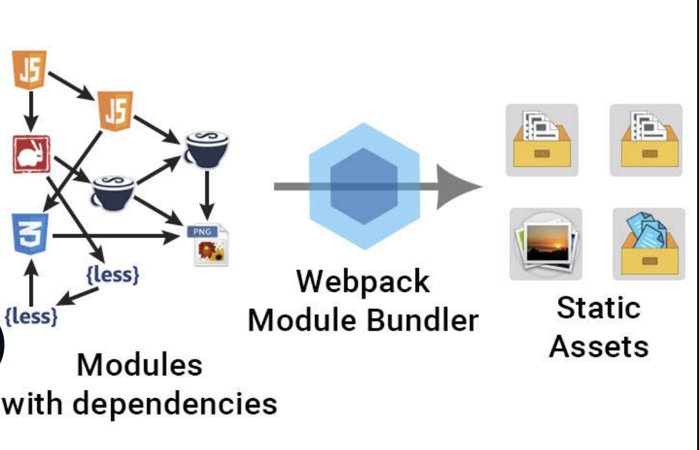
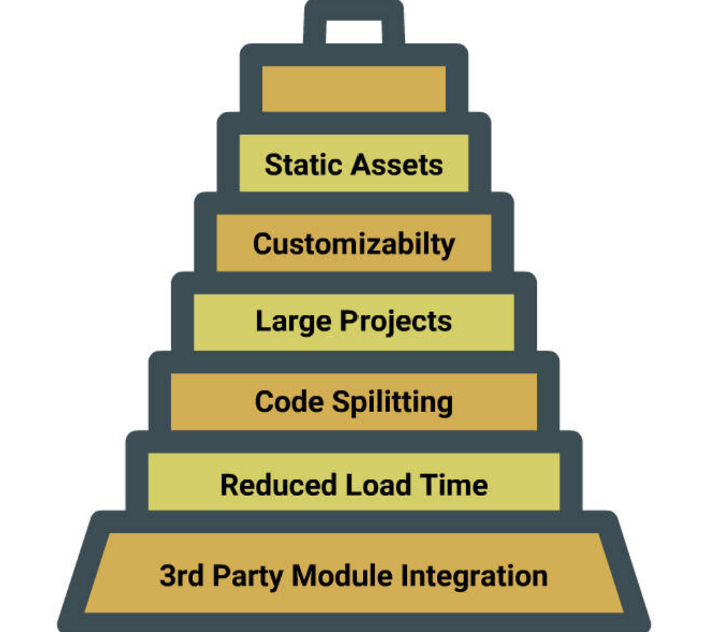

# Webpack



_Webpack_ is an open source module bundler for modern **JavaScript** applications. It takes modules with dependencies and generates static assets representing those modules

## When do you need Webpack?

Webpack is _good fit_ for a complex front-end application with non-code static assets like style sheets, images, etc

Webpack is not recommended for small web applications

## Why do need Webpack?

Based on the **_dependency_**, Webpack creates a **dependency graph** so as to give a modular approach to the web applications

_Code Splitting_ is an exciting feature that keeps Webpack distinct from all other module bundlers

## Goals of Webpack



The Webpack goals are not limited to:

- Splitting the dependency tree into chunks loaded on demand
- Reducing initial load time
- Every static asset should be able to be a module
- Integrating Third party libraries as modules
- Ensuring each part of the module is customizable

_Webpack is very much suitable for large projects_

To save webpack only as dev dependency, we use the command given below

```
npm install webpack --save-dev
```

## webpack-dev-server

- The **webpack-dev-server** is a little **Node.js** Express server, which uses the **webpack-dev-middleware** to serve a webpack bundle
- The server listens for any change in your project and then injects that change into the browser

### Installing Dev server

To **intsall** webpack dev server,

```
npm install webpack-dev-server --save-dev
```

**Modify** the build script in package.json as follows

```
"built": "webpack-dev-server --entry ./src/app.js --output -filename ./dist/bundle.js"
```

Now type **npm run build**

- Open index.html(http://localhost:8080) and check network tab in developers console. You should see assets being downloaded

## Assets From Memory

Webpack dev server prevents webpack from emitting the resulting files to the disk. Instead it keeps and serves the resulting files from memory

```
 - Delete dist folder
 - Run `npm run build`
 - open index.html in browser.
```

We will still get the same output without bundle.js getting created

# Core Concepts of webpack

Webpack includes four core concepts

1. Entry - The starting point of dependency graph is called an **Entry point**, it tells webpack where to start bundling
2. Output - It tells the webpack where to bundle the modules of the application and how to treat a bundled code
3. Module loaders
4. Plugins

## Defining Entry and Output

Create **webpack.config.js** in the root of the working directory

**webpack.config.js**

```
     // Nodejs module for absolute path resolving
     var path = require('path');
    module.exports = {
    //  Entry point of webpack
    entry: './src/app.js',
    output: {
        // Need to be resolved to absolute path
        path: path.resolve(__dirname, 'dist'),
        // bundled/compiled file name
        filename: './bundle.js',
        // For webpack dev server to identify the full path
        publicPath: '/dist'
        }
    };
```

Modify the script for webpack dev server by removing the entry and outputs in **package.json**

**package.json**

```
 {
    "name": "webpack_practice",
    "version": "1.0.0",
    "description": "",
    "main": "index.js",
    "scripts":
    {
    "test": "echo \"Error: no test specified\" && exit 1",
    "build": "webpack-dev-server"
    },
    "author": "",
    "license": "ISC",
    "devDependencies":
    {
    "webpack": "^2.4.1"
    }
}
```

Now run the build

```
npm run build
```

Open localhost:8080 in browser, our js loads as expected.

## Why do we need Loaders?

- Webpack can handle JavaScript natively
- Loaders are like **tasks** in other build tools, and provide a powerful way to handle frontend build steps
- Loaders can:
  - Transform files from a different language like **CoffeeScript** to **JavaScript** or **inline images** as **data URL**s
  - Loaders also allow you to include **css** file(**require()**) right in JavaScript!

There is wide variety of loaders available which includes: - conversion of ES6 code to ES5 code using babel. - **scss** loader which converts **SASS** code to **css**

## Loading CSS

To laod CSS, you need to use

```
1. `css-loader` : For processing css files.
2. `style-loader` : injects the styling through a style element.
```

- Install css and style loaders

```
npm install css-loader style-loader --save-dev
```

- create css folder in /src and include **main.css** in it

## Create HTML file

Modify the **index.html** file

**index.html**

```
<!DOCTYPE html>
<html>
    <head>
        <meta charset="utf-8">
        <title>Webpack Demo</title>
        <script src="dist/bundle.js" charset="utf-8"></script>
    </head>
    <body>
        <button type="button" name="button" id="redButton">I'm Red</button>
        <button type="button" name="button" id="greenButton">I'm Green</button>
        <button type="button" name="button" id="blueButton">I'm Blue</button>
    </body>
</html>
```

## Create your StyleSheet

Modify the **main.css** file

**main.css**

```
body {
    background-color: aquamarine;
}
button {
    border: 1px solid black;
    padding: 5px 10px;
    font-size: 2rem;
    color: ghostwhite;
    border-radius: 10px;
}
#redButton {
    background-color: red;
}
#greenButton {
    background-color: forestgreen;
}
#blueButton {
    background-color: blue;
}
```

## Configure your webpack

Modify the **app.js** file

**app.js**

```
require("./css/main.css");
```

**Add loader modules in webpack.config.js**

**webpack.config.js**

```
var path = require('path');
module.exports = {
    entry: './src/app.js',
    output: {
        path: path.resolve(__dirname, 'dist'),
        filename: './bundle.js',
        publicPath: '/dist'
    },
    module: {
        loaders: [
            { test : /\.css$/, loader: "style-loader!css-loader" }
        ]
    }
};
```

## Run your CSS loader

Type **npm run build** in terminal. It opens http://localhost:8080 in a browser. Check to ensure that all styles are being applied

## Setting up ES6 Loader

To use ES6 in our application with webpack, we need

```
- `babel-core`: Transpiles es6 code to es5 so that it works in any browser.
- `babel-loader`:Helps in using babel with webpack
- `babel-preset-es2015`: unlocks all the es6 features to use in our application.
```

```
npm install babel-core babel-loader babel-preset-es2015  --save-dev
```

**Add operations.js in /src folder with the following content**

**operations.js**

```
function sum(a, b) {
    return a+b;
}

function difference(a, b) {
    return a-b;
}

export { sum, difference }
```

### Configure your webpack

Modify **app.js** as follows

**app.js**

```
require("./css/main.css");
import {sum, difference} from './operations.js';
document.write("Sum of 2 and 3 is "+sum(2, 3)); // 5
document.write("Difference of 5 and 5 is "+difference(5, 2));  // 3
```

But this will not work unless we include the babel loader configuration in **webpack.config.js**

**webpack.config.js**

```
var path = require('path');
module.exports = {
    entry: './src/app.js',
    output: {
        path: path.resolve(__dirname, 'dist'),
        filename: './bundle.js',
        publicPath: '/dist'
    },
    module: {
        loaders: [
            {
                test : /\.css$/,
                loader: "style-loader!css-loader" },
            {
                test: /\.js$/,
                use: [
                    {
                        loader: 'babel-loader',
                        options: { presets: ['es2015'] }
                    }
                ]
            }
        ]
    }
};
```

### Running ES6 Loader

Try running **npm run build** and open **localhost:8080** to see the changes in browser

# Plugins

- In Webpack, the developers are not confined to the _predefined build callbacks_. They can use _customized build callbacks_ using **plugins**
- Plugins are the backbone of Webpack as it fully exposes the potential of webpack
- Plugins are additional node modules that usually work on the resulting bundle

**Example**

- _HtmlWebpackPlugin_ simplifies the creation of HTML files to serve Webpack bundles
- _ExtractTextWebpackPlugin_ moves all CSS modules in entry chunks into a separate CSS file. So that the styles are no longer inlined into the JS bundle, but are saved in a separate CSS file (style.css)

## HtmlWebpackPlugin

First install plugin as dev dependency:

```
npm install html-webpack-plugin --save-dev
```

To make it work, modify the **webpack.config.js** as follows:

**webpack.config.js**

```
var path = require('path');
var HtmlWebpackPlugin = require('html-webpack-plugin');

module.exports = {
    entry: './src/app.js',
    output: {
        path: path.resolve(__dirname, 'dist'),
        filename: 'bundle.js'
    },
    module: {
        loaders: [
            {
                test : /\.css$/,
                loader: "style-loader!css-loader" },
            {
                test: /\.js$/,
                use: [
                        {
                            loader: 'babel-loader',
                            options: { presets: ['es2015'] }
                        }
                ]
            }
        ]
    },
    plugins: [ new HtmlWebpackPlugin() ]
};
```

Run the build

This will generate a _dist/index.html_ file, which has the following content

**dist/index.html**

```
<!DOCTYPE html>
<html>
    <head>
        <meta charset="utf-8">
        <title>Webpack App</title>
</head>
<body>
        // output assets
    <script src="bundle.js" charset="utf-8"></script>
</body>
</html>
```

```
npm run build
```

### Modifying webpack.config.js

If you notice, all the buttons that are missing from the final index.html, will by default serve just **js** and **css** compiled assets

We can also give specification for the template to generate, rather than using the default template

Modify the _webpack.config.js_ as follows:

**webpack.config.js**

```
var path = require('path');
var HtmlWebpackPlugin = require('html-webpack-plugin');
module.exports = {
    entry: './src/app.js',
    output: {
        path: path.resolve(__dirname, 'dist'),
        filename: './bundle.js',
        publicPath: '/dist'
    },
    module: {
        loaders: [
            {
                test : /\.css$/,
                loader: "style-loader!css-loader" },
            {
                test: /\.js$/,
                use: [
                    {
                        loader: 'babel-loader',
                        options: { presets: ['es2015'] }
                    }
                ]
            }
        ]
    },
    plugins: [
        new HtmlWebpackPlugin({
            template: 'index.html'   // we are providing our index.html which has all our code.
        })
    ]
};
```

Again, run **npm run build**. You will notice that all buttons will be included

# Dependency Graph

- In Webpack, whenever a file refers to another, it is called a **dependency**
- Webpack starts from the entry point, finds each dependency and creates the dependency graph
- It considers all the non-code assets such as images and stylesheets and adds them to the graph
- Based on the graph, it bundles the file together, hence the overhead of loading all the distint files is eliminated

## Optimization

Now that you have successfully bundled your application. The next step is:

- The bundled application is not directly suitable for production because of the lengthy junk comments and spaces
- You should optimize it using a webpack command to make it ready for production

```
webpack -p
```

This will do the minification for you

## Minification

Modify the **package.json** file like this

```
 {
    "name": "webpack_practice",
    "version": "1.0.0",
    "description": "",
    "main": "index.js",
    "scripts": {
        "test": "echo \"Error: no test specified\" && exit 1",
        "build": "webpack ./src/app.js ./dist/bundle.js",
        "prod": "webpack –p"
    },
    "author": "",
    "license": "ISC",
    "devDependencies": {
        "webpack": "^3.8.1"
    }
}
```

Run it using the following command:

```
npm run prod
```

# Resources

https://www.youtube.com/c/ChrisCourses/playlists
