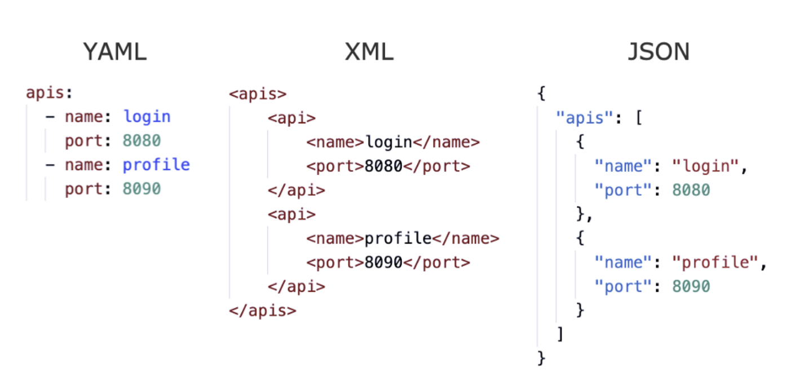

**YAML** is a data serialization language that, like JSON, allows you to store information in a human-readable format. It is an abbreviation for "YAML Ain't Markup Language" (a recursive acronym) that stresses that YAML is for data rather than documents. It may also be combined with other programming languages and also considered a superset of JSON

> YAML is a human friendly data serialization language for all programming languages

YAML can self-referentially, support complicated data types, incorporate block literals, and support comments, among other things. Recently, YAML is widely used in infrastructure-as-code (IoC) systems such as Helm Charts or Kubernetes to build configuration files or to manage containers in the DevOps pipelines

## YAML Syntax

The structure of a YAML file is a map or a list. YAML uses Python-style indentation to show nesting. Whitespaces are only allowed, hence no tab spaces. There are no standard formatting symbols like braces, square brackets, closing tags, or quotation marks

_Pictorial difference between YAML, XML and JSON syntax_

The .yml or .yaml extension is used for YAML files

## Syntax Illustration

As already mentioned, YAML is a superset of JSON. Hence, YAML is a key-value combination separated by colon and whitespace

```
---
# This is a comment for illustrating a YAML file
name: Vivek Naskar
designation: "Software Developer"
age: 29
company: Google
frameword:
    - Spring Boot
    - Django
    - nodeJS
languages:
    java:expert
    python: beginner
    javascript: proficient
certifications: |
    4 Google certifications
    2 Best employee awards
    Bachelors in Computer Science & Engineering

# The symbol ">" is used for paragraphs
mission: >
    My mission is
    to learn newer
    technologies
```

A YAML file usually contains scalars or variables represented by colon and space. Comments can be given by using # at the beginning of a sentence

---

A key is always a string, however, the value is a scalar, just like in progrramming languages such as Python, JavaScript, and Perl. Hence they can be of any data type as an integer, string, float, etc, as shown below

```
name: Vivek Naskar
designation: "Software Developer"
age: 29
```

---

Strings can be specified using the | charaacter, which keeps newlines intact

```
certifications: |
    4 Google certifications
    2 Best employee awards
    Bachelors in Computer Science & Engineering
```

Strings can also be specified using the > character to print as a paragraph

```
mission: >
    My mission is
    to learn newer
    technologies
```

---

Sequences are data structures that, like a list or an array, store numerous values under the same key

```
frameworks:
    - Spring Boot
    - Django
    - nodeJS
```

In the above snippet, you can also see spaces are used to structure the document in block format. It is simpler to read yet less compact than the flow style

## Uses of YAMl

When it comes to developing configuration files for Infrastructure as Code, YAML is a popular choice. These files provide the parameters and configuration for the intended cloud environment

Docker uses YAML files known as Dockerfiles, which are essentially blueprints for everything required to execute applications, such as codes, runtime, tools, settings, and libraries

Even Ansible, an automation tool, also uses YAML to construct automation processes. Ansible users write playbooks in YAML code to automate the tedious operations of provisioning and deploying a cloud environment

YAML files are also used to create Kubernetes resources such as pods, services, and deployments
