# YAML

Basically programming languages are divided into two types

- Declarative programming language
- Imperative programming language

1. **Declarative programming** can be defined as what a program can do rather than how it can be done. Examples - HTML/CSS
2. **Imperative programming** can be defined as how a program can be accomplished. Examples - C++, JAVA, Python, and so on

_JSON, YAML, and XML are generally considered as context-sensitive languages and comes under declarative programming language_

### What is YAML?

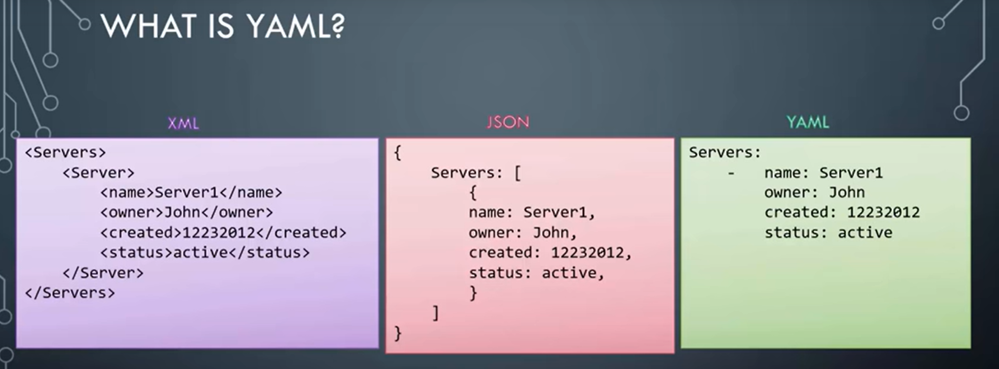

### Declaring Key-Value Pair, Array/Lists, and Dictionary/Map in YAML

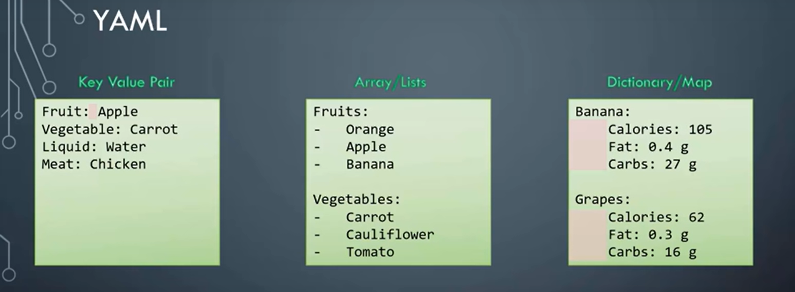

### Importance of Spacing in YAML

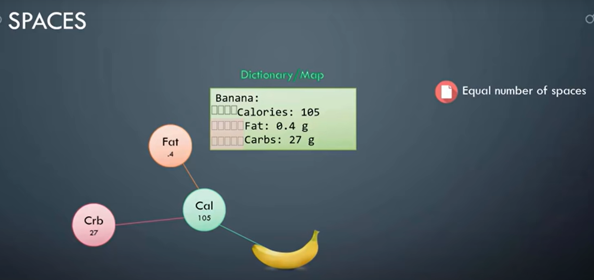

### YAML Advanced

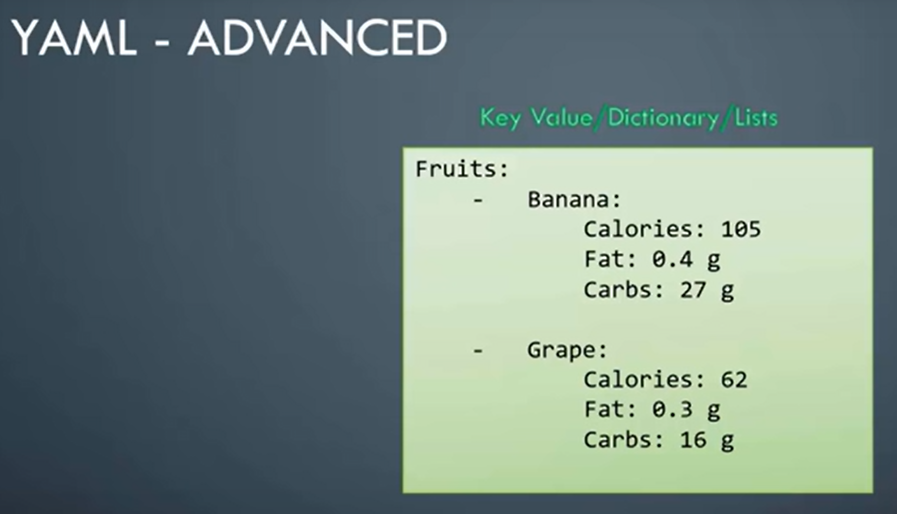

### Dictionary v/s List v/s List of Dictionaries

To store different information of a single object we use **Dictionary**

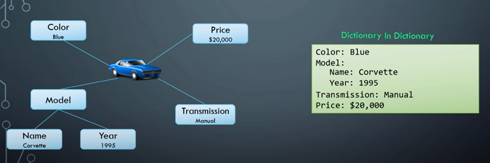

To store multiple items of a same type of object we use **List**

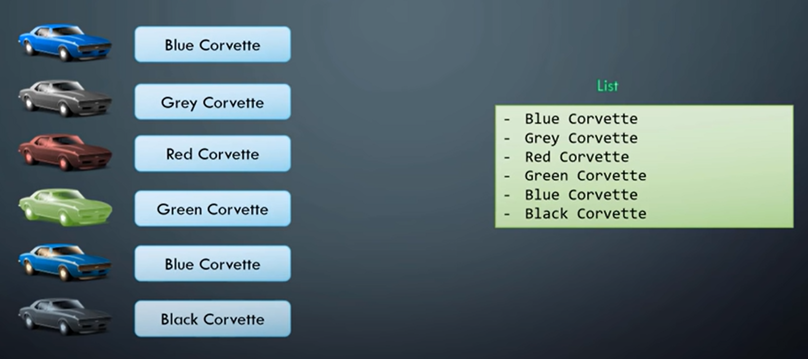

**List of Dictionaries**

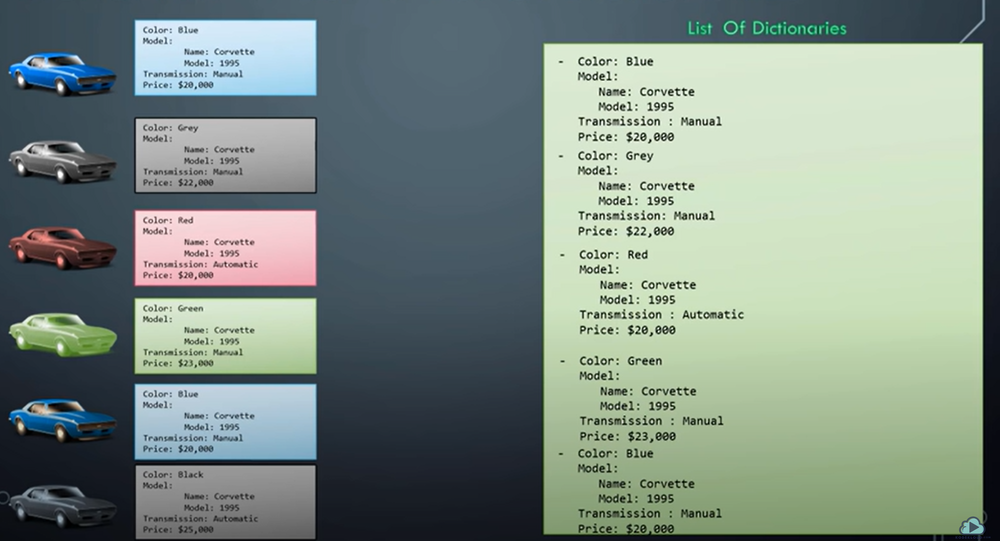

**Difference between Dictionary and List**

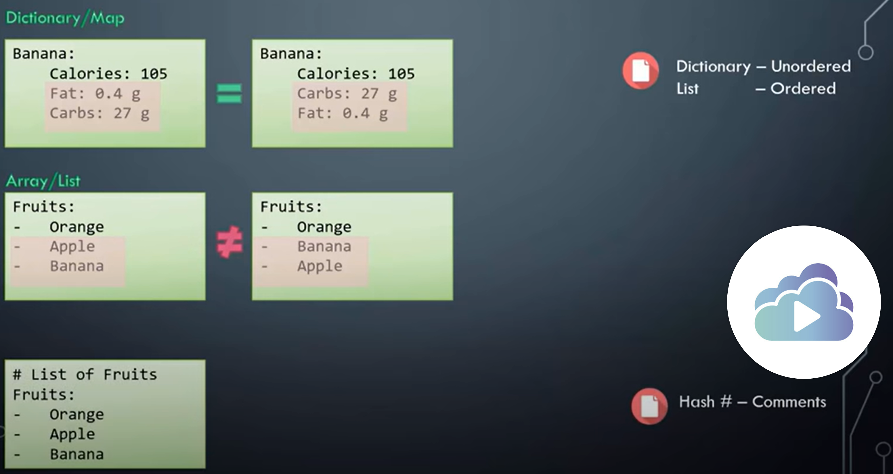

### Benefits of YAML

- YAML data can be portable with many programming languages like Perl, Python, PHP, Ruby, and JavaScript
- It is easily readable and editable
- It can be easily implemented
- It consists of data consistent model
- It supports one-direction processing

### Comparisons

**Comparison between YAML, JSON, and XML**

- YAML has some advantages over JSON like self reference support for complex datatypes, embedded block literals, comments, and more
- JSON is only readable whereas YAML can be readable as well as editable
- JSON is a subset of YAML so that YAML parsers can be able to parse JSON
- YAML doesn't use any extra delimiters. So it is light-weight than XML and JSOn

**Note: YAML file is case-sensitive and you can save the YAML file in .yaml or .yml extension. YAML doesn't allow any tabs while creating a YAML file**

### Maps or Dictionaries

Sequences can be defined as **(lists or arrays)**:

Example

```
sequence1:
    - Item 1
    - Item 2
    - 0.5   # sequences can contain disparate types
    - Item 4
    - key: value
      another_key: another_value
    - sequence1
    - sequence2
```

## Basic Components of YAML file

**In this topic you will learn about basic types and syntaxes that are used in YAML file**

YAML file can be formatted into three types

- Conventional Block format
- Inline format
- Folded Text format

### Conventional Block format

The format that is followed in this is **hyphen(-)** and **space(" ")**:

**Example**

```
--- # Learning resources in tcs
- Fresco play
- Lynda
- Skillsoft
- Safari
```

### Inline format

It is delimited with comma(,) and space(" ")

**Example**

```
--- # Learning resources in tcs
[Fresco play, Skillsoft, Lynda, Safari]
```

### Folded Text

It converts newlines to spaces and removes leading white spaces

**Example**

```
- {name: tcs, founded: 1968}
        or
- name: tcs
  founded: 1968
```

## Indentation

**Spacing/Indentation** - As you know that YAML doesn't allow any tab spaces, but it follows spaces between element parts. **Example** - Key: Value

**Comments** - YAML suports only single-line comments. Comments are not supported in scalars but in collections it is vice-versa. The shortcut for commenting block is **Ctrl+Q**

syntax: # this is a comment

**comments in collection**

```
key: # comment 1
    - value line 1
     # comment 2
    - value line 2
```

### Structures

- To separate directives from document content, YAML uses three dashes (---)
- To end the document, YAML uses three dots(...)

**Example**

```
# Learning resources in TCS
---
- Fresco Play
- Lynda
- Skillsoft
...
```

- Repeated nodes are first identified as anchor (indicated by the symbol **&**)
- The subsequent sequences are then aliased (indicated by the symbol **\***)
- A question mark and a space indicates a complex mapping key
- For anchors and alias to work with maps and sequences inject **>>**

**Example - 1**

```
---
Software Companies:
- TCS
- &Apple # First occurence
- IBM
Fruits:
- *Apple # Subsequent occurence
```

**Example - 2**

```
? - TCS
  - Fresco PLAY
:
  12-11-2018
```

**Example - 3**

```
default: &default
  school: hogwarts

harry:
  <<: *default
  house: gryffindor
```

### Basic YAML Elements

YAML supports different data types such as **Scalar and Collections**

**Scalar** - Scalar can be of any type like **Integers, Floating point numbers, Dates and Miscellaneous Example**:

```
number1: 53 # integer
number2: 45.2361 # floating point number
date: 12-11-2010 # date
boolean: true # boolean
null_value: null # miscellaneous
```

Scalar is composed of two different styles like **Block scalar style** and **flow scalar style**

### Block Styles

**YAML consists of different types such as scalars, collections, sequences, and mappings**

In Block scalar style, multi-line strings can be written in two types such as **block notation** which uses a literal style, indicated by ("|") and **folded style**, indicated by (">")

- In block notation, each line break (means where text is divided into 2 lines) is preserved
- In folded style each line break is turned into a space, if it is an empty line or more-indented line

**Example of Block notation**

```
--- |
welcome to fresco play
hi, this is yaml course
you are in scalar topic
```

**Example of Folded style**

```
--- >
    In tcs there are several learning resources
        like fresco play, skill soft, safari and lynda.

        Now you are
        learning YAML course

        congratulations!
```

### Flow scalar styles

There are three different types of **Flow scalar types**:

- **Double-quoted** - It is surrounded by **Double quotes(")** and uses **\\** as escape sequence
- **Single-quoted** - It is surrounded by **Single quotes(')**. Escape sequences are not present in single-quoted style
- **Unquoted** - It is not surrounded by any indicators or escape sequences

## Collections

Collections are of two types like

- Lists
- Map or Dictionaries

**Lists** - The element in the list are denoted by the syntax **hyphen and space**

**Example**

```
- Fresco Play
- Lynda
- Skillsoft
- Safari
```

**Maps or Dictionaries** will be in the form of **Key: Value** pair

Maps can also be nested as follows

**Example**

```
nested_map1:
    key1: value1
    key2: value2
    nested_map2:
    key1: value1
```

_Maps don't have string as keys_

You can also have key with multiple lines by using the following syntax:

**Example**

```
? |
  This is a key
  which has multiple lines
: its value
```

### Information in YAML

> YAML is used to represent the information in text format and it is also used as a method to represent native data structure

YAML node is used to represent single native data structure which can be represented in three forms known as scalar, mapping, and sequence

### Examples

**Collections**

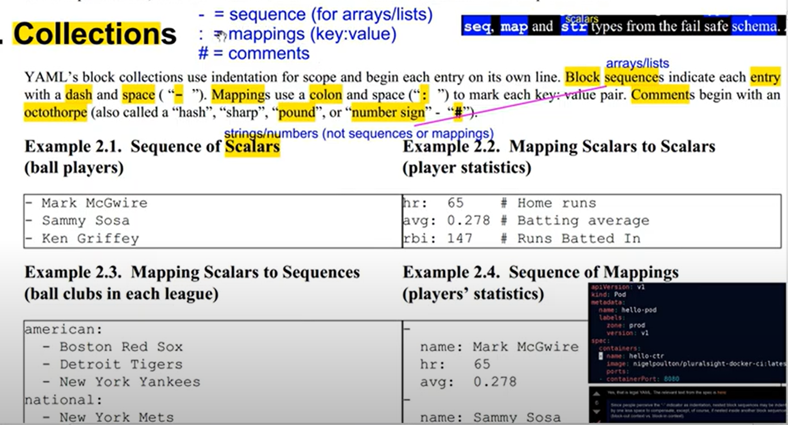
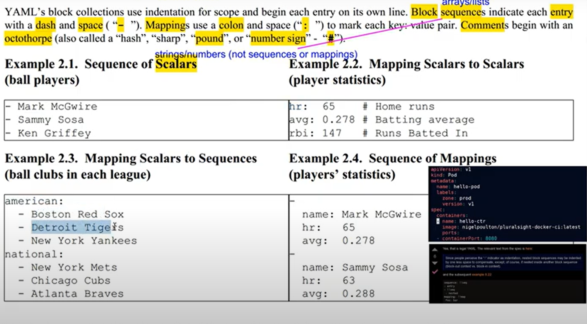

**Structures**

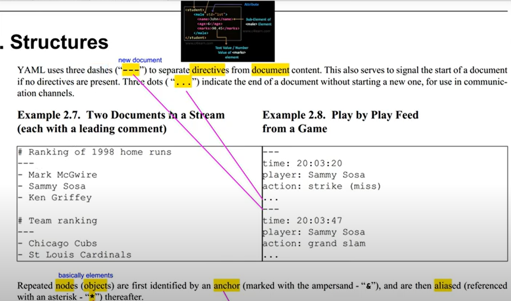
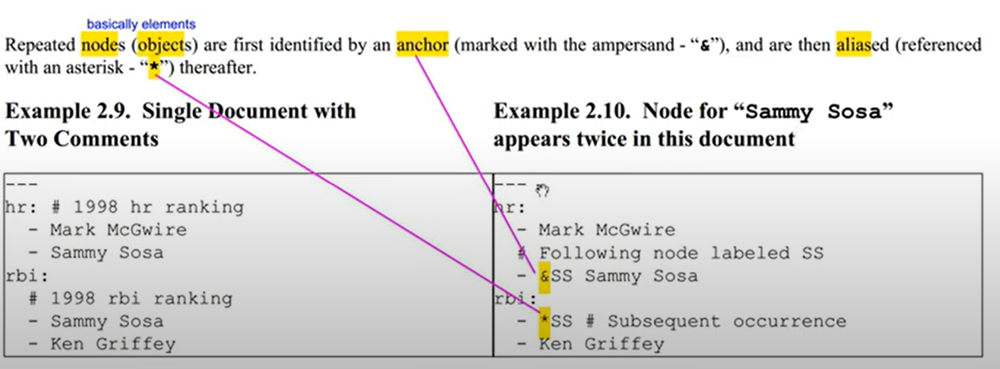

**Preserving the line break**

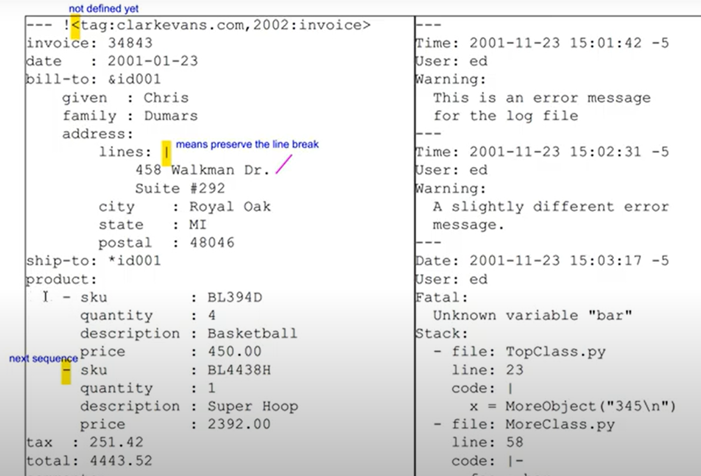

### YAML Processing Overview

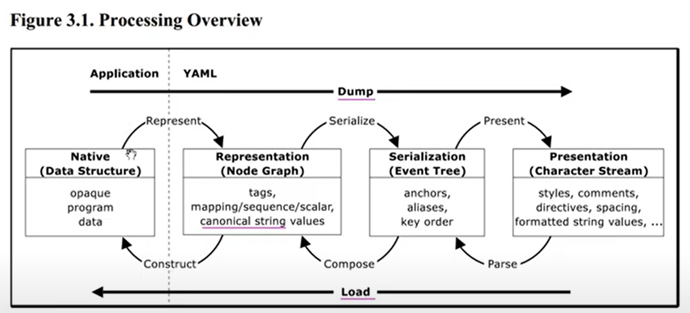

# Processing YAML information

YAML information can be specified in two formats

- YAML Representation (A class of data objects)
- YAML Stream (YAML representation is presented as a series of characters)

---

YAML processor is used to handle this two different views and it does it work by obtaining and modifying the information from another module known as _Application_

---

YAML information can be understandable by two ways

- Machine processing
- Human consumption

**_The tuning between this two ways can be done in three stages such as_**

- **Representation** - It tells how YAML views native data structure to attain portability between different programmable environments
- **Serialization** - It is the process of converting YAML representation into serial form
- **Presentation** - In this YAML serialization can be converted into series of characters(human-friendly)

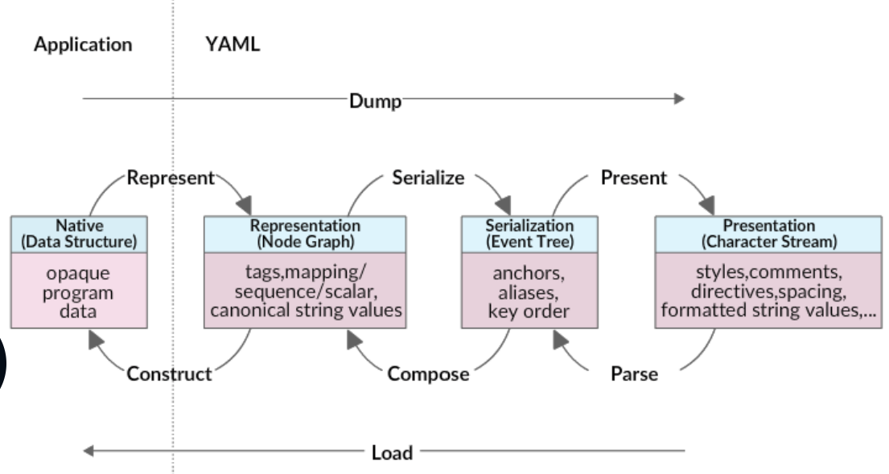

The functionality of YAML processor is to convert information between different stages which are mentioned above in the diagram. This can be done in two ways

- Dump
- Load

**_Dumping native data structure into character stream can be done in three stages_**

- Representing Native Data Structures
- Serializing the Representation Graph
- Presenting the Serialization Tree

### Dump

**Representing native data structure** - Native data structure can be represented in three node kinds like _sequence_ (ordered series of entries), _mapping_ (unordered entries of key and value pairs), and _scalar_ (data with opaque structure is represented as unicode characters) and these are combined to generate graph structures

**Serializing the representation graph** - serialization is required to _order the mapping keys_ and _replacing the node that has occurred two or more times with the placeholders known as aliases_. YAML processor will take care of all the ordering of keys and aliases with the help of application

**Presenting the Serialization Tree** - The final stage is presenting the YAML serialization as character stream in a human-friendly manner. Different presentation styles like _node styles, how a scalar content is formatted, the chunk of indentation, the tag handles which can be used, to leave node tags which are not specified, the directives and so on_ are introduced by YAML processor with the help of application

### Load

**Loading is used to construct native data structure from character stream in three stages**

**Parsing the Presentation Stream** - The reverse process of presentation is known as parsing. It takes stream of characters and converts it into serialization events. It can fail due to ill-formed input

**Composing the Representation Graph** - Serialization event is converted to representation graph. It can also fail due to many reasons

**Constructing Native Data Structure** - You will construct native data structure from YAML representation. It doesn't consider any serialization details. It can fail due to absence of some required native data types

### Information models

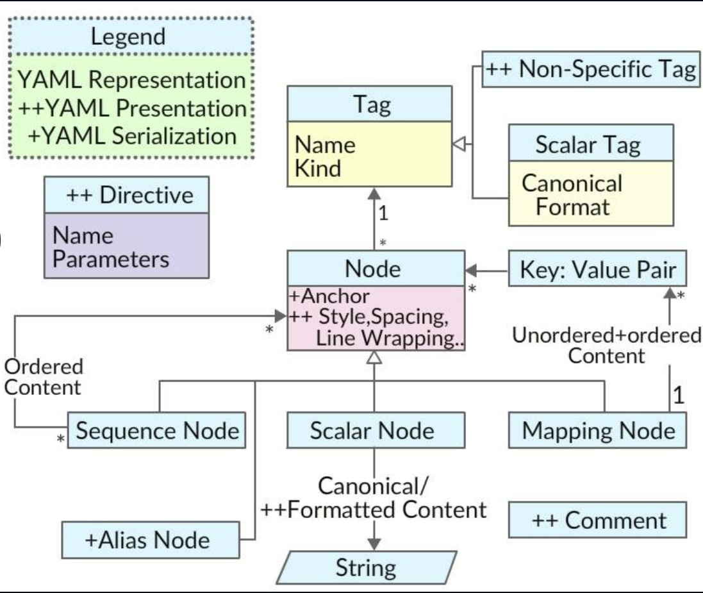

The above picture explains about three information models like

- Representation graph
- Serialization tree
- Presentation stream
- Full arrows denote composition
- Hollow arrow denotes inheritance
- 1 denotes single relationship
- "\*" denotes many relationships
- Single "+" denotes serialization details
- Double "++" denotes presentation details

### Representation Graph

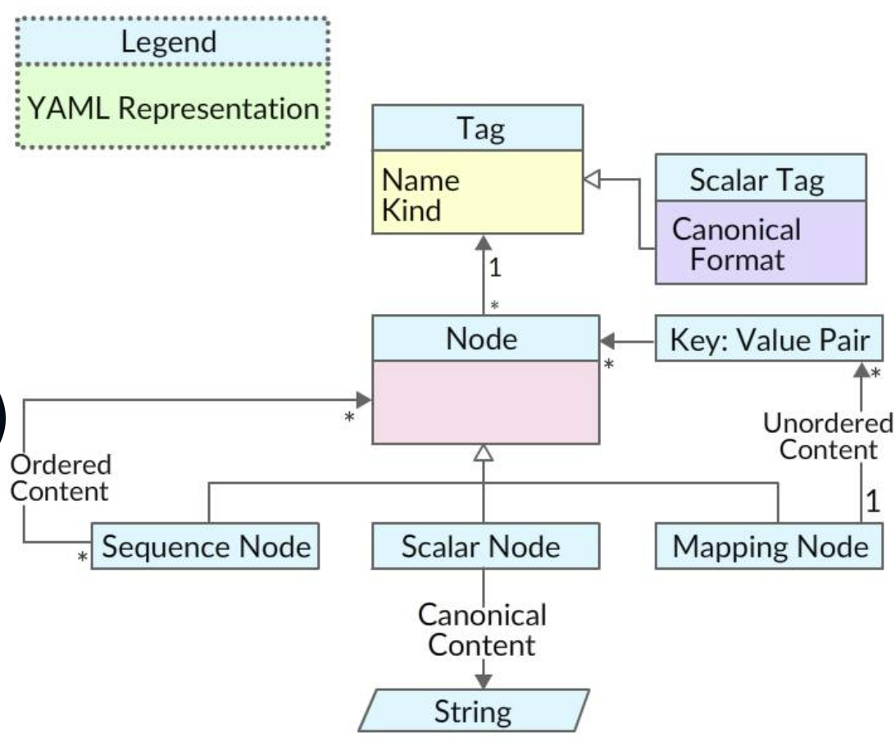

In YAML representation graph **native data structure** is rooted, connected and directed graph(tagged nodes). Every node is connected to each node through edges and at final all nodes must connect to the root node through edges. The directed graph can contain cycles and node can have more than one edge

The definition of nodes that are explained in terms of other nodes are _collection_. YAML supports two types of collection nodes called _sequences_ and _mappings_. The nodes which are independent are called _scalars_. Mapping nodes are tricky as they are unique and unordered

### Node

**Node** can be defined as single native data structure. The content present in the nodes is of three types such as **scalar, sequence or mapping**

- The values that are present in the content are restricted through the tag
- The content of **Scalar node** can be presented as a series of zero or more unicode characters
- The content of **sequence node** is represented as ordered series of zero or more unicode characters
- The content of **mapping node** is represented as unordered key, value pairs
- you can consider sequence and mappings as collections

### Tag

**The type information of native data structure is represented by an identifier known as Tag**

- There are two different types of tags known as **Global Tag** and **Local Tag**
- Global tags are nothing but URI's which are unique and can be used in any application
- Local tags start with "!" symbol and they are not considered as unique and URI's
- They are used to associate meta with each node
- It should specify node kind (like scalar, sequence or mapping)

### Serialization tree

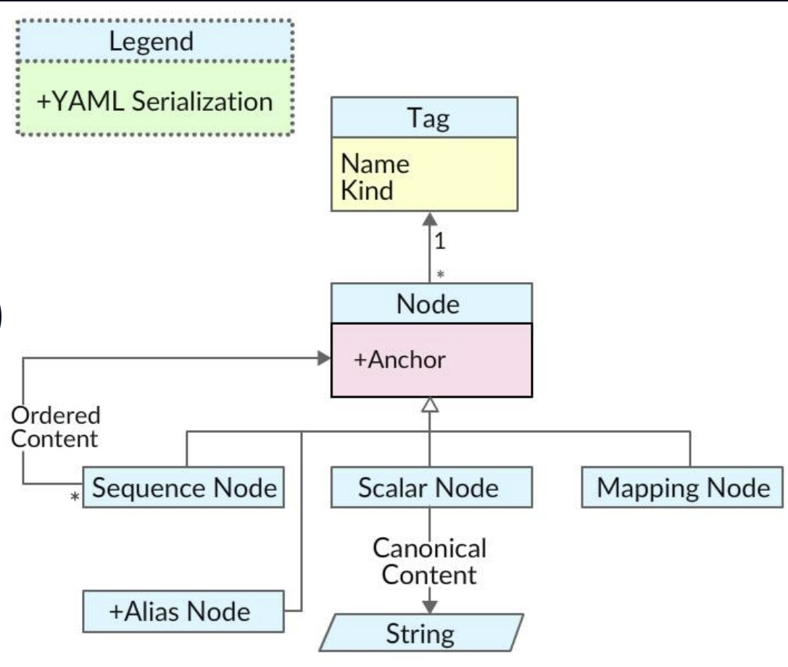

YAML representation can be expressed in serial API by doing two things

- Imposing an ordering on mapping keys
- Mentioning aliasing nodes for the subequent occurences of the anchor nodes. The result of the above process is known as **Serialization Tree**

The two important concepts of serialization tree are **keys order** and **anchors and aliases**

- **keys order** - From the representation model mapping keys are not ordered. To serialize mappings you should impose an ordering on maps. Ordering mappings can be treated as a sequence of mappings. Mapping is a **key:value** pair

- **Anchors and Aliases** - A node can appear more than one time in a collection. The first occurrence is termed as an anchor and subsequent occurrences are considered as **aliases** which will refer back to the anchor. When a representation graph is constructed from serialization events alias will refer to most recent node having specified anchor. Anchors need not to be unique in this context

### Presentation Stream

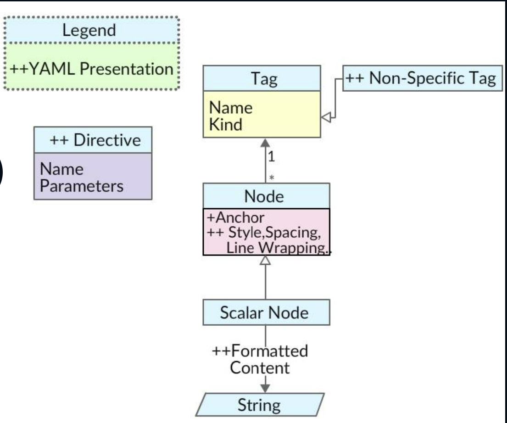

**Presentation stream** can be defined as the stream of unicode characters which makes use of comment, directives, node styles, scalar content formats, and also other presentation details so that to present the content in a human-readable manner

- YAML allows numerous serialization trees to be contain in same character stream, as a series of documents separated by markers

**Node Styles** - Node can be represented in some style. YAML supports two types of styles like **Block style** (uses indentation) and **Flow style** (uses explicit indicators)

> YAML consists of two scalar styles like **Block scalar style (literal and folded style) and Flow scalar style (plain style, single-quoted style and double-quoted style)**

**Scalar formats** - Scalar can be presented in various formats. For example integer can be represented in hexa-decimal format

**Comments** - Comments are not associated with any node. It is like a bridge between various human maintainers of a file

**Directives** - Document is associated with set of directives. Directive is like giving set of instructions to the YAML processor. YAML provides you with two types of directives like **YAML** and **TAG**

### Loading Failure Points

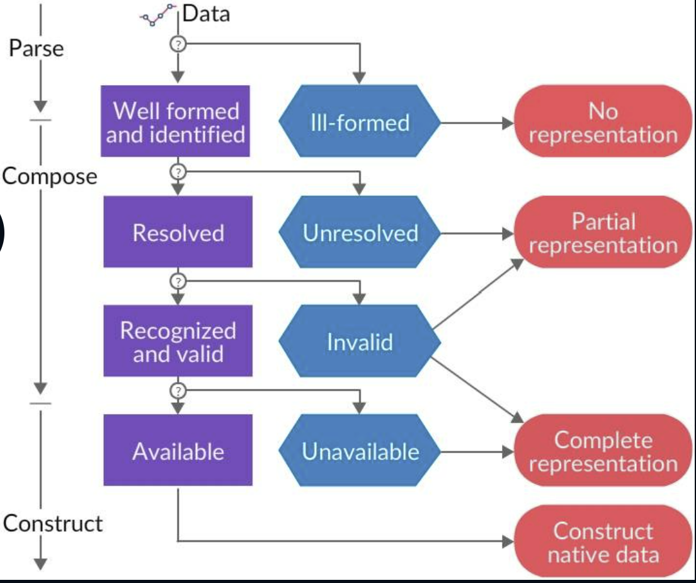

When you are loading native data structure from the YAML stream it has several failure points

- There are few common failure points like character stream might be deformed, aliases might be not identifiable, unspecified tags are not resolved, tags might be not recognized, content might not be valid and a native type might be not available

**Well formed streams and identified aliases** - YAML processor should reject ill-formed streams and unidentified aliases. It can get back from syntax errors by ignoring ceretain parts of input and such errors should be reported in some mechanism

**Resolved Tags** - Resolving a tag depends on mainly three important parameters like non-specific tag of the node, the path leading from root to node and the content of the node

**Recognized and valid tags** - To recognize node as a valid one, it must have a tag recognized by YAML processor and the content of node must satisfy the constraints imposed by tag. If the scalar node contains a unrecognized tag or invalid content, a partial representation is composed

**Available Tags** - A tag must contain an available native type. If node's tag is unavailable then YAML processor will unable to construct native data structure

## Syntax Primitives

YAML consists of the following syntax primitives like

- Production parameters
- Production naming conventions

### Production Parameters

**Production parameters** can be defined as set of parameters and their ranges that are used for specific production. There are different parameters like

- **Indentation** - character stream depends on the indentation level present in the block and it is denoted by the character **m** or **n**. So many production have enabled this feature
- **Context** - is divided into two types like _block styles_ and _flow styles_ and it is denoted by a character **c**
- **Style** - Scalar content can be represented in one of these five styles **(plain, double quoted and single quoted flow, literal and folded block)**
- **Chomping** - block scalars offers three mechanism for chomping(formatting new line strings) any trailing line breaks with _strip, clip, and keep_. It is denoted by the character **b**

### Production Naming Conventions

The naming conventions which are mentioned below are explained in the context of production combinations

- Production names uses Hungarian-style naming convention
- The following are the different type of characters that are used in production for different purposes
  - e - Matching no characters
  - c - Starting and ending with a special character
  - b - Matching a single-line break
  - nb - Starting and ending with a non-break character
  - s - Starting and ending with white space character
  - ns - Starting and ending with non-space character
  - l - Matching a complete line(s)
  - x-y- - starting with x- and ending with y- characters, where x- and y- are any of the above prefixes
  - x+, x-y+ - The additional property that the matched content indentation level is greater that the specified n parameter

## Space Processing

To achieve the structure, serialized YAML uses text lines. These requires special processing rules for white space(both space and tab)

### Indentation

Structure is determined by the indentation (line break character followed by zero or more spaces at start of the line)

- Tab characters are not allowed in indentation as they vary in different system
- The amount of indentation is presentation detail
- The child node is more indentated than parent node
- All siblings should follow same indentation and content of siblings can be indented independently
- The "-", "?", and ":" characters used to denote block collection entries

**Example**

```
%YAML 1.2
- - -
!!map {
  ? !!str "Not indented"
  : !!map {
      ? !!str "By one space"
      : !!str "By four\n  spaces\n",
      ? !!str "Flow style"
      : !!seq [
          !!str "By two",
          !!str "Also by two",
          !!str "Still by two",
        ]
    }
}
```

### Separation Spaces

YAML uses white space characters between token in a line that is outside of indentation and scalar content

- white space also includes tab space
- separation spaces comes under presentation detail

**Line Prefix**

_Each line in scalar content begin with non-content line prefix (which includes indentation)._

- Flow scalar style includes leading white-spaces including tab spaces
- Line prefixes also come under presentation details

```
%YAML 1.2
---
!!map {
  ? !!str "plain"
  : !!str "text lines",
  ? !!str "quoted"
  : !!str "text lines",
  ? !!str "block"
  : !!str "text\n·→lines\n",
}
```

### Empty lines

\*Empty lines consists of non-content prefix followed by line break

**Example**

```
%YAML 1.2
---
!!map {
  ? !!str "Folding"
  : !!str "Empty line\nas a line feed",
  ? !!str "Chomping"
  : !!str "Clipped empty lines\n",
}
```

### Line Folding

_Line folding can be defined as breaking of lines for human readability_

- If empty lines appears after the line break, then it is chopped
- If the line is not empty, then line break is converted into single space
- Line folding is applied to styles of scalar content like block style and flow style

### Types of foldings

**Block folding**

- In this the final line break and trailing empty lines are chomped and never folded
- The line breaks which are surrounded by text lines which contains leading white space are not subjected to folding
- The rules that are followed in the block folding are **_paragraph is interpreted as a line, empty lines as line feed and finally more indented lines are preserved_**

**Flow folding**

- The structure in the line folding depends on the indicators rather than indentation
- The rules that are followed in flow folding are **_paragraph is interpreted as a line, empty line as line feed and text can be more indented without effecting the content_**

### Comments

- An explicit comment is denoted by the syntax **#**
- Comments are separated from other token with white spaces
- Comment lines appear independently outside of scalar content and only white space character is considered to be a comment line

**Example**

```
# This is a comment
```

**Multi-line comments**

- YAML doesn't support multi-line comments, but you can write comments in multiple lines

**Example**

```
# this comment
# is written in
# multiple lines
```

### Directives

**_Directives can be defined as instructions given to YAML processor_**

- Each directive is denoted by the character **%** followed by directive name and its parameters

There are two different types of directives such as

- **_Reserved directive_**
- **_YAML directive_**
- **_TAG directive_**

**Reserved directive**: YAML should reject unknown directives with an appropriate warning. Those directives are called reserved directives

**Example**

```
% # This is ignored
  # with warning
```

**YAML directive**

**YAML directive** specifies the version of document that YAML follow to

- Let us consider an YAML 1.2 version processor which accepts documents with %YAML 1.2 directive and also accept the documents which doesn't have an directives
- If the directive is higher minor version (e.g.: %YAML 1.3 directive) then the document is processed with an appropriate warning
- If the directive is higher major version (e.g.: %YAML 2.0 directive) then the document is rejected with an approprite error
- If the directive is less than the processor version (e.g.: %YAML 1.1. directive), then it should accept the document as 1.2 version is superset of 1.1

**NOTE**: It gives an error when you specify more than one directive in same document

**TAG Directive**

**Node tags** are specified through a short-hand notation through TAG directive

- TAG directive is associated with handle along with a prefix

**Example**

```
%TAG !yaml! tag:yaml.org,2002:
---
!yaml!str "A"
```

- You can't specify more than one **_TAG directive_** for one handle

**TAG Handles**

**_The prefix of the exactly concerned tag handle will be matched by tag handle. There are three types of handle variants_**

- Primary Handle - Primary handle is indicated by single **!** identifier. These are interpreted as local tags. The prefix associated with this handle is **!**
- Secondary Handle - Secondary Handle is indicated by double **! !** identifier. The prefix associated with this is **tag:yaml.org, 2002:**
- Named Handle - Named handle is surrounded by a non-empty name with **!** character. A handle name cannot be used in tag shorthand until an explicit TAG has associated with some prefix

### TAG Prefixes

There are two types of tag prefixes such as

- Local Tag Prefix and
- Global Tag Prefix **Local Tag Prefix** - If the prefix consists of **!** identifier, then the shorthands using handle are expanded to a local tag

**Syntax**

```
c-ns-local-tag-prefix ::= "!" ns-uri-char*
```

**Global Tag Prefix** - If the prefix begin with an identifier other than **!**, it must be a valid URI prefix. Shorthands using handle are expanded to a global URI tag

**Syntax**

```
ns-global-tag-prefix ::= ns-tag-char ns-uri-char*
```

### Node Properties

**_Node may consists of two optional properties such as anchor and tag_**

- Node properties are specified in any order

**Example**

```
!!str &A "string1":
  !!str "string2"
&B  "string3": *A
```

### Node Tags

**\*The type of native data structure is presented by node is identified by the **Tag property\*\*

- **_Verbatim Tags_** - verbatim tag is surrounded by the identifiers **<** and **>**. Verbatim tag must start with a local tag(**!**) or a global tag (**valid URI**)
- **_Tag shorthand_** - It should consist of tag handle with prefix followed by non-empty suffix. Prefix must start with either local tag or global tag. The suffix should not contain characters like "!", "[", "]", "{", "}", ","
- **_Non-specific tag_** - If a node doesn't contain any tag property then it is assigned to non-specific tag. For scalar the non-specific tag **!** and for other node it is **?**. You can explicitly specify the non-specific tag ! and the node can be interpreted to "tag:yaml.org, 2002:seq",
  "tag:yaml.org,2002:map" and "tag.yaml.org,2002:str"
- An anchor is identified by the symbol **&**
- An alias node is used to represent the subsequent occurrences of the anchored nodes and it is represented as **\***
- Anchor names should not contains characters like **"{", "}", "[", "]", ","**
- Anchor name is preserved in serialization tree but it is not reflected in representation graph

**Example**

```
First occurrence: &anchor Value
Second occurrence: *anchor # This is alias
```
